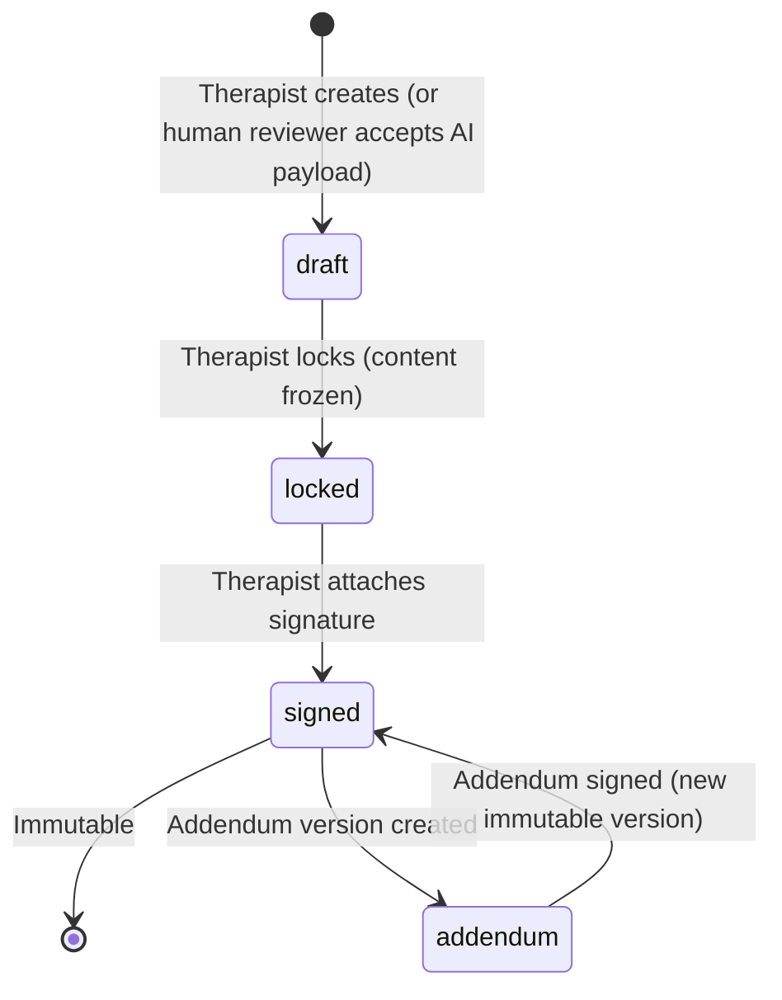
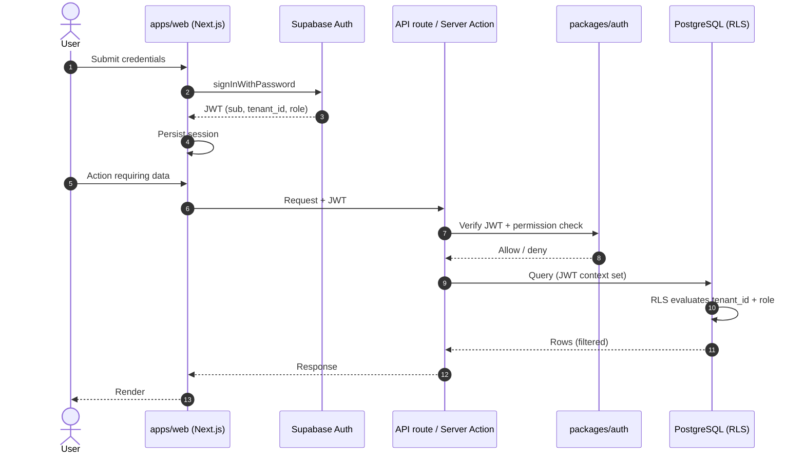
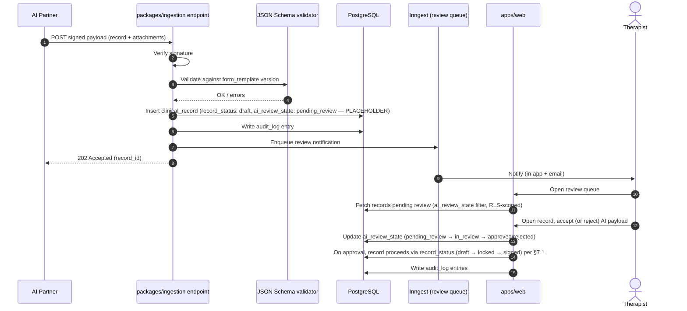
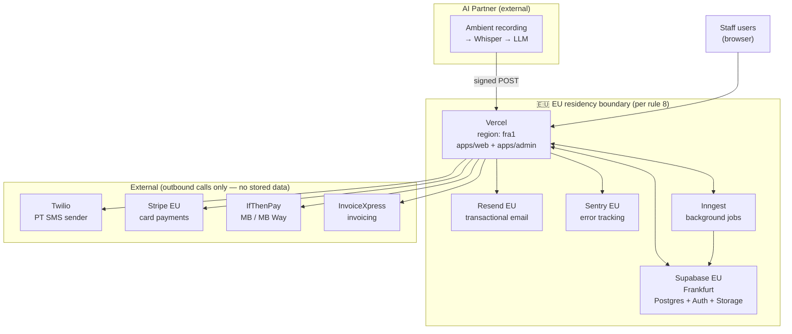

# Architecture — OsteoJP Platform

> Engineering overview of the OsteoJP unified clinic platform. Single source of truth for system shape, stack, data model summary, permission model, key flows, integration map, and deployment topology.
>
> Companion documents: [`mega-plan.md`](./mega-plan.md) (task plan), [`claude-md-reference.md`](./claude-md-reference.md) (architectural rules referenced by Claude Code in this repo), [`tech-stack.md`](./tech-stack.md), [`handoff-brief.md`](./handoff-brief.md).
>
> Schema is the source of truth for table shape, not this doc. See `packages/db/src/schema.ts`.

---

## 1. Overview

OsteoJP is a Portuguese osteopathy and physiotherapy clinic with locations in Linda-a-Velha, Castelo Branco, and Montemor-o-Novo (opening). Brand pillars: Osteopatia, Fisioterapia, Formação. Reference site: https://osteojp.pt.

The platform replaces two legacy systems — Fisiozero (clinical) and Stylus.pt (scheduling) — with a single multi-tenant application covering scheduling, patient records, clinical forms, invoicing, and payments. The system is multi-tenant from day 1 to support a future licensing path beyond OsteoJP.

The platform is API-first for clinical record ingestion: an external AI partner runs ambient recording → Whisper → LLM and pushes completed clinical reports into a signed endpoint. The platform owns the AI-ingestion review queue (`ai_review_state`, placeholder pending the partner contract), the clinical record lifecycle (`record_status`: `draft` → `locked` → `signed`), and the immutability of locked/signed records.

Target launch: end of June 2026.

---

## 2. Hard architecture rules

These are non-negotiable constraints applied across the codebase. Sourced from `CLAUDE.md`.

1. Every domain table has `tenant_id uuid not null`. No exceptions.
2. Every domain table has an RLS policy keyed on the JWT `tenant_id` claim.
3. Service-role queries (migrations, ingestion, jobs) must set `tenant_id` explicitly. Never global.
4. Clinical records have two orthogonal state machines, defined in `packages/db/src/schema.ts`:
   - `record_status` — lifecycle of every clinical record regardless of origin: `draft` → `locked` → `signed`. Locking makes content immutable (enforced by the BEFORE UPDATE OR DELETE trigger); signing attaches the therapist signature. Changes after locking create addendum versions.
   - `ai_review_state` — review queue for records arriving via the AI ingestion endpoint only. PLACEHOLDER values (`pending_review`, `in_review`, `approved`, `rejected`) pending the AI partner auth contract; refine in schema once signed off. AI ingestion never produces a `locked` or `signed` record directly — a human reviewer must accept the AI payload, after which the resulting `clinical_record` follows the standard `record_status` lifecycle.
5. Form templates are JSON Schema-driven. Templates are versioned and immutable once referenced by a record.
6. Audit log writes on every clinical record mutation and every permission-sensitive action. No exceptions.
7. PII never appears in logs, error messages, or Sentry events. Sanitize before logging.
8. EU data residency: Supabase EU (Frankfurt), Vercel `fra1`, Resend EU. No US-region resources for stored data.

---

## 3. Stack

| Layer | Technology |
|---|---|
| Framework | Next.js 16 (App Router), TypeScript strict |
| UI | shadcn/ui + Tailwind v4 |
| ORM | Drizzle |
| Database | PostgreSQL via Supabase EU (Frankfurt) |
| Auth | Supabase Auth (JWT with `tenant_id` + role claims) |
| File storage | Supabase Storage (signed URLs only, never public) |
| Background jobs | Inngest |
| Hosting | Vercel (region: `fra1`) |
| Error tracking | Sentry (EU) |
| Email | Resend (EU) |
| SMS | Twilio (PT sender) |
| Payments | Stripe (EU), IfThenPay (MB, MB Way) |
| Invoicing | InvoiceXpress |
| Monorepo | pnpm + Turborepo |
| Testing | Vitest (unit), Playwright (E2E) |

---

## 4. Repo layout

```
apps/
  web/                 # Staff platform (Next.js)
  admin/               # Superadmin (tenant management, system ops)
packages/
  db/                  # Drizzle schema, migrations, RLS policies, seed
  ui/                  # shadcn components, brand tokens
  auth/                # Permission matrix, JWT helpers
  ingestion/           # AI partner ingestion contract + validators
  integrations/        # InvoiceXpress, IfThenPay, Stripe, Twilio, Resend
  i18n/                # User-facing strings (PT primary, EN secondary)
docs/                  # Architecture, brand, voice, wireframes, templates
supabase/
  migrations/          # Tracked
  config.toml          # Tracked
  .branches/           # Gitignored
  .temp/               # Gitignored
```

Notes:

- `packages/db/seed/form-templates/` holds JSON Schema seed templates (osteopathy, physiotherapy v1). Loader is live (`packages/db/seed/form-templates.ts`) — idempotent upsert on `(tenant_id, key, version)`. Patient seed data in `packages/db/seed/patients.json` (50 PT-realistic records).
- `packages/i18n/` is the canonical home for `strings.pt.json` and `strings.en.json`. Both files are fully populated (112+ keys each, typecheck-clean). PT is primary.
- Tests live next to code: `foo.ts` + `foo.test.ts`. E2E tests in `apps/web/e2e/` (Playwright, 51 scenarios across auth, patients, scheduling, clinical, admin).

---

## 5. Data model — high-level

The full schema lives in `packages/db/src/schema.ts`. This section names the V1 tables and explains how they relate, but it is not the schema reference.

### 5.1 Table inventory (V1)

| Table | Purpose |
|---|---|
| `tenants` | Top-level isolation unit. Every domain row belongs to one tenant. |
| `users` | Platform user accounts (staff). Tied to Supabase Auth identities. |
| `roles` | Role definitions per the permission matrix. |
| `locations` | Per-tenant clinic locations (Linda-a-Velha, Castelo Branco, etc.). |
| `services` | Per-tenant service catalogue (treatments offered, pricing). |
| `patients` | Patient records. |
| `appointments` | Scheduled sessions. Linked to patient, practitioner, location, service. |
| `form_templates` | Versioned, JSON Schema-driven clinical form definitions. Immutable once referenced. |
| `clinical_episodes` | A patient's course of treatment for a given complaint. Groups records. |
| `clinical_records` | Individual clinical notes / forms. State machine driven (see §7). |
| `attachments` | Files attached to records (images, scans). Stored in Supabase Storage; row holds the signed-URL handle. |
| `audit_log` | Append-only record of mutations to clinical data and permission-sensitive actions. |
| `invoices` | Issued invoices, tied to InvoiceXpress IDs once issued. |

### 5.2 Relationships (selected)

- `tenants` → `users`, `locations`, `services`, `patients`, `form_templates`, `appointments`, `clinical_episodes`, `clinical_records`, `invoices`, `audit_log` (1-to-many on `tenant_id`)
- `patients` → `clinical_episodes` (1-to-many) → `clinical_records` (1-to-many)
- `appointments` → `clinical_records` (optional 1-to-1, linked when the visit produces a record)
- `clinical_records` → `form_templates` (many-to-1, references a specific `(key, version)`)
- `clinical_records` → `attachments` (1-to-many)
- `invoices` → `appointments` (many-to-many, an invoice can cover multiple sessions)

### 5.3 Money

All monetary values stored as integer cents with currency on the column. Never floats. (Per CLAUDE.md.)

### 5.4 Time

All timestamps stored in UTC. Display layer converts to Europe/Lisbon. (Per CLAUDE.md.)

### 5.5 Form template versioning

`form_templates` rows are keyed by `(key, version)` — e.g. `("osteopathy", "v1")`, `("physiotherapy", "v1")`. A clinical record references a specific template version. Once any record references a template version, that version is immutable. New template revisions ship as `v2`, `v3`, etc. Migration of existing records to new versions is an explicit operation, not implicit.

---

## 6. Permission matrix

Server-enforced. Client-side checks exist for UX but are never the security boundary.

| Action | Admin | Therapist | Receptionist |
|---|---|---|---|
| View any patient | ✓ | ✓ (own only) | ✓ |
| View clinical records | ✓ | ✓ (own patients only) | ✗ |
| Edit clinical records | ✓ | ✓ (own, until locked) | ✗ |
| Schedule appointments | ✓ | ✓ (own calendar) | ✓ |
| Issue invoices | ✓ | ✗ | ✓ |
| Manage users/roles | ✓ | ✗ | ✗ |
| Tenant settings | ✓ | ✗ | ✗ |

Enforcement model: every API route runs a server-side check via `packages/auth`, and RLS policies on `packages/db` enforce the same constraints at the database layer. Both must pass; one is not sufficient.

---

## 7. Clinical record state machine

Per architecture rule 4, `clinical_records` rows carry **two orthogonal state machines**, both defined in `packages/db/src/schema.ts`:

1. **`record_status`** — lifecycle of every clinical record regardless of origin: `draft` → `locked` → `signed`. Mandatory column, defaults to `draft`.
2. **`ai_review_state`** — review queue for records arriving via the AI ingestion endpoint only. Nullable; populated only on AI-ingested rows. **PLACEHOLDER** values pending the AI partner auth contract (see §16.1).

These axes are independent: an AI-ingested record carries both columns and progresses through each separately. Manual records leave `ai_review_state` NULL.

### 7.1 `record_status` — record lifecycle (all records)



Rules:

- A record in `draft` is editable by the assigned therapist (or admin), subject to the permission matrix in §6.
- Locking makes content immutable. A `BEFORE UPDATE OR DELETE` trigger on `clinical_records` (see `packages/db/migrations/0001_rls.sql`) rejects any mutation of rows where `status IN ('locked', 'signed')`. The trigger fires regardless of RLS / `BYPASSRLS`, so even `service_role` cannot mutate a locked or signed row.
- Signing requires therapist signature and transitions the row to `signed`. The row remains immutable.
- Any change to a locked or signed record creates a new addendum version. The original is preserved; the addendum is signed independently and chained via a `parent_record_id` reference.
- Every state transition writes to `audit_log` with actor, timestamp, and from/to states.

### 7.2 `ai_review_state` — AI ingestion review queue (PLACEHOLDER, pending partner contract)

> The enum below is a **placeholder**. Exact values, transitions, and audit semantics depend on the AI partner auth contract (open item §16.1) and will be refined in `packages/db/src/schema.ts` once the contract is signed off. Do not build product flows on the specific names until then.

Applies only to records arriving via the AI ingestion endpoint (§9). Current placeholder values: `pending_review`, `in_review`, `approved`, `rejected`.

```mermaid
stateDiagram-v2
    note right of pending_review: PLACEHOLDER — pending partner contract
    [*] --> pending_review: AI partner ingests
    pending_review --> in_review: Reviewer opens
    in_review --> approved: Reviewer accepts payload
    in_review --> rejected: Reviewer rejects payload
    approved --> [*]: clinical_record proceeds via record_status (§7.1)
    rejected --> [*]
```

Rules:

- AI ingestion **never produces a `locked` or `signed` record directly**. A row inserted via the AI endpoint enters with `record_status = 'draft'` and `ai_review_state = 'pending_review'`. Only a human reviewer accepting the payload (`ai_review_state` → `approved`) allows the record to follow the standard `record_status` lifecycle from §7.1.
- Rejection (`ai_review_state` → `rejected`) terminates the row; it does not silently roll back into the standard lifecycle.
- A record with `ai_review_state` set is gated to reviewing roles (admin, assigned therapist); receptionists are denied per §6.

---

## 8. Auth flow

Supabase Auth issues JWTs containing custom claims for `tenant_id` and `role`. Those claims are propagated into PostgreSQL via Supabase's RLS context, where policies key on them.



Notes:

- `supabase-js` is used only for auth flows. Application-layer queries go through Drizzle ORM via `packages/db`.
- JWT verification is centralized in `packages/auth`. Routes do not re-implement verification.
- The permission check in step 5 references the matrix in §6.
- RLS is defense in depth, not the primary check. The server check in step 5 is the primary gate. If the server check is bypassed by bug, RLS still prevents cross-tenant reads.

---

## 9. AI ingestion flow

The AI partner runs an ambient-recording → Whisper → LLM pipeline external to the platform and pushes completed clinical reports into a signed endpoint exposed by `packages/ingestion`. Volume: 10–15 reports per month.



Notes:

- Authentication contract between partner and platform is **unresolved** — see §16. CLAUDE.md specifies API key + HMAC; the partner has recommended a service-account bearer token. Decision pending lead + partner sign-off.
- Validation in step 3 uses the JSON Schema in `packages/db/seed/form-templates/` for the referenced `(key, version)`. Records that fail validation are rejected with a structured error response to the partner — no `clinical_record` row is created.
- Records ingested via this path always enter the `ai_review_state` review queue (PLACEHOLDER values pending the partner contract — see §7.2). The endpoint cannot produce a `clinical_record` whose `record_status` is `locked` or `signed`; only a human reviewer accepting the payload can advance the record through the standard `record_status` lifecycle.
- Attachments are uploaded via signed URLs issued by the platform on partner request, never proxied through the Next.js server.
- Per-field `ai_extractable` flags on form templates control which fields the partner is permitted to populate. Fields marked `ai_extractable: false` (including `physiotherapy_v1.private_notes`) reject any partner-supplied value at validation time.

---

## 10. Background jobs

Inngest schedules and runs background jobs. All job code lives in functions registered with Inngest and triggered by either schedule or event.

| Job | Trigger | Purpose |
|---|---|---|
| Appointment reminder (48h) | Cron (per appointment) | Send SMS + email 48 hours before appointment. |
| Appointment reminder (24h) | Cron (per appointment) | Send SMS + email 24 hours before appointment. |
| Post-visit thank you | Event (appointment marked complete) | Send post-visit email same day. |
| Post-visit feedback | Cron (+3 days post-appointment) | Send feedback request email. |
| InvoiceXpress retry | Event (invoice issue failure) | Retry with exponential backoff. |
| IfThenPay reconciliation | Cron (hourly) | Reconcile pending payments against IfThenPay API. |
| Review queue notification | Event (`ai_review_state` queue insertion — PLACEHOLDER, pending partner contract) | Notify assigned therapist of pending review. |

Notes:

- All jobs operate on a single tenant context — set explicitly per CLAUDE.md rule 3. No global queries.
- Failures are reported to Sentry (PII sanitized per rule 7).
- Per-patient communication preferences (SMS / email / both) are honoured at send time, not job scheduling time.

---

## 11. Integration map

Each external service is wrapped in a module under `packages/integrations`. Application code never calls third-party SDKs directly — all calls go through the wrapper, which centralizes retry, logging (PII-sanitized), and error handling.

| Integration | Purpose | Where invoked |
|---|---|---|
| **InvoiceXpress** | Issue, retrieve, void, list invoices (fatura-recibo format with NIF, fiscal data). | Invoice creation flow; reconciliation jobs. |
| **IfThenPay** | MB (Multibanco reference) and MB Way payment requests + callback handler. | Patient payment flow; reconciliation jobs. |
| **Stripe** | Card payments + webhook handler + refund flow. | Patient payment flow (card option). |
| **Twilio** | SMS sending. PT sender (registered). 160-char GSM-7 compliant per `docs/sms-templates.md`. | Reminder jobs; transactional notifications. |
| **Resend** | Transactional email. EU region. From `[from-address]@osteojp.pt` (pending DNS verification). | Reminder jobs; post-visit jobs; auth flows. |
| **Sentry** | Error tracking. EU region. PII sanitized before send. | All apps. |
| **Supabase Storage** | File storage for attachments (clinical record images, scans). Signed URLs only, never public. | Clinical records; AI ingestion attachments. |

The AI partner is not in `packages/integrations` — it is an *inbound* integration (pushes data to us), and its contract lives in `packages/ingestion`.

---

## 12. Deployment topology



Notes:

- All services storing OsteoJP data sit inside the EU residency boundary per rule 8.
- Twilio, Stripe, IfThenPay, and InvoiceXpress are outbound only — the platform sends them transactional payloads (SMS, payment requests, invoice records). No clinical data crosses these boundaries.
- The AI partner pushes data inbound into `packages/ingestion`. Their pipeline is external to the platform and outside our control.
- Sentry events are scrubbed of PII before send per rule 7.

---

## 13. Environments

| Environment | Hostname | Purpose | DB |
|---|---|---|---|
| Local | `localhost:3000` | Developer machines | Local Postgres or Supabase branch |
| PR Preview | Vercel preview URL per PR | Review individual PRs in isolation | Supabase branch per PR (DB branching enabled per mega plan Phase 2) |
| Development | `app-dev.osteojp.pt` | Shared staging | Supabase dev project |
| Production | `app.osteojp.pt` | Live platform | Supabase production project |
| Ingestion API | `api.osteojp.pt` | AI partner ingestion endpoint (production) | Same as production |

CI/CD via GitHub Actions: lint, typecheck, and test run on every PR. Merge to `main` deploys to production. Branch protection on `main` requires PR + 1 approval + status checks.

---

## 14. Coding conventions

Sourced from `CLAUDE.md`.

- Server actions over API routes when possible.
- No `any`. If forced, comment why.
- Database access only through `packages/db`. No raw SQL in app code.
- All dates in UTC in DB, Europe/Lisbon for display.
- Money: integer cents, currency on the column. Never floats.
- File uploads always go through signed URLs; never proxy through the Next.js server.
- Tests live next to code: `foo.ts` + `foo.test.ts`.

Naming:

- Tables: `snake_case`, plural (`patients`, `clinical_records`).
- TS: `camelCase` for variables, `PascalCase` for types and components.
- Routes: `/api/v1/...` with explicit versioning.

---

## 15. Out of scope for V1

Per `CLAUDE.md`. Do not build, ignore in PR reviews.

- Patient portal
- WhatsApp integration
- Mobile app
- Telehealth
- Insurance handling
- Waitlist
- Loyalty / referral programs
- Pilates module
- Formação module
- CID-10 mandatory enforcement (codes captured but not enforced)
- Full historical archive migration (partial migration only — see mega plan Phase 5)

---

## 16. Open questions

Items that need a decision from the lead, the owner, or the AI partner before they're locked in.

1. **AI ingestion authentication contract.** `CLAUDE.md` specifies API key + HMAC. The partner has recommended a service-account bearer token. Decision pending; affects `packages/ingestion` and the partner-side client.
2. **Per-field `ai_extractable` flag values.** Form templates currently set every flag to `false` pending the AI partner contract. Once signed, narrative textareas will likely flip to `true`; structured fields and `private_notes` stay `false` permanently.
3. **Email sender details.** Sender display name, reply-to address, and 48h vs 24h reminder timing pending owner decision.
4. **Resend DNS verification.** `[from-address]@osteojp.pt` is placeholder pending DNS records (SPF, DKIM, DMARC) — DNS access required from the owner per `docs/dns-records-pending.md`.
5. **Twilio PT sender registration.** SMS sender ID "OsteoJP" needs PT registration before SMS templates can send.
6. **No-show charge policy.** Whether the no-show email mentions a charge / late-cancellation fee. Owner decision.
7. **Montemor-o-Novo opening date + contacts.** Pending owner confirmation.
8. **`invoicing.total*` string deduplication.** `invoicing.totalPaid/Pending/Overdue` duplicate the status labels — consolidate if they render in the same context. Flagged in i18n copy review (#55).
9. **`patients.fieldSex` EN label.** Current: `"Biological sex"`. Confirm clinically acceptable to owner (vs `"Sex"`). Flagged in i18n copy review (#55).

**Resolved since last update:**
- ~~Seed loader contract~~ — loader shipped in `packages/db/seed/form-templates.ts` (PR #31). Form templates relocated and validated (PR #36). Patient seed data added (PR #52).
- ~~i18n package initialization~~ — `packages/i18n/` fully populated, typecheck-clean (PR #32).
- ~~Supabase branching setup~~ — per-PR Supabase branches live (PR #39). See `docs/supabase-branching.md`.
- ~~Storybook scaffold~~ — `packages/ui` Storybook working with brand tokens wired (PRs #33–#35).

---

## 17. References

- [`mega-plan.md`](./mega-plan.md) — phased task plan
- [`claude-md-reference.md`](./claude-md-reference.md) — architectural rules (the `CLAUDE.md` companion this doc transcribes)
- [`tech-stack.md`](./tech-stack.md) — stack rationale
- [`handoff-brief.md`](./handoff-brief.md) — team context
- [`brand-tokens.md`](./brand-tokens.md) — visual identity
- [`brand-voice.md`](./brand-voice.md) — copy and tone reference
- [`sms-templates.md`](./sms-templates.md) — SMS content (PR #18)
- [`email-templates-reminders.md`](./email-templates-reminders.md) — appointment reminder emails (PR #20)
- [`email-templates-post-visit.md`](./email-templates-post-visit.md) — post-visit emails (PR #21)
- [`wireframes/README.md`](./wireframes/README.md) — wireframe index
- [`dns-records-pending.md`](./dns-records-pending.md) — pending DNS items for Resend
- [`supabase-branching.md`](./supabase-branching.md) — per-PR Supabase branch setup and CI guard
- [`supabase-setup.md`](./supabase-setup.md) — Supabase project configuration
- [`i18n-copy-review.md`](./i18n-copy-review.md) — PT/EN copy review findings (PR #55)
- [`packages/db/src/schema.ts`](../packages/db/src/schema.ts) — schema source of truth
- [`packages/db/seed/README.md`](../packages/db/seed/README.md) — seed strategy and loader contract
- [`apps/web/e2e/`](../apps/web/e2e/) — Playwright E2E test suite (PR #53)
