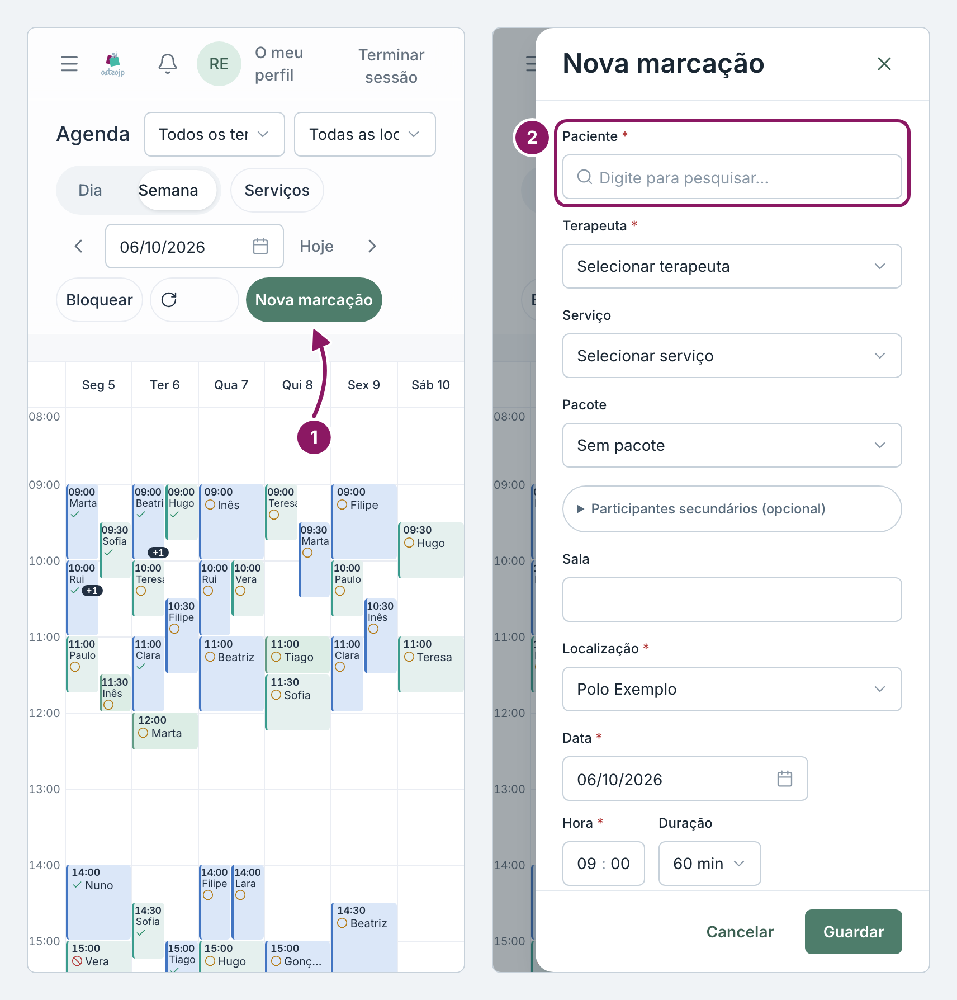
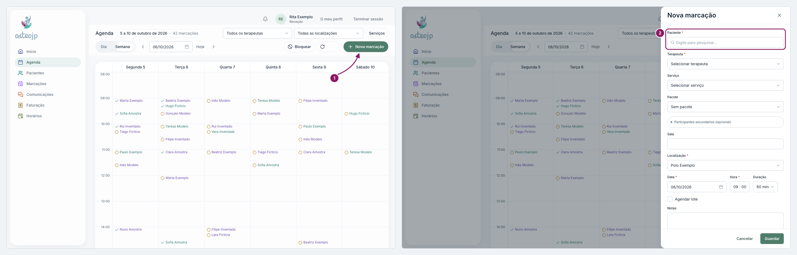

## Marcar consulta

1. Na **Agenda**, clique em **Nova marcação**. No computador, também pode clicar num espaço livre da grelha.
2. Em **Paciente**, escreva parte do nome e escolha o paciente na lista.
3. Confirme o **Terapeuta**, o **Serviço**, a **Data** e a **Hora**, e clique em **Guardar**.

::: terapeuta
O campo **Terapeuta** já traz o seu nome.
:::

A janela não cria pacientes: registe primeiro o paciente novo em **Pacientes**, **Novo paciente**. Se o paciente tiver sessões pagas por usar, a janela avisa com **Este utente tem sessões por usar**.

