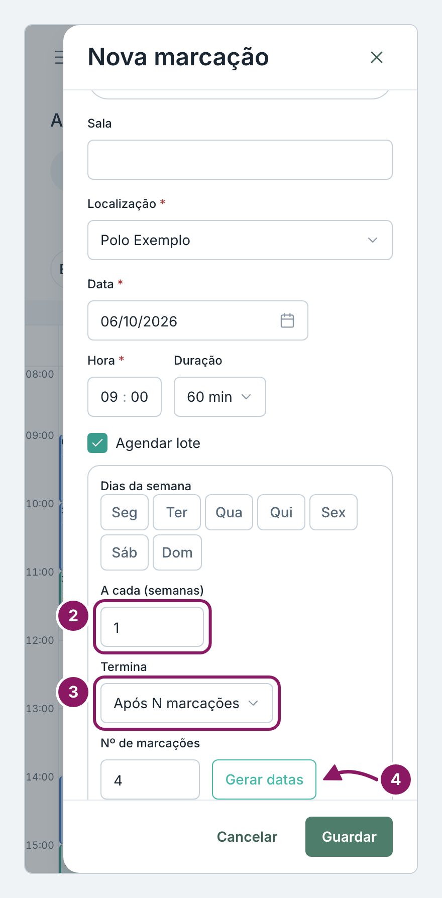
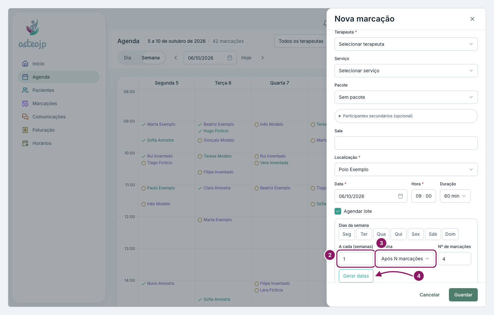

## Marcar em lote

1. Na janela **Nova marcação**, preencha o paciente, o terapeuta, a data e a hora da primeira sessão.
2. Marque **Agendar lote**, escolha os **Dias da semana**, o intervalo em **A cada (semanas)** e quando **Termina**.
3. Clique em **Gerar datas**, confira a lista e clique em **Guardar**.

Se aparecer **Algumas marcações não foram criadas**, marque à parte as sessões que ficaram por marcar.

As sessões de um pacote não usam **Agendar lote**: cada sessão é escolhida à mão, nunca gerada.

