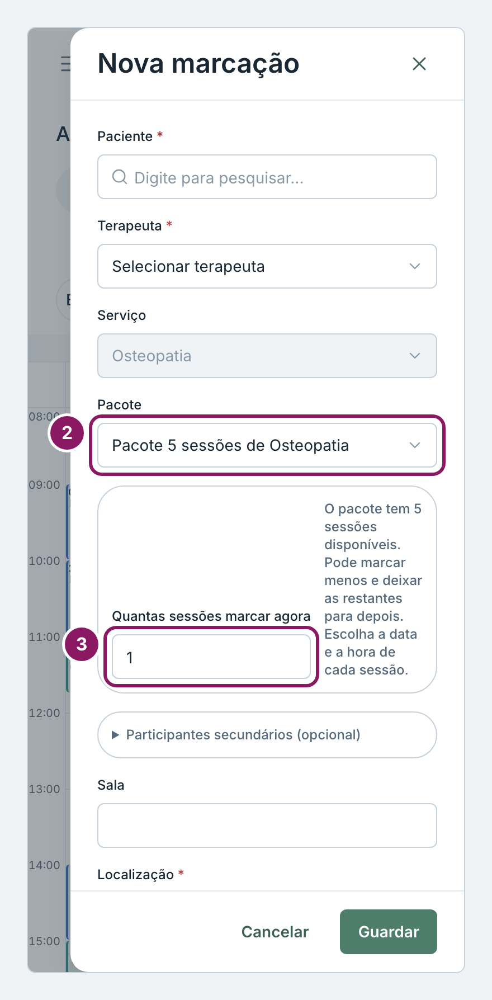
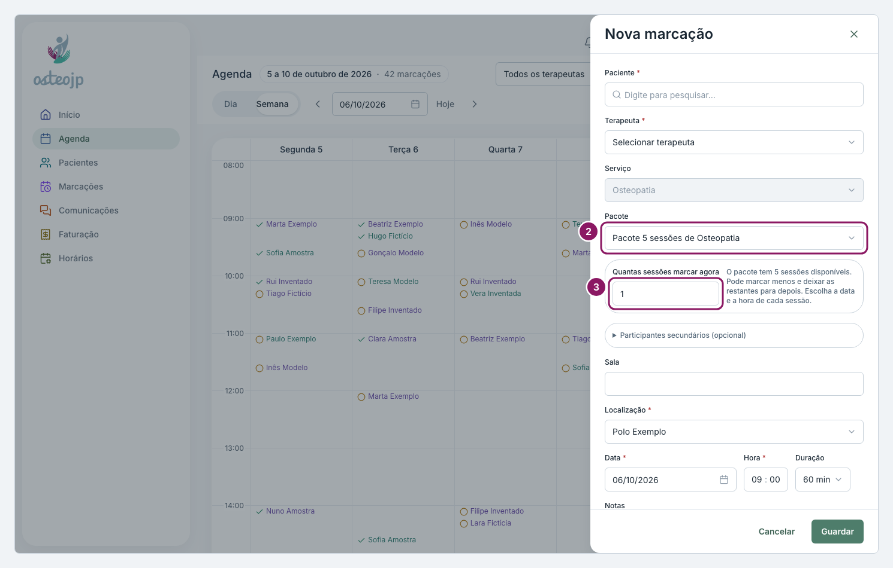

## Atribuir pacote

1. Clique em **Nova marcação** e escolha o **Paciente**, o **Terapeuta**, a **Data** e a **Hora** da primeira sessão.
2. Em **Pacote**, escolha o pacote. O **Serviço** passa a ser o serviço do pacote.
3. Em **Quantas sessões marcar agora**, indique quantas sessões marca já e escolha a data e a hora de cada uma.
4. Clique em **Guardar**.

Se o paciente já tem sessões por usar, a janela avisa com **Este utente tem sessões por usar**: clique em **Marcar com este pacote** no pacote certo.

