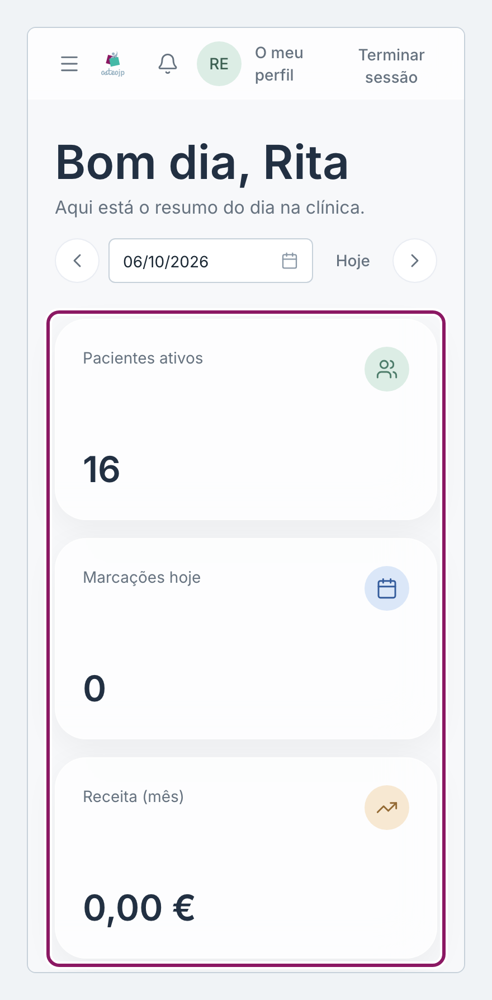
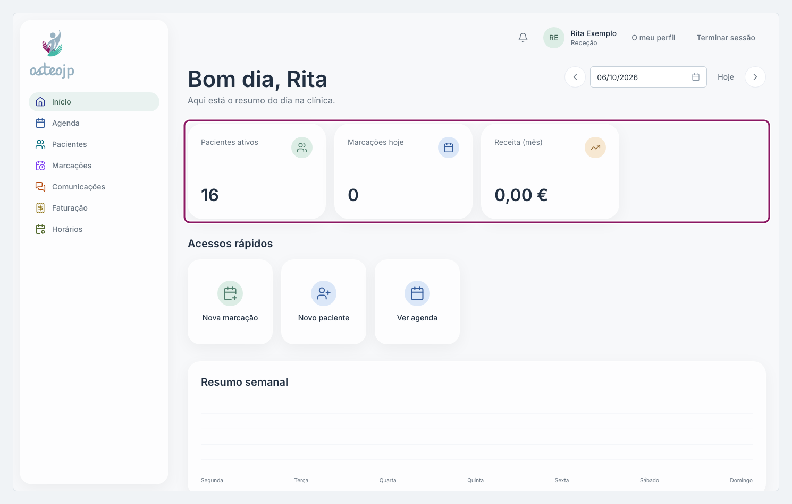

## O resumo do dia

O **Início** é a primeira página depois de entrar e mostra o resumo do dia.

* No topo ficam os números: **Pacientes ativos** e **Marcações hoje** (as do dia escolhido, sem contar as canceladas).
* **Acessos rápidos** abre as tarefas mais frequentes, como **Nova marcação**, **Novo paciente** e **Ver agenda**.
* O gráfico **Resumo semanal** mostra o número de marcações de cada dia desta semana.
* **Próximas marcações** lista a hora, o paciente e o terapeuta.
* **Notas rápidas** guarda uma nota sobre um paciente sem abrir a ficha.

::: terapeuta proprietario
**Novas fichas** conta os registos clínicos criados esta semana. Em **Acessos rápidos** estão também **Ficha Clínica** e **Iniciar consulta**.
:::

::: rececao proprietario
**Receita (mês)** soma as faturas emitidas e pagas no mês corrente, nos locais a que tem acesso.
:::

::: proprietario
Só o Proprietário, e só com mais de um local ativo, tem a lista **Todas as clínicas** por baixo do valor da receita: escolha um local para ver só a receita desse local.
:::

::: terapeuta
Pacientes visíveis: os números e as listas contam só as marcações em que participa ou que criou, as do equipamento partilhado da sua clínica e as de colegas com pacientes que já tratou ou que lhe foram atribuídos.
:::

