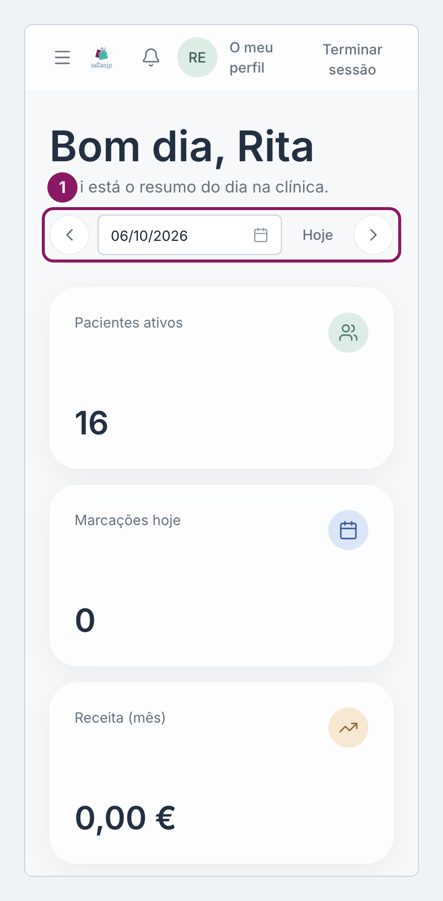
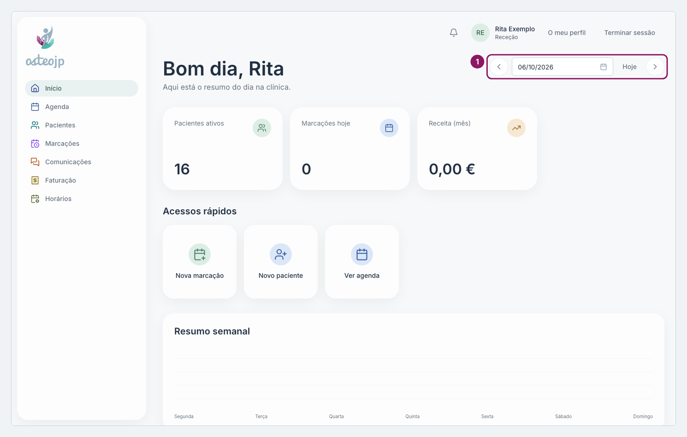

## Ver outro dia

1. Use as setas ao lado da data para ir ao dia anterior ou ao dia seguinte, ou clique na data e escolha outro dia no calendário.
2. Clique em **Hoje** para voltar ao dia atual.

Ao mudar de dia, só **Marcações hoje** e **Próximas marcações** mudam, e só cobrem hoje e os seis dias seguintes. Num dia passado ou mais distante aparecem vazias: para esses dias, use a **Agenda** ou as **Marcações**. No dia de hoje, **Próximas marcações** mostra apenas as marcações que ainda não começaram, no máximo seis.

O **Resumo semanal** mostra sempre a semana atual, seja qual for o dia escolhido.

::: rececao proprietario
**Receita (mês)** mostra sempre o mês atual, seja qual for o dia escolhido.
:::

::: proprietario
Se escolheu um local em **Todas as clínicas**, a escolha mantém-se ao mudar de dia.
:::

