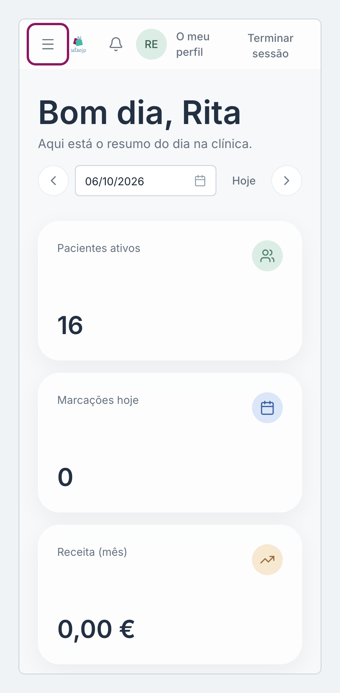
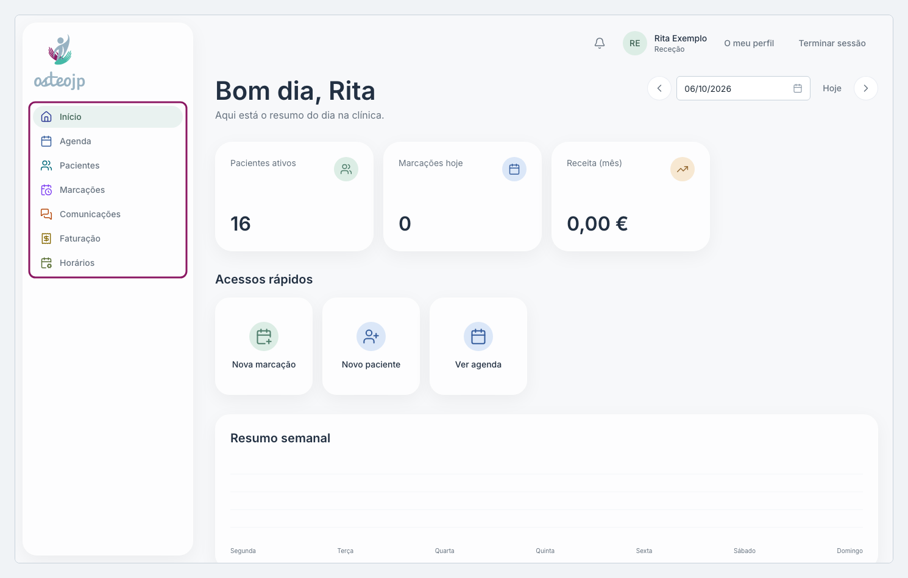

## O menu, o sino e o fim da sessão

O menu lateral leva a cada ecrã da plataforma. No telemóvel, o menu abre-se com o botão de três linhas no canto superior esquerdo.

::: rececao
O menu tem, por esta ordem, **Início**, **Agenda**, **Pacientes**, **Marcações**, **Comunicações**, **Faturação** e **Horários**.
:::

::: terapeuta
O menu tem, por esta ordem, **Início**, **Agenda**, **Pacientes**, **Marcações**, **Comunicações**, **Revisão Consulta** e **Horários**. Os ecrãs **Nova ficha clínica** e **Iniciar consulta** não estão no menu: abrem a partir dos **Acessos rápidos** do **Início**.
:::

::: proprietario
O menu tem, por esta ordem, **Início**, **Agenda**, **Pacientes**, **Marcações**, **Comunicações**, **Faturação**, **Revisão Consulta**, **Estatísticas**, **Horários** e **Administração**. Um administrador não tem **Revisão Consulta**.
:::

No topo de todas as páginas ficam o sino das **Notificações**, **O meu perfil** e **Terminar sessão**. O número no sino indica as notificações por ler; clique no sino para abrir a página **Notificações**.

Num computador partilhado, termine sempre o dia com **Terminar sessão**.

