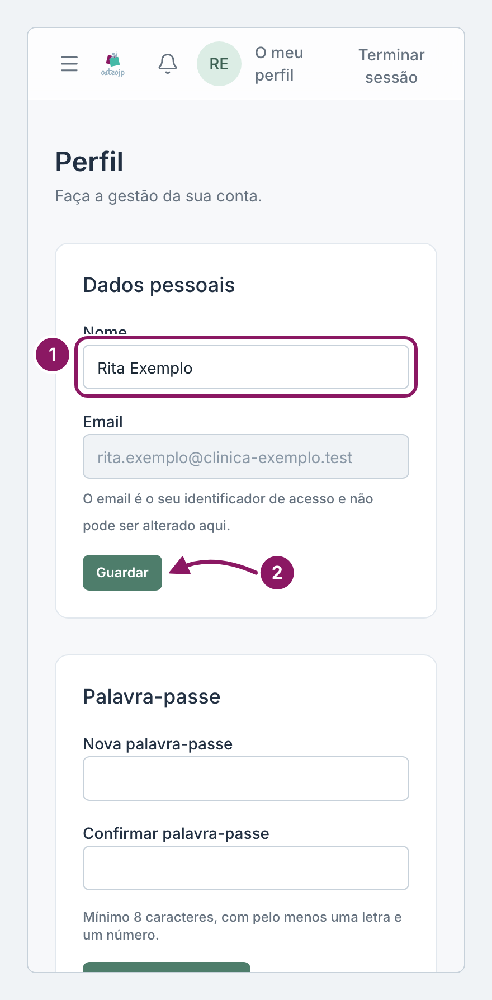
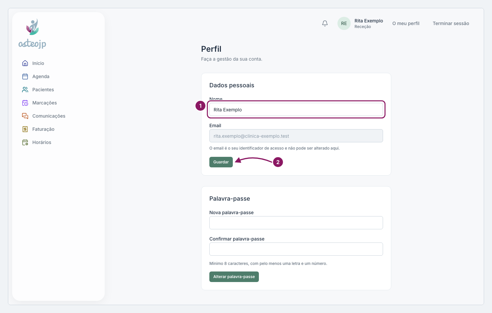

## Mudar o nome ou a palavra-passe

**O meu perfil**, no topo da página, abre o ecrã onde muda o nome e a palavra-passe da sua conta.

### Mudar o nome

1. Em **Dados pessoais**, corrija o **Nome**.
2. Clique em **Guardar**. Aparece **Nome atualizado.**

### Mudar a palavra-passe

1. Em **Palavra-passe**, escreva a nova em **Nova palavra-passe** e repita em **Confirmar palavra-passe**. Tem de ter pelo menos 8 caracteres, com pelo menos uma letra e um número.
2. Clique em **Alterar palavra-passe**. Aparece **Palavra-passe alterada.**

O **Email** é o seu identificador de acesso e não pode ser alterado aqui. A saudação do **Início** usa a primeira parte do email e não o nome da conta, por isso não muda quando altera o **Nome**.

::: proprietario
A palavra-passe da conta não é a palavra-passe de eliminação das Definições da Clínica.
:::

