# Receção

A receção gere o dia a dia da clínica na plataforma: marca, muda e cancela consultas, regista pacientes novos, contacta quem não voltou, gere os horários dos terapeutas e consulta as faturas. O menu lateral tem, por esta ordem, Início, Agenda, Pacientes, Marcações, Comunicações, Faturação e Horários; no telemóvel, o menu abre-se com o botão de três linhas no canto superior esquerdo. No topo de todas as páginas ficam o sino das Notificações, **O meu perfil** e **Terminar sessão**.

## Início

O Início é a primeira página depois de entrar e mostra o resumo do dia na clínica. No topo há três números: **Pacientes ativos** (com os novos desta semana), **Marcações hoje** (as do dia escolhido, sem contar as canceladas) e **Receita (mês)** (a soma das faturas emitidas e pagas no mês corrente, nos locais a que está atribuída). Por baixo ficam os **Acessos rápidos** (**Nova marcação** abre a Agenda de hoje em vista de dia, **Novo paciente** abre o registo e **Ver agenda** abre a Agenda), o gráfico **Resumo semanal** com o número de marcações de cada dia desta semana, a lista **Próximas marcações** (hora, paciente e terapeuta) e o quadro **Notas rápidas**.

### Como fazer: ver outro dia

1. Use as setas ao lado da data para ir ao dia anterior ou ao dia seguinte, ou clique na data e escolha outro dia no calendário.
2. Clique em **Hoje** para voltar ao dia atual.

### Como fazer: deixar uma nota rápida

1. Em **Notas rápidas**, no campo **Paciente**, escreva o nome e escolha o paciente.
2. Em **Consulta (opcional)**, deixe **Nota geral do paciente (sem consulta)** ou escolha uma das marcações do paciente.
3. Escreva a nota e clique em **Guardar**. Aparece **Notas guardadas** e a nota fica no separador **Notas** da ficha do paciente.

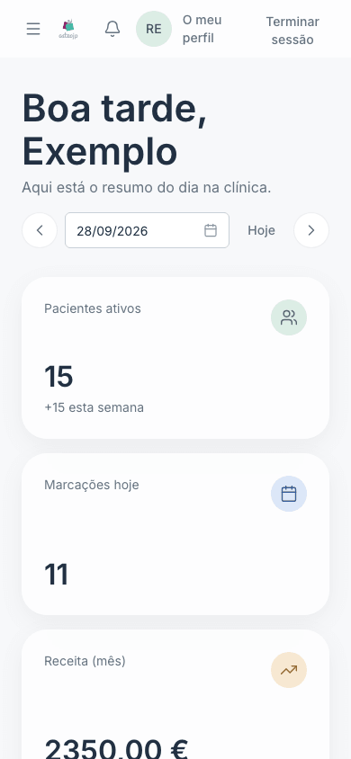
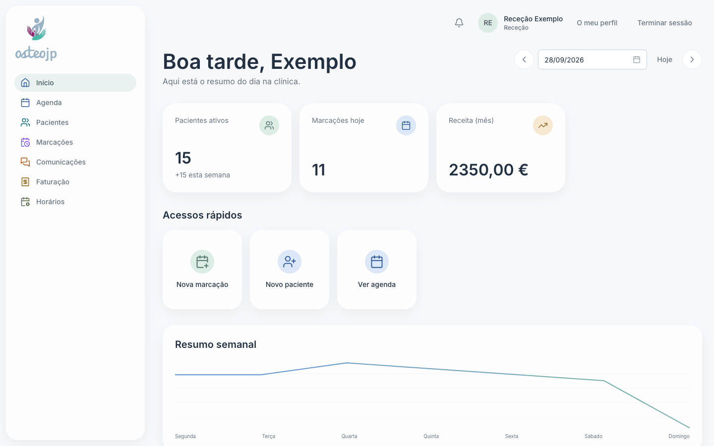

Nota: **Marcações hoje** e **Próximas marcações** só cobrem hoje e os seis dias seguintes. Num dia passado ou mais distante aparecem vazios, por isso use a Agenda ou as Marcações para esses dias. No dia de hoje, a lista mostra apenas as marcações que ainda não começaram, no máximo seis.

## Agenda

A Agenda mostra as marcações de todos os terapeutas, por dia ou por semana, e é aqui que se marca, muda e cancela. No computador, a semana vai de segunda a sábado; no telemóvel, a semana aparece compacta e inclui o domingo quando há marcações nesse dia (toque no nome de um dia para o abrir em vista de dia). Cada marcação mostra o nome do paciente com um pequeno símbolo do estado: círculo amarelo para Agendada, visto verde para Confirmada, círculo com visto para Concluída, círculo cortado vermelho para Cancelada e, para Falta, um símbolo vermelho de pessoa com o nome riscado. Na barra de cima estão **Dia** e **Semana**, a data com as setas e **Hoje**, os filtros **Todos os terapeutas**, **Todas as localizações** e **Serviços**, e os botões **Bloquear**, atualizar (uma seta circular com a hora do último carregamento) e **Nova marcação**.

### Como fazer: criar uma marcação

1. Clique em **Nova marcação**. No computador, também pode clicar num espaço livre da grelha: a janela abre já com esse dia e essa hora.
2. Em **Paciente**, escreva parte do nome e escolha o paciente na lista.
3. Escolha o **Terapeuta**. O **Serviço** fica preenchido com o serviço habitual desse terapeuta; mude se a consulta for de outro serviço.
4. Se trabalhar com mais de uma clínica, escolha a **Localização**.
5. Confirme **Data**, **Hora** e **Duração**. O quadro **Disponibilidade** mostra os **Horários livres** do terapeuta nesse dia; clique num deles para preencher a hora.
6. Se quiser, escreva uma nota em **Notas** e clique em **Guardar**.

### Como fazer: marcar várias sessões de uma vez

1. Na janela **Nova marcação**, preencha o paciente, o terapeuta, a data e a hora da primeira sessão.
2. Marque **Agendar lote**, escolha os **Dias da semana**, o intervalo em **A cada (semanas)** e, em **Termina**, **Após N marcações** ou **Numa data**.
3. Clique em **Gerar datas**, confira a lista e clique em **Guardar**. Se algum horário estiver ocupado, aparece **Algumas marcações não foram criadas**, com as que ficaram por marcar e, quando existe, a **Alternativa mais próxima**.

### Como fazer: mudar, confirmar ou cancelar uma marcação

1. Clique na marcação. Abre a janela **Editar marcação**.
2. Para mudar o dia, a hora ou o terapeuta, altere **Data**, **Hora**, **Duração** ou **Terapeuta** e clique em **Guardar**.
3. Para registar o que aconteceu, escolha em **Estado** a opção **Confirmada**, **Concluída**, **Falta** ou **Cancelada** e clique em **Guardar**.
4. Se a marcação fizer parte de uma série, escolha primeiro em **Aplicar a** se a alteração vale para **Esta marcação**, **Esta e seguintes** ou **Toda a série**.

### Como fazer: bloquear um horário

1. Clique em **Bloquear** (em ecrãs muito largos o botão diz **Bloquear horário**).
2. Escolha o **Terapeuta**, a **Data**, o **Início** e o **Fim**.
3. Escreva o motivo em **Nota (obrigatória)** e clique em **Bloquear**. O bloqueio aparece na grelha, com a nota, quando esse terapeuta está escolhido no filtro de terapeutas.

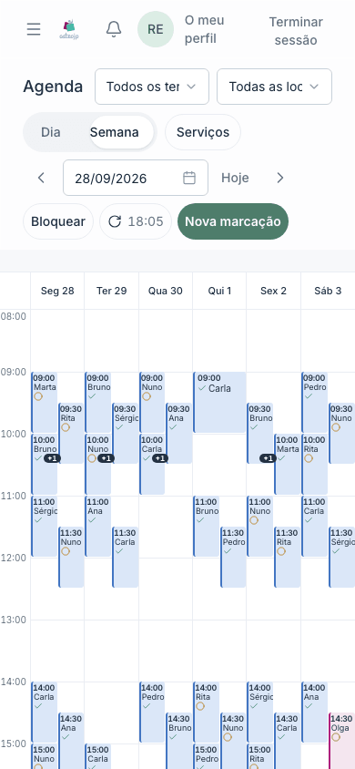
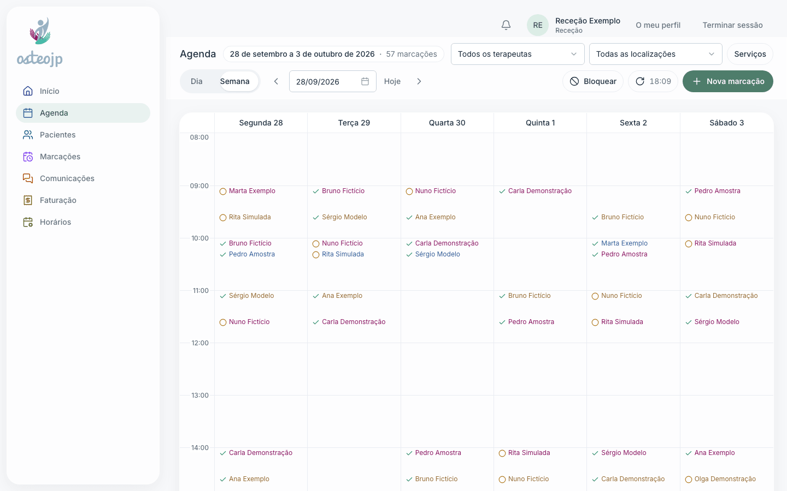

Nota: a janela de marcação não cria pacientes. Se a pessoa ainda não tem ficha, registe primeiro em **Pacientes**, **Novo paciente**, e depois marque a partir da ficha.

Nota: se houver conflito (terapeuta ou sala ocupados, ou uma ausência), aparece um aviso amarelo e o botão passa a **Guardar mesmo assim**; use esse botão só quando tiver a certeza. A plataforma recusa sempre duas marcações confirmadas do mesmo terapeuta à mesma hora, uma hora fora do horário definido para o terapeuta (altere primeiro em Horários) e uma hora em que a clínica está fechada.

Nota: a agenda não se atualiza sozinha. Uma marcação feita por um colega ou por um paciente no portal só aparece depois de clicar no botão da seta circular.

Nota: o estado que na agenda se chama **Agendada** aparece na janela como **Pendente**. Para repor uma marcação **Cancelada**, mude o **Estado** para **Pendente** ou **Confirmada** (só é aceite se o horário continuar livre); para corrigir **Concluída** ou **Falta**, use **Corrigir estado** na ficha do paciente. A receção não elimina marcações: cancela.

Nota: se aparecer **Este utente tem sessões por usar**, clique em **Marcar com este pacote** para descontar a sessão do pacote do paciente.

## Pacientes

A lista de Pacientes mostra todos os pacientes da clínica. No topo há quatro números: **Utentes**, **Vistos este mês**, **Com marcação futura** e **Na janela de recuperação**. A tabela tem as colunas **Nº**, **Paciente**, **NIF**, **Telemóvel**, **Clínica**, **Última consulta** e **Próxima**, onde a data aparece a verde quando o paciente já tem marcação futura. Clique no título **Paciente** ou **Última consulta** para ordenar, e use os botões de página no fundo para avançar.

### Como fazer: encontrar um paciente

1. No campo **Pesquisar**, escreva pelo menos três letras ou algarismos do nome, do NIF, do telemóvel ou do nº de utente. A lista atualiza sozinha.
2. Se precisar, escolha uma clínica em **Clínica** ou marque **Só com marcação futura**. **Limpar filtros** volta à lista completa.
3. Clique no nome do paciente para abrir a ficha.

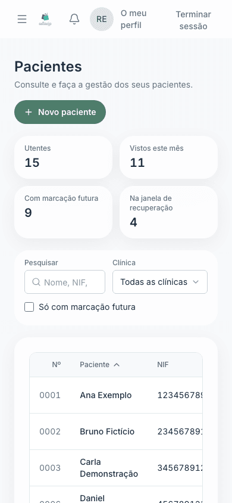
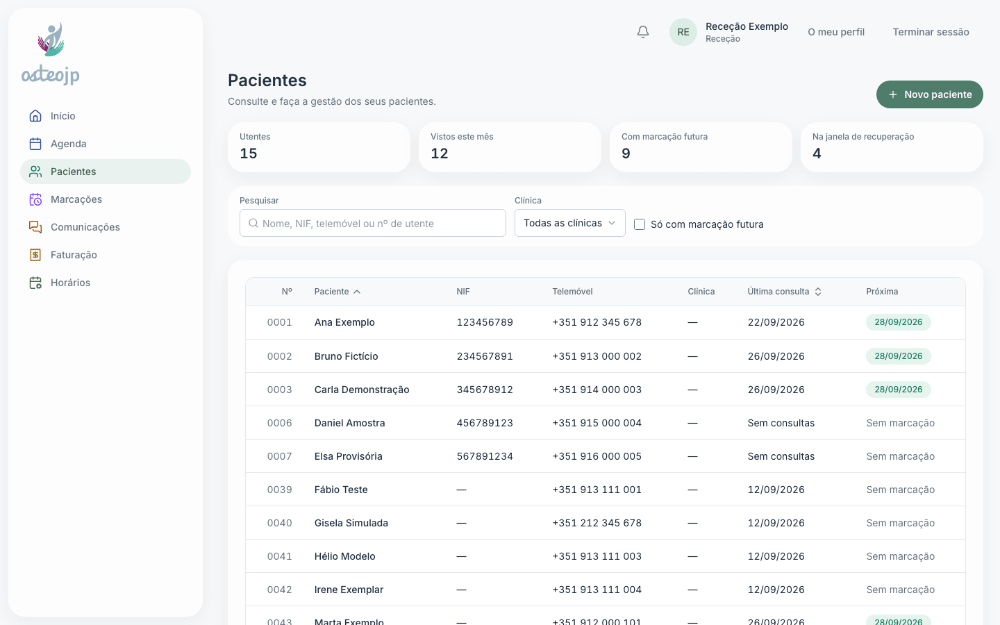

Nota: antes de registar um paciente novo, pesquise sempre pelo NIF ou pelo telemóvel. Assim evita criar uma segunda ficha para a mesma pessoa.

## Novo paciente

Este formulário serve para registar um paciente que vem pela primeira vez. Os campos com asterisco são obrigatórios: **Nome completo**, **NIF** e **Localização** (quando tem mais de uma clínica; com uma só, a clínica já aparece preenchida). Os restantes campos são opcionais, mas sem **Telemóvel** o paciente não pode receber lembretes por SMS.

### Como fazer: registar um paciente

1. Em **Pacientes**, clique em **Novo paciente**.
2. Preencha o **Nome completo**.
3. Escreva o **NIF** com 9 dígitos. Se o paciente não tiver NIF português, marque **Estrangeiro / sem NIF** e escreva o **Motivo**.
4. Preencha o **Telemóvel** e o **Email**. Por baixo do telemóvel aparece como o número vai ficar guardado.
5. Escolha a **Localização** e, se souber, a resposta a **Como nos conheceu?**. Para um seguro de saúde, clique em **Adicionar seguro** e preencha **Seguradora** e **Número**.
6. Em **Contraindicações Gerais**, marque o que se aplica: **Epilepsia**, **Gravidez**, **Portador de pacemaker** ou **Outra** (neste caso, escreva qual).
7. Clique em **Criar paciente**. Abre a ficha do paciente acabado de criar.

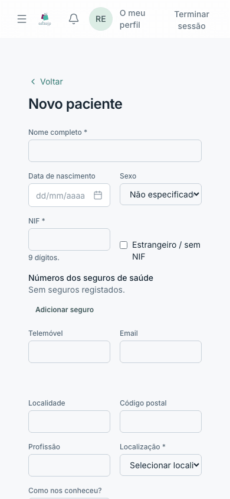
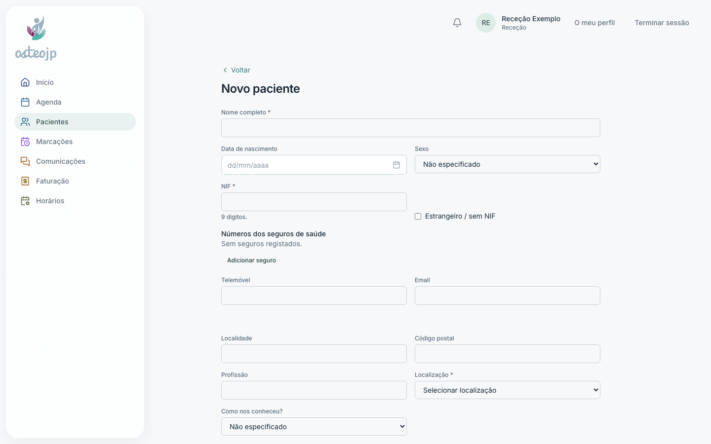

Nota: se o número for um telefone fixo ou um número estrangeiro, aparece um aviso por baixo do campo: os lembretes por SMS não chegam a esse número. Peça ao paciente um telemóvel português.

Nota: **Epilepsia**, **Gravidez** e **Portador de pacemaker** fazem aparecer um aviso na janela de marcação quando se escolhe um serviço sensível a contraindicações.

Nota: se o formulário mostrar a caixa **Consentimento RGPD assinado**, marque apenas quando o paciente tiver assinado. Enquanto não estiver registado, a ficha mostra **RGPD em falta**.

## Ficha do paciente

A ficha reúne tudo o que a receção precisa sobre um paciente: dados pessoais, marcações, notas, documentos e faturação. Os registos clínicos não aparecem para a receção. No topo estão o nome, o NIF, os contactos e o botão **Nova marcação**, que abre a Agenda com o paciente já escolhido; por cima dos separadores podem aparecer avisos, como **Ficha incompleta: falta o NIF.** ou um aviso de que o telefone guardado não recebe SMS. Os separadores são **Resumo** (com **Dados pessoais** e **Terapeutas atribuídos**), **Marcações** (histórico com filtros e pacotes), **Notas**, **Documentos** e **Faturação** (as faturas do paciente, só para consulta).

### Como fazer: atualizar dados e atribuir terapeutas

1. No separador **Resumo**, clique em **Editar dados**, corrija o que for preciso e clique em **Guardar**.
2. Em **Terapeutas atribuídos**, escolha o **Terapeuta** e clique em **Atribuir**. Para tirar um terapeuta atribuído à mão, clique em **Remover**.

### Como fazer: cancelar uma marcação ou corrigir um estado

1. No separador **Marcações**, na marcação certa, clique em **Gerir marcação**.
2. Para cancelar, clique em **Cancelar marcação**, escreva o **Motivo do cancelamento** se quiser e confirme em **Cancelar marcação**.
3. Se uma consulta ficou com o estado final errado (por exemplo **Falta** em vez de **Concluída**), escolha o estado certo em **Corrigir estado** e clique em **Corrigir**. A correção fica no registo de auditoria.

### Como fazer: imprimir uma declaração de presença

1. No separador **Documentos**, clique em **Imprimir Declaração de Presença**.
2. Em **Marcação**, escolha a consulta, ou escolha **Introdução manual** e preencha **Data**, **Hora de início** e **Hora de fim**. Na introdução manual, se trabalhar em mais do que um local, escolha também a **Localização**.
3. Confira o **NIF** e, se quiser, escreva **Observações (opcional)**.
4. Clique em **Gerar**. A declaração abre num novo separador do navegador, pronta a imprimir, com o carimbo do local da consulta.

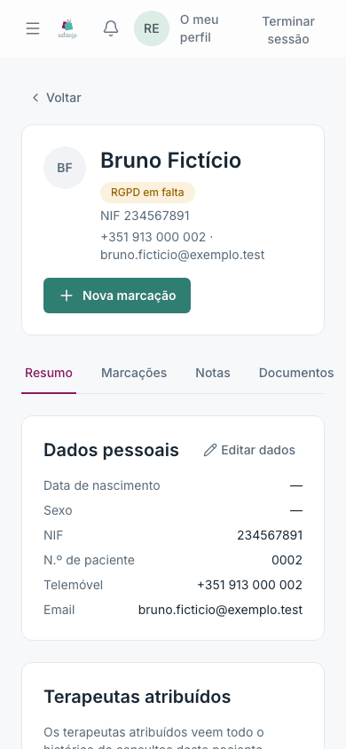
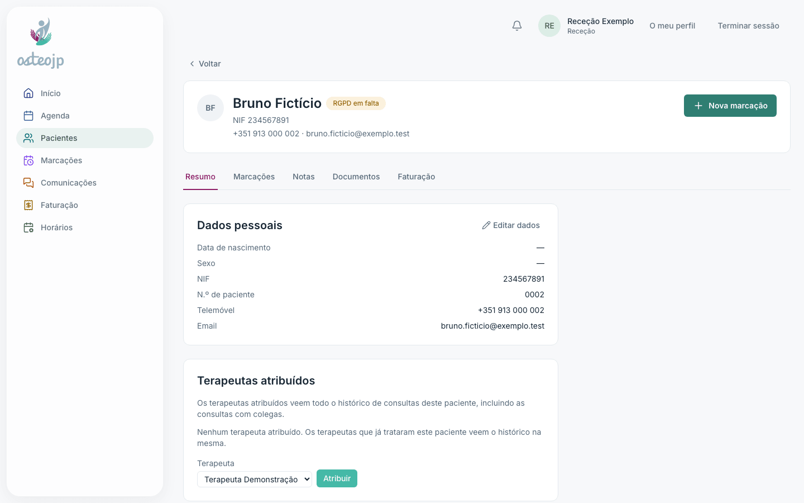

Nota: um terapeuta atribuído passa a ver todo o histórico de consultas do paciente, incluindo as consultas com colegas, por isso atribua apenas quem o vai acompanhar. As entradas acrescentadas automaticamente a partir de uma marcação não podem ser removidas.

Nota: em **Documentos**, **Carregar documento** aceita PDF, imagem ou documento Word até 50 MB. Ao eliminar um documento, o motivo é obrigatório e o ficheiro não é apagado: deixa só de aparecer na ficha.

Nota: sem NIF (nem **Estrangeiro / sem NIF**), a declaração de presença não pode ser emitida. Corrija primeiro em **Editar dados**.

Nota: num local que ainda não tem carimbo, a declaração de presença não é emitida e aparece o aviso «Declaração indisponível neste local: falta o carimbo. Contacte a administração.».

## Marcações

O ecrã Marcações mostra as mesmas marcações da agenda em forma de lista, agrupadas por dia. Por omissão mostra a semana atual. Cada linha tem a hora, o paciente, quem criou a marcação, o estado, o aviso **Sem nota** quando uma consulta concluída ainda não tem nota, o serviço, a clínica e o terapeuta, e os botões **Notas** e **Abrir marcação**. Os filtros são as duas datas (início **a** fim), **Pesquisar por paciente**, **Todas as localizações**, **Todos os estados**, **Todos os serviços** e **Todos os terapeutas**.

### Como fazer: encontrar as marcações de um paciente

1. Escolha a data de início e a data de fim.
2. Escreva o nome em **Pesquisar por paciente**. Se precisar, filtre também por estado (**Agendada**, **Confirmada**, **Concluída**, **Cancelada** ou **Falta**), serviço ou terapeuta.
3. Clique em **Abrir marcação** para ver ou alterar a marcação. Abre a mesma janela **Editar marcação** da agenda.

### Como fazer: deixar uma nota numa marcação

1. Na linha da marcação, clique em **Notas**.
2. Clique em **Adicionar nota**, escreva a nota e clique outra vez em **Adicionar nota**.

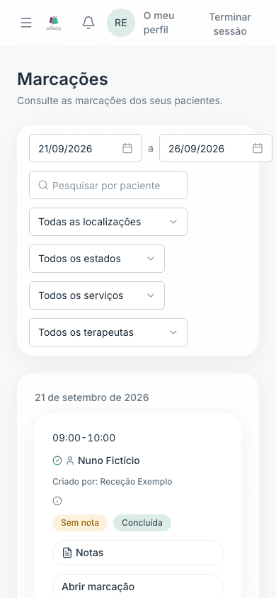
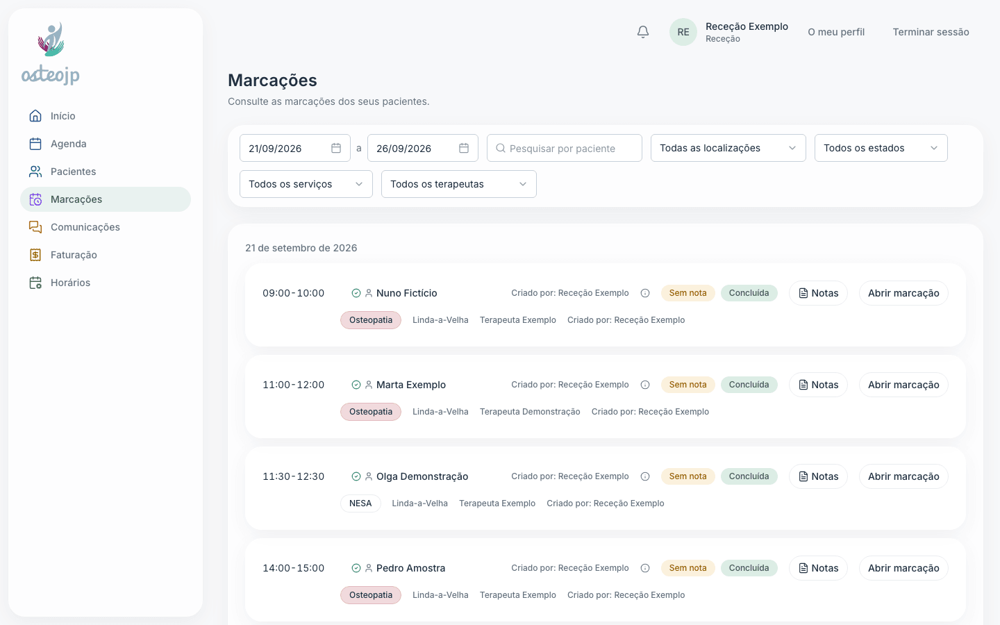

Nota: as notas de uma marcação são o canal entre a receção e o terapeuta. Cada nota fica com o autor e a hora, e nenhuma nota apaga a anterior.

Nota: o intervalo de datas tem no máximo 92 dias. Se escolher um intervalo maior, a lista mostra apenas os primeiros 92 dias.

## Comunicações: Recuperação

**Comunicações** tem três separadores: **Recuperação**, **Lembretes SMS** e **Respostas SMS**, e abre sempre em **Recuperação**. O separador **Recuperação** mostra a lista **Recuperação de utentes**: pacientes que estiveram em tratamento recentemente e não têm marcação futura. A lista mostra quem esteve na clínica desde o início do mês passado até há 7 dias, a começar pelos que estão há mais tempo sem voltar. Cada paciente aparece com a **Última consulta**, o **Terapeuta**, o telefone, a última nota (quando existe) e os botões **WhatsApp**, **SMS**, **Email**, **Adiar**, **Abrir ficha** e, quando o paciente tem notas, **Notas**. Mais abaixo fica a secção **Adiados**.

### Como fazer: contactar um paciente

1. Clique em **WhatsApp**, **SMS** ou **Email**. A mensagem abre já escrita na aplicação do seu telemóvel ou computador.
2. Reveja a mensagem, altere o que quiser e envie nessa aplicação.
3. De volta à lista, o paciente fica com a indicação de quem o contactou e quando.

### Como fazer: adiar um paciente

1. Clique em **Adiar**.
2. Escolha **2 semanas**, **4 semanas**, **8 semanas** ou **12 semanas**. O paciente sai da lista até essa data e volta sozinho quando a data passar.
3. Para o trazer de volta mais cedo, em **Adiados** clique em **Trazer de volta**.

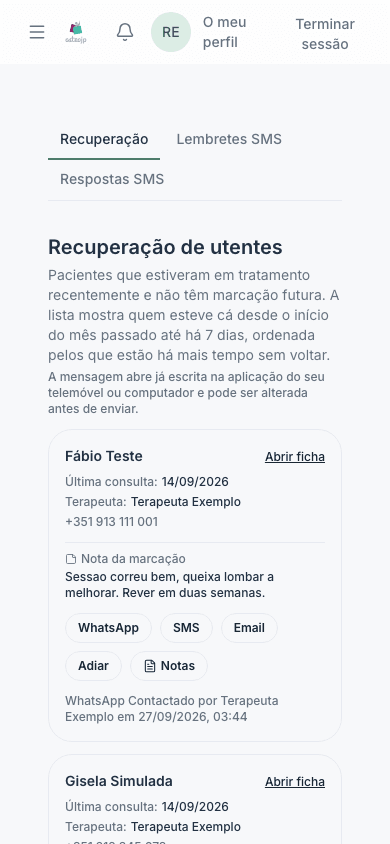
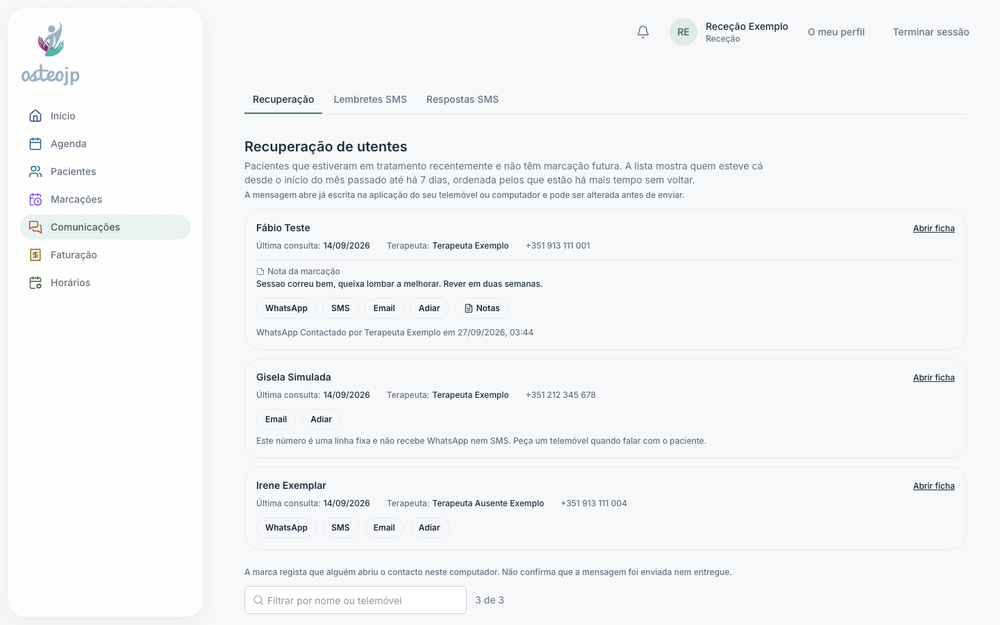

Nota: a indicação de contacto regista apenas que alguém abriu o contacto nesse computador. Não confirma que a mensagem foi enviada nem entregue.

Nota: quando o número é um telefone fixo, não aparecem os botões **WhatsApp** e **SMS**. Ligue ao paciente e peça um telemóvel. Para encontrar alguém depressa, use **Filtrar por nome ou telemóvel**.

## Comunicações: Lembretes SMS

O separador **Lembretes SMS** mostra cada tentativa de enviar um SMS a um paciente: lembretes, confirmações de marcação e mensagens depois da consulta ou de uma falta, a mais recente primeiro. As colunas são **Paciente**, **Marcação**, **Canal**, **Tipo**, **Previsto para (calculado)**, **Enviado**, **Estado**, **Código de erro** e **Telefone atual do paciente**. O **Estado** pode ser **Enviado**, **Entregue**, **Não entregue**, **Falhou no fornecedor** ou **Não enviado** com o motivo.

### Como fazer: ver os lembretes que falharam

1. Clique em **Só falhas**. A lista passa a mostrar apenas os SMS **Não entregue** e **Falhou no fornecedor**.
2. Para cada linha, veja a marcação e o **Telefone atual do paciente**, e ligue ao paciente para confirmar a consulta.
3. Clique em **Todos** para voltar à lista completa.

### Como fazer: ver os SMS de um paciente

1. Escreva o nome no campo **Nome do paciente**. O contador à direita mostra quantos envios correspondem.

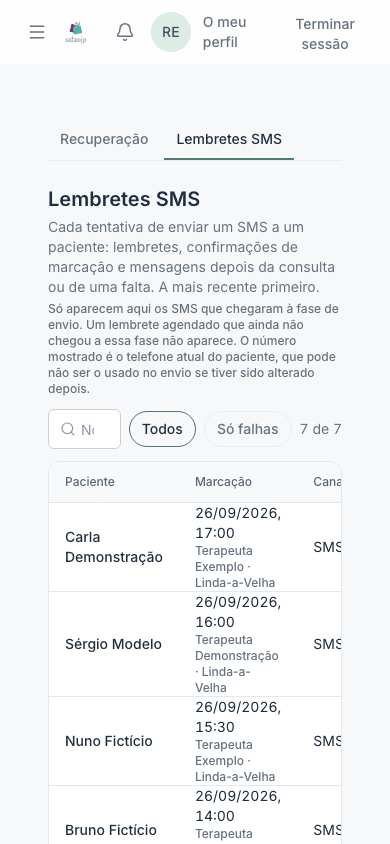
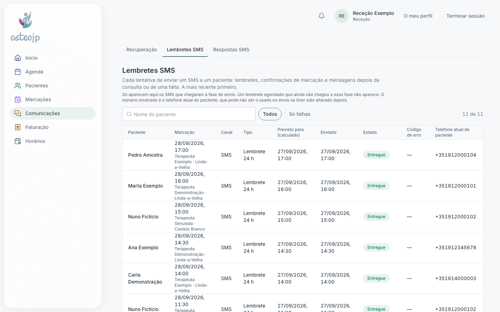

Nota: este ecrã só mostra o que aconteceu e não reenvia mensagens. Um lembrete agendado que ainda não chegou à fase de envio não aparece, e o telefone mostrado é o atual, que pode não ser o do envio se foi alterado depois.

## Comunicações: Respostas SMS

Nesta versão, a clínica ainda não recebe respostas dos pacientes por SMS, por isso o separador **Respostas SMS** mostra apenas o aviso **Respostas por rever indisponível**. O resto desta secção, incluindo as capturas, mostra o ecrã depois de a receção de respostas ser ativada.

O separador **Respostas SMS** abre o ecrã **Respostas por rever**: as respostas de pacientes aos SMS da clínica que não correspondem a uma palavra-chave e que, por isso, alguém da receção tem de ler. Cada resposta mostra o paciente (ou **Paciente não identificado**), a data em que chegou (**Recebida em**), a consulta a que foi associada (ou **Sem consulta associada**), o texto da mensagem e os botões **Marcar como confirmada**, **Marcar como cancelada** e **Marcar como lida**.

### Como fazer: tratar uma resposta

1. Leia a mensagem e veja a consulta associada.
2. Se o paciente confirma, clique em **Marcar como confirmada**; se desmarca, clique em **Marcar como cancelada**. A consulta passa a **Confirmada** ou **Cancelada** e a resposta fica tratada.
3. Se a mensagem não pede nenhuma alteração, clique em **Marcar como lida**. A resposta fica tratada e a consulta não muda.

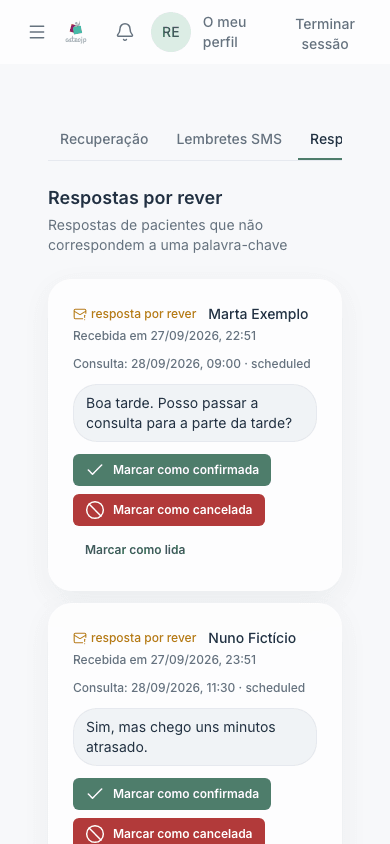
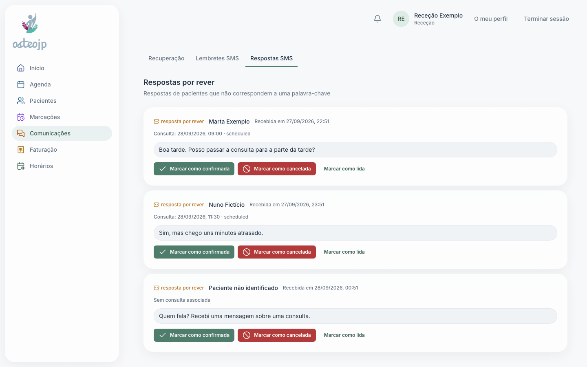

Nota: **Marcar como confirmada** e **Marcar como cancelada** só mudam uma consulta que ainda está **Agendada**. Se a consulta já estiver noutro estado, ou se não houver consulta associada, a resposta fica tratada e aparece **Resposta arquivada. Nenhuma consulta foi alterada.** Se já houver outra consulta confirmada à mesma hora com o mesmo terapeuta, a confirmação é recusada e a resposta continua por tratar.

## Faturação

A Faturação mostra as faturas da clínica num período. Por omissão, mostra do dia 1 do mês atual até hoje. A tabela tem as colunas **Nº**, **Paciente**, **Data**, **Valor** e **Estado** (**Rascunho**, **Emitida**, **Paga** ou **Anulada**), e um botão **Abrir** em cada linha. No fundo da tabela aparecem os totais **Pago** e **Pendente** (as faturas emitidas e ainda não pagas).

### Como fazer: consultar as faturas de um período

1. Escolha a data de início e a data de fim nos dois campos de data.
2. Se precisar, escolha um estado em **Todos os estados** e uma clínica em **Todas as localizações**.
3. Clique em **Abrir** numa linha para ver o número, o paciente, a data, o valor e o estado da fatura. Clique em **Fechar** para voltar.

### Como fazer: ver as faturas de um paciente

1. Abra a ficha do paciente.
2. Clique no separador **Faturação**.

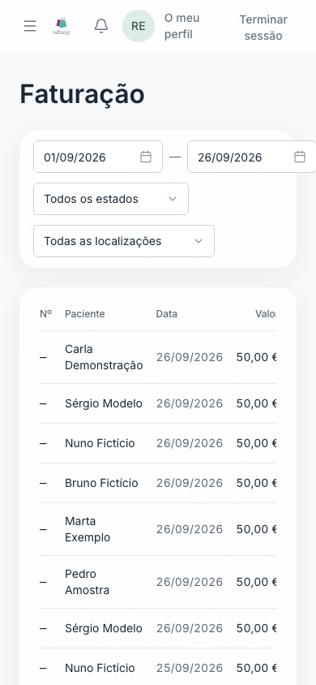
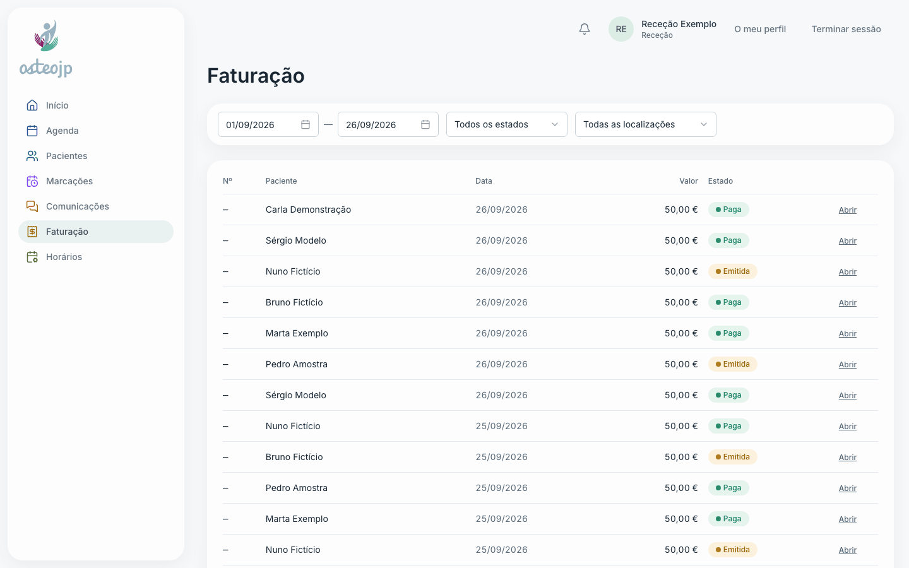

Nota: nesta versão, a Faturação serve só para consultar: não há botão nem formulário para emitir faturas.

## Horários

O ecrã **Horários da equipa** serve para definir os horários de trabalho e as ausências dos terapeutas da sua unidade. No topo está o **Inspetor de horários**, que mostra, dia a dia, o horário que a agenda usa para um terapeuta e porquê: **Base** (o horário semanal habitual), **Dia definido**, **Exceção** (uma ausência), **Não trabalha** ou **Bloqueado**. Por baixo há um cartão por terapeuta, com **Ver no inspetor**, **Definir semanas alternadas**, **Definir dia a dia**, **Bloquear horário** e **Editar horários**.

### Como fazer: ver onde e quando um terapeuta trabalha

1. No **Inspetor de horários**, escolha o **Terapeuta** (ou clique em **Ver no inspetor** no cartão dele).
2. Em **Período**, escolha **Esta semana**, **Duas semanas** ou **Este mês**.

### Como fazer: alterar o horário semanal habitual

1. No cartão do terapeuta, clique em **Editar horários**.
2. Para cada dia, marque **Trabalha** e escolha **Início**, **Fim** e **Local**. Se o dia tiver uma pausa, clique em **Adicionar 2.º período**.
3. Clique em **Guardar**. Aparece **Horário guardado.**

### Como fazer: registar uma ausência

1. No cartão do terapeuta, clique em **Bloquear horário**. A janela mostra os bloqueios já marcados e, por baixo, **Adicionar bloqueio**.
2. Em **Tipo**, escolha **Bloqueio pontual** (umas horas num dia), **Bloqueio repetido** (o mesmo bloqueio em várias semanas) ou **Ausência prolongada** (dias inteiros, de uma data a outra).
3. Preencha as datas (e as horas, quando o tipo as pede) e escreva a **Nota**, que é obrigatória.
4. Clique em **Guardar**. Numa ausência prolongada aparece primeiro um aviso; se estiver certo, clique em **Bloquear na mesma**.

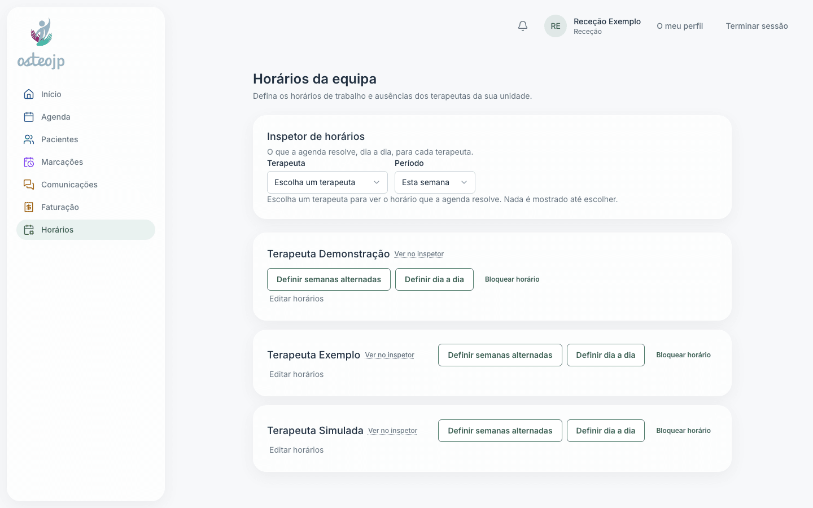

Nota: uma ausência prolongada tira o terapeuta da agenda em todas as clínicas: ninguém consegue marcar com ele, nem a receção nem os pacientes no portal. As marcações que já existem continuam na agenda e não são canceladas, por isso reveja essas marcações. Se o terapeuta vai apenas atender noutra clínica, não bloqueie: use **Definir dia a dia**.

Nota: **Definir semanas alternadas** serve para quem muda de clínica de semana a semana e **Definir dia a dia** para períodos sem padrão; fora das datas escolhidas vale o horário semanal habitual.

## Notificações

As Notificações abrem-se com o sino no topo da página; o número no sino indica as notificações por ler. A página junta, por esta ordem: **Pedidos de remarcação**, **Gravações que não foram processadas**, **Pedidos de marcação** (feitos pelos pacientes no portal), **Pedidos de novos clientes**, **Pacientes sem SMS possível** e, no fim, **Notificações**, a lista das alterações feitas pelos pacientes (novas marcações, pedidos de marcação, cancelamentos, remarcações e confirmações), cada uma com **Ver marcação**.

### Como fazer: confirmar um pedido de marcação do portal

1. Em **Pedidos de marcação**, veja o paciente e o horário pedido. O horário só fica reservado depois de confirmado.
2. Clique em **Confirmar**. Se o horário já não estiver livre, aparece um aviso: contacte o paciente e proponha outro horário.
3. Para ver a marcação antes de decidir, clique em **Abrir na agenda**. A marcação abre no ecrã Marcações.

### Como fazer: tratar um pedido de novo cliente

1. Em **Pedidos de novos clientes**, veja o nome, o **Telemóvel**, a **Preferência** e, se existir, clique em **Ver questionário clínico**.
2. Clique em **Criar paciente e marcar**. Se o número já existir numa ficha, a plataforma pergunta **Quem é esta pessoa?**: confirme com a pessoa e escolha **É este paciente** ou **É alguém novo, criar ficha**.
3. Abre a Agenda com a janela de nova marcação e o paciente já escolhido. Escolha o terapeuta e a hora e clique em **Guardar**.
4. Se um pedido ficar convertido mas sem marcação, clique em **Dispensar** para o tirar da lista.

### Como fazer: tratar um pedido de remarcação

1. Remarque a consulta na Agenda, como habitualmente.
2. Em **Pedidos de remarcação**, clique em **Marcar como tratado**.

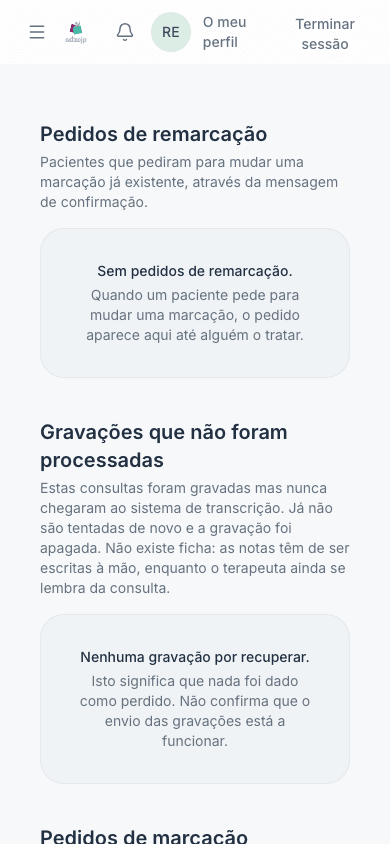
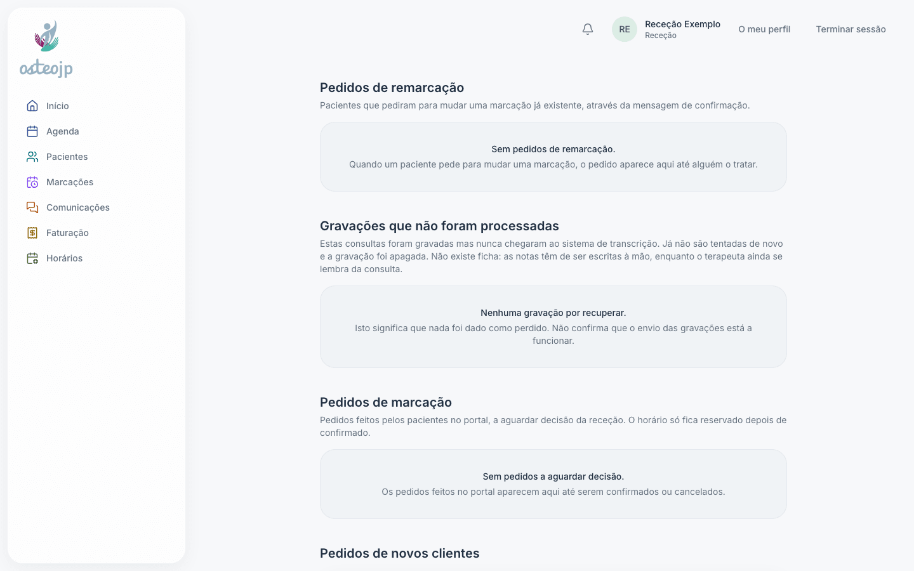

Nota: **Marcar como tratado** não altera a marcação; mude sempre a marcação na Agenda primeiro. Para limpar o número no sino, clique em **Marcar todas como lidas**.

Nota: em **Pacientes sem SMS possível** estão pacientes com marcação próxima e um número fixo, que não vão receber o lembrete: ligue, peça um telemóvel e atualize a ficha com **Abrir ficha**. Em **Gravações que não foram processadas** estão consultas gravadas que nunca chegaram à transcrição: avise o terapeuta indicado, que tem de escrever as notas à mão.

## O meu perfil

O perfil abre-se com **O meu perfil** no topo da página e serve para mudar o nome e a palavra-passe da sua própria conta. O **Email** aparece, mas não pode ser alterado aqui, porque é o seu identificador de acesso.

### Como fazer: mudar o nome

1. Em **Dados pessoais**, corrija o **Nome**.
2. Clique em **Guardar**. Aparece **Nome atualizado.**

### Como fazer: mudar a palavra-passe

1. Em **Palavra-passe**, escreva a nova em **Nova palavra-passe** e repita em **Confirmar palavra-passe**. Tem de ter pelo menos 8 caracteres, com pelo menos uma letra e um número.
2. Clique em **Alterar palavra-passe**. Aparece **Palavra-passe alterada.**

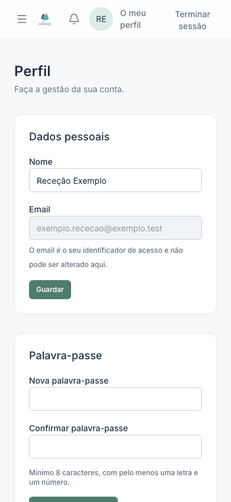
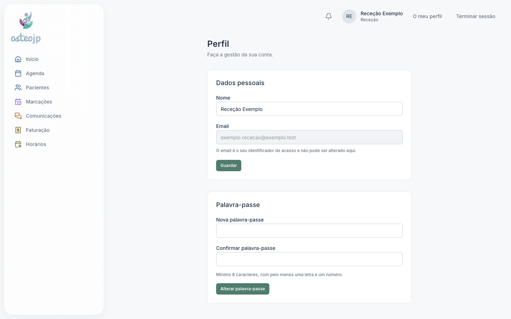

Nota: num computador partilhado, termine sempre o dia com **Terminar sessão**, no topo da página.
