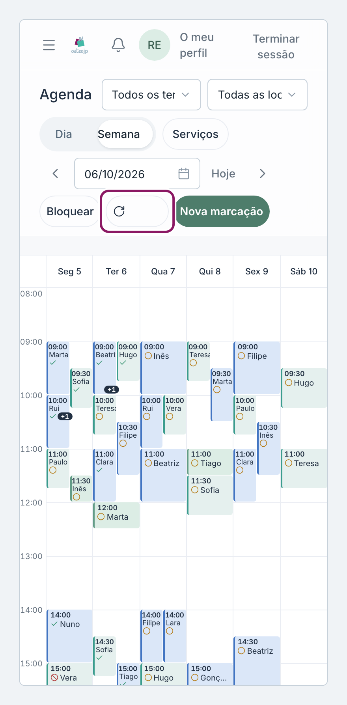
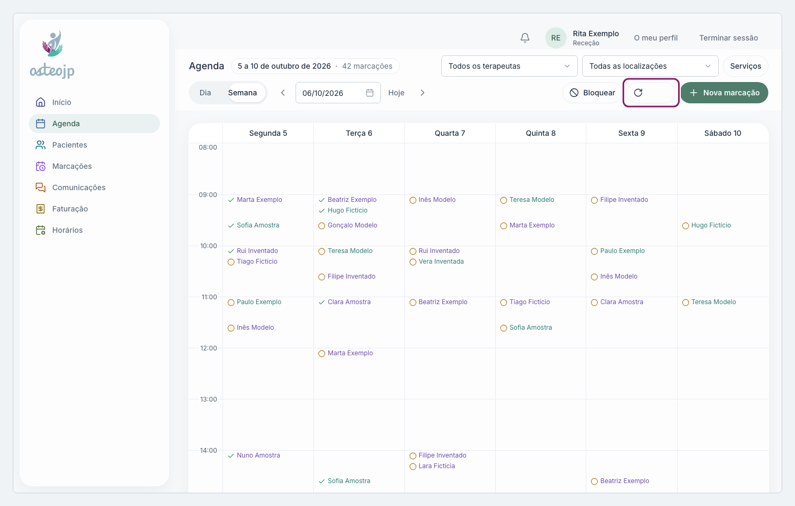

## Ler a agenda

A **Agenda** mostra as marcações por **Dia** ou por **Semana**. Use as setas e a data para mudar de período, e **Hoje** para voltar ao dia atual. No computador, a semana vai de segunda a sábado; no telemóvel, na vista **Semana**, toque no nome de um dia para abrir esse dia.

::: rececao proprietario
Mostra as marcações de toda a equipa, nos locais a que tem acesso. Filtre com **Todos os terapeutas**, **Todas as localizações** e **Serviços**.
:::

::: terapeuta
Mostra as marcações em que é o terapeuta principal (campo **Terapeuta**) e, se a sua clínica tiver um equipamento partilhado, as desse equipamento. Filtre com **Serviços**. As marcações em que é **Terapeuta 2** não aparecem aqui: estão no separador **Marcações** da ficha do paciente.
:::

Cada marcação mostra o nome do paciente e um símbolo do estado:

* círculo amarelo: Agendada;
* visto verde: Confirmada;
* círculo com visto: Concluída;
* círculo cortado vermelho: Cancelada;
* pessoa vermelha com o nome riscado: Falta.

A agenda não se atualiza sozinha: uma marcação feita por um colega ou no portal só aparece depois de clicar na seta circular de atualizar.

