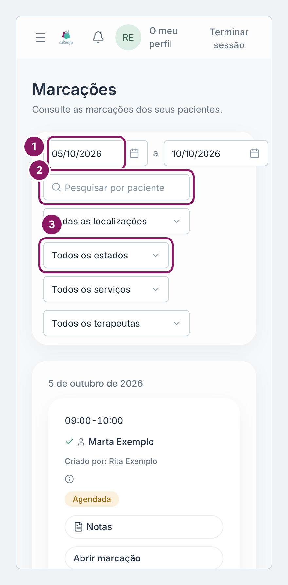
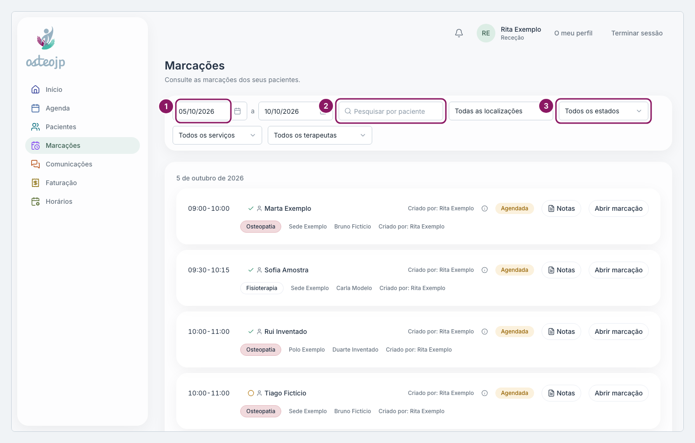

## Encontrar marcações na lista

O ecrã **Marcações** mostra as marcações em lista, agrupadas por dia, e abre na semana atual. Cada linha tem a hora, o paciente, o serviço, a clínica, o terapeuta, quem criou a marcação e o estado.

1. Escolha a data de início e a data de fim.
2. Escreva o nome em **Pesquisar por paciente**.
3. Se precisar, reduza a lista com **Todos os estados** e **Todos os serviços**.
4. Clique em **Abrir marcação**. Abre a mesma janela **Editar marcação** da agenda.

::: rececao proprietario
Também pode filtrar por **Todas as localizações** e **Todos os terapeutas**.
:::

::: terapeuta
A lista mostra só as marcações em que é o terapeuta principal. As marcações em que é **Terapeuta 2** e as dos seus pacientes com colegas estão no separador **Marcações** da ficha do paciente.
:::

O período tem no máximo 92 dias. Se escolher um período maior, a lista termina ao fim de 92 dias a contar da data de início.

