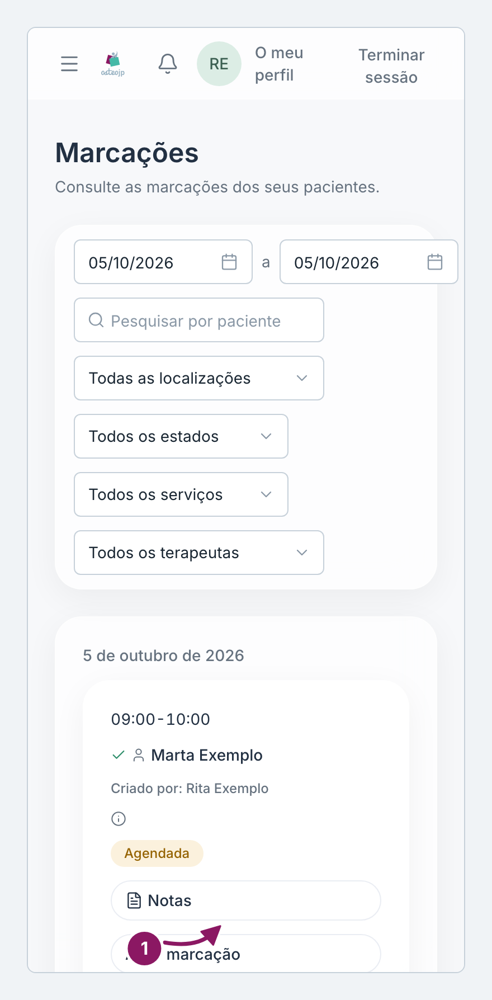
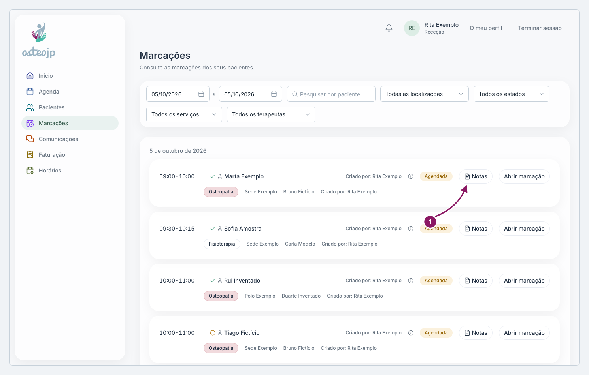

## Deixar uma nota numa marcação

1. Em **Marcações**, na linha da marcação, clique em **Notas**.
2. Clique em **Adicionar nota**, escreva a nota e clique outra vez em **Adicionar nota**.

As notas de uma marcação são o canal entre a receção e o terapeuta. Cada nota fica com o autor e a hora, e nenhuma nota apaga a anterior.

Uma consulta concluída que ainda não tem nota mostra a etiqueta **Sem nota** na lista.

