# Terapeuta

Como terapeuta, usa a plataforma para gerir a sua agenda, consultar e atualizar as fichas dos seus pacientes, escrever e assinar registos clínicos, gravar consultas e rever os registos que resultam dessas gravações. O menu lateral tem, por esta ordem, **Início**, **Agenda**, **Pacientes**, **Marcações**, **Comunicações**, **Revisão Consulta** e **Horários**; no telemóvel, o menu abre-se com o botão de três linhas no canto superior esquerdo. No topo de cada página ficam o sino das notificações, o seu nome, **O meu perfil** e **Terminar sessão**; os ecrãs **Nova ficha clínica** e **Iniciar consulta** não estão no menu e abrem a partir do **Início** (a **Nova ficha clínica** também abre a partir da ficha do paciente).

## Início

O **Início** é a página que se abre depois de entrar. Mostra três números no topo (**Pacientes ativos**, **Marcações hoje** e **Novas fichas**), os **Acessos rápidos**, o gráfico **Resumo semanal** com o número de marcações de cada dia da semana atual, a lista **Próximas marcações** e o quadro **Notas rápidas**. **Novas fichas** conta os registos clínicos criados esta semana.

Pacientes visíveis: os números e as listas contam apenas o que a sua conta pode ver. **Marcações hoje** e **Próximas marcações** incluem as marcações em que participa ou que criou, as do equipamento partilhado da sua clínica e, nas clínicas onde trabalha, as marcações de colegas com pacientes que já tratou ou que lhe foram atribuídos. Por isso, cada linha de **Próximas marcações** mostra também o nome do terapeuta.

### Como fazer

Ver o resumo de outro dia:

1. Carregue nas setas ao lado da data para andar um dia para trás ou para a frente, ou escolha o dia no campo de data.
2. Carregue em **Hoje** para voltar ao dia de hoje.

Escrever uma nota rápida sobre um paciente:

1. Em **Notas rápidas**, escreva parte do nome no campo **Paciente** e escolha o paciente na lista.
2. Se a nota for sobre uma consulta concreta, escolha essa consulta em **Consulta (opcional)**. Se não for, deixe **Nota geral do paciente (sem consulta)**.
3. Escreva a nota e carregue em **Guardar**. A mensagem **Notas guardadas** confirma que ficou guardada, e a nota passa a aparecer no separador **Notas** da ficha do paciente.

Começar uma tarefa frequente: em **Acessos rápidos**, carregue em **Nova marcação**, **Novo paciente**, **Ficha Clínica**, **Ver agenda** ou **Iniciar consulta**.

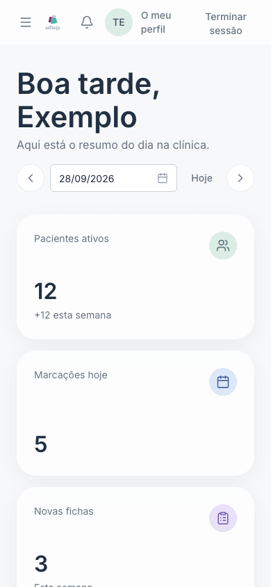
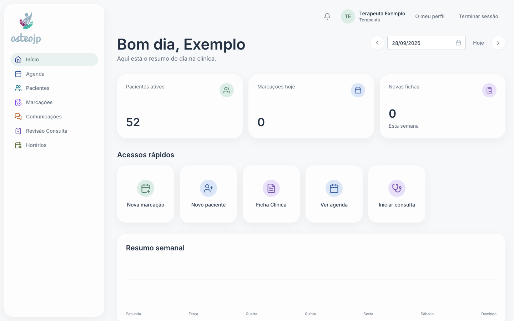

Nota: ao escolher outro dia, só **Marcações hoje** e **Próximas marcações** mudam, e só mostram marcações de hoje e dos seis dias seguintes. Para um dia passado ou mais distante, use a **Agenda** ou **Marcações**.

## Agenda

A **Agenda** mostra as suas marcações numa grelha, por **Dia** ou por **Semana**. No topo estão as setas para mudar de período, o campo de data, **Hoje**, o filtro **Serviços**, **Bloquear**, o botão de atualizar (a seta circular com a hora da última leitura) e **Nova marcação**. No computador, ao lado do título, aparece também o número de marcações do período.

Pacientes visíveis: a agenda mostra as marcações em que é o terapeuta principal (campo **Terapeuta**) e, se a sua clínica tiver um equipamento partilhado (por exemplo o NESA), também as marcações desse equipamento. Não há escolha de terapeuta nem de localização. Ao criar uma marcação, a pesquisa de **Paciente** só encontra os pacientes que aparecem na sua lista **Pacientes**.

### Como fazer

Criar uma marcação:

1. Carregue em **Nova marcação**. No computador, também pode carregar num espaço vazio da grelha, que já traz a data e a hora.
2. Em **Paciente**, escreva parte do nome e escolha o paciente.
3. O campo **Terapeuta** já traz o seu nome. Se a clínica tiver um equipamento partilhado, pode escolher esse equipamento no mesmo campo.
4. Escolha o **Serviço**, a **Localização** (se trabalhar em mais de uma clínica), a **Data** e a **Hora**, e confirme a **Duração**.
5. Carregue em **Guardar**.

Para marcar várias sessões de uma vez, marque **Agendar lote**, preencha **Dias da semana**, **A cada (semanas)** e **Termina**, e carregue em **Gerar datas** antes de guardar.

Alterar, concluir ou cancelar uma marcação:

1. Carregue na marcação. Abre o painel **Editar marcação**.
2. Mude a data, a hora ou o **Estado** (**Pendente**, **Confirmada**, **Concluída**, **Cancelada** ou **Falta**).
3. Carregue em **Guardar**. Para abrir a ficha, use **Ficha do paciente** no mesmo painel.

Bloquear tempo na sua agenda:

1. Carregue em **Bloquear**. O campo **Terapeuta** já traz o seu nome.
2. Escolha a **Data**, o **Início** e o **Fim**, e escreva na **Nota (obrigatória)** o motivo.
3. Se o bloqueio se repetir, marque **Repetir bloqueio** e indique os dias. Carregue em **Bloquear**.

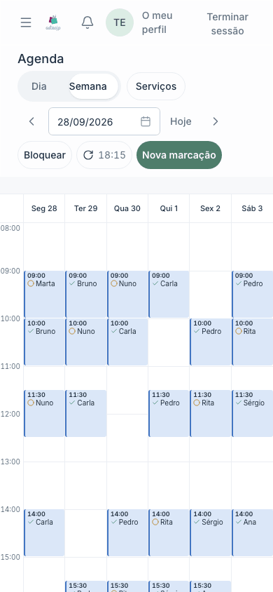
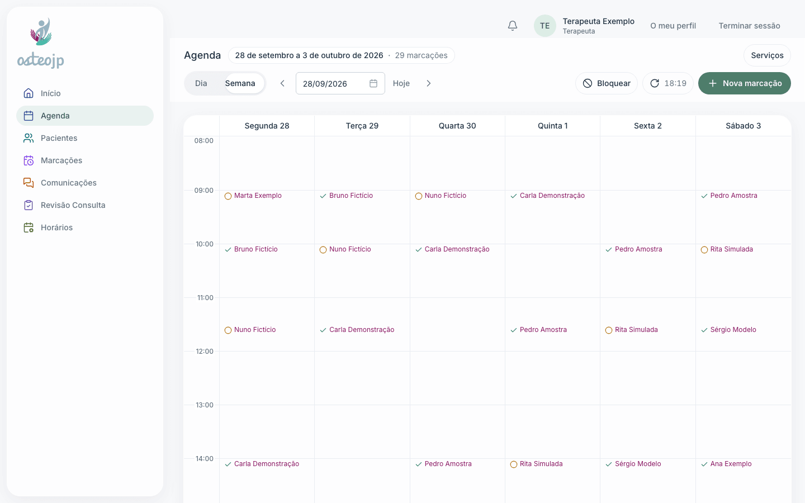

Nota: as marcações em que é **Terapeuta 2** não aparecem na sua agenda; encontra essas marcações no separador **Marcações** da ficha do paciente. Só pode cancelar marcações em que é **Terapeuta** ou **Terapeuta 2**. Um bloqueio não cancela as marcações que já existem nesse período. Se aparecer um aviso de conflito (terapeuta ou sala ocupados, ou uma ausência), leia o aviso antes de carregar em **Guardar mesmo assim**. Uma hora fora do seu horário é sempre recusada (altere primeiro o horário em **Horários**), e uma hora com a clínica fechada também. No telemóvel, na vista **Semana**, toque no nome de um dia para abrir esse dia.

## Pacientes

A lista **Pacientes** serve para encontrar um paciente e abrir a ficha. No topo há quatro números (**Utentes**, **Vistos este mês**, **Com marcação futura** e **Na janela de recuperação**), a barra de filtros (**Pesquisar**, **Clínica** e **Só com marcação futura**) e a tabela com as colunas **Nº**, **Paciente**, **NIF**, **Telemóvel**, **Clínica**, **Última consulta** e **Próxima**. O botão **Novo paciente** regista um paciente novo.

Pacientes visíveis: a lista mostra os pacientes com quem tem ou teve uma marcação, como **Terapeuta** ou como **Terapeuta 2**, e os pacientes que registou na plataforma. Um paciente que a receção lhe atribuiu, mas com quem ainda não tem nenhuma marcação, não aparece. Os quatro números contam só estes pacientes.

### Como fazer

Encontrar um paciente:

1. Escreva no campo **Pesquisar** o nome, o NIF, o telemóvel ou o número de utente.
2. A lista filtra sozinha a partir do terceiro carácter; com menos, prima a tecla Enter.
3. Carregue no nome do paciente para abrir a ficha.

Ver só quem tem consulta marcada: marque **Só com marcação futura**. Para ordenar, carregue no título da coluna **Paciente** ou **Última consulta**. Para voltar à lista completa, carregue em **Limpar filtros**.

Registar um paciente novo:

1. Carregue em **Novo paciente**.
2. Preencha pelo menos o **Nome completo** e o **NIF**. Se o paciente não tiver NIF português, marque **Estrangeiro / sem NIF** e escreva o **Motivo**.
3. Se lhe for pedida a **Localização**, escolha a clínica. Carregue em **Criar paciente**.

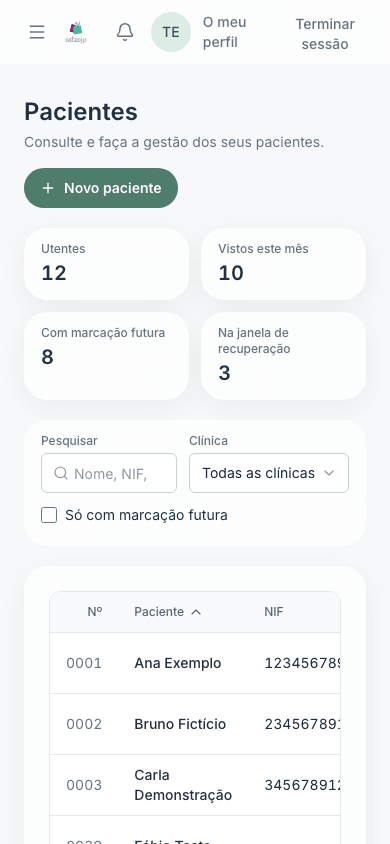
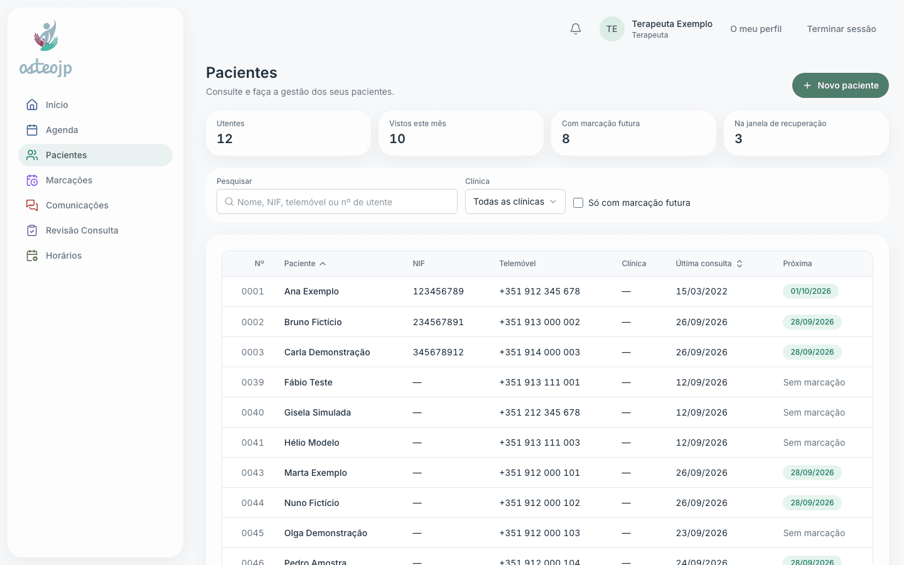

Nota: quando a lista tem várias páginas, os botões **Anterior** e **Seguinte** ficam no fim da página.

## Ficha do paciente

A ficha reúne o que a sua conta pode ver sobre um paciente. No cabeçalho estão o nome, o NIF, os contactos e o botão **Nova marcação** (abre a agenda com o paciente já escolhido). A etiqueta **RGPD em falta** indica que não há consentimento RGPD registado para este paciente. Por baixo há seis separadores:

* **Resumo**: os **Dados pessoais**, com **Editar dados** e, se o paciente fez o pedido de marcação pela internet, o **Questionário clínico do pedido online**.
* **Marcações**: o histórico de marcações, com os filtros **De**, **Até**, **Estado**, **Terapeuta**, **Clínica**, **Serviço**, **Sem nota** e **Ordenar**.
* **Notas**: as notas do paciente e das marcações.
* **Registos clínicos**: os registos do paciente, cada um com o estado **Rascunho**, **Bloqueada** ou **Assinada**. É também aqui que abre um episódio novo, com o botão **Episódio**.
* **Documentos**: os ficheiros do paciente e a **Declaração de Presença**.
* **Faturação**: as faturas do paciente, só para consulta.

Pacientes visíveis: só abre a ficha dos pacientes que aparecem na sua lista **Pacientes**; a ligação de outro paciente não abre. Em **Registos clínicos** vê todos os registos deste paciente, incluindo os escritos por colegas. Em **Marcações** vê as marcações em que participa ou que criou e, nas clínicas onde trabalha, também as marcações deste paciente com colegas, quando já tratou o paciente ou lhe foi atribuído.

### Como fazer

Acrescentar uma nota:

1. Abra o separador **Notas**.
2. Escreva a nota e carregue em **Adicionar nota**.

Criar um registo clínico:

1. Abra o separador **Registos clínicos** e carregue em **Nova ficha**.
2. Abre o ecrã **Nova ficha clínica** com o paciente já escolhido (ver a secção seguinte).

Marcar a próxima consulta:

1. Abra o separador **Marcações**.
2. Na marcação que quer repetir, carregue em **Marcar novamente**, escolha a **Data** e a **Hora** e carregue em **Marcar**. Em alternativa, use **Nova marcação** no cabeçalho.

Nas marcações ainda por realizar, **Gerir marcação** mostra **Reagendar**, a mudança de **Estado** (com **Aplicar**) e **Cancelar marcação**. Cada marcação tem também o botão **Notas**.

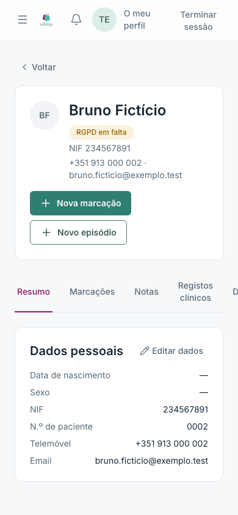
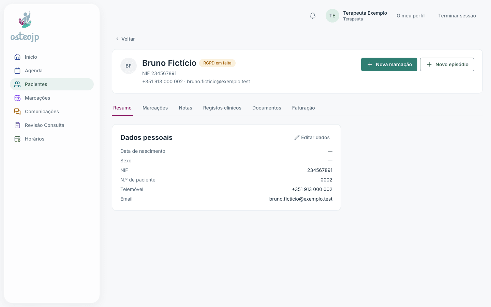

Nota: um registo com o estado **Assinada** já não pode ser alterado; para corrigir, use **Nova versão (adenda)**. **Eliminar** (só em rascunho) e **Anular** (só em registos assinados) pedem a palavra-passe de eliminação da clínica, que não é a sua palavra-passe de acesso. Um registo anulado fica com a etiqueta **ANULADO** e só aparece depois de carregar em **Mostrar anulados**. Sem NIF na ficha, a **Declaração de Presença** não pode ser emitida. As imagens são da versão anterior do ecrã, que ainda mostra o botão Novo episódio no cabeçalho; esse botão já não existe.

## Nova ficha clínica

Este ecrã cria um registo clínico novo. Abre a partir do **Início** (**Ficha Clínica**, em **Acessos rápidos**) ou da ficha do paciente (**Registos clínicos**, **Nova ficha**). Tem três campos: **Paciente**, **Modelo** (todas as fichas novas usam o modelo **Ficha Clínica**) e **Episódio**.

Pacientes visíveis: a pesquisa de **Paciente** só encontra os pacientes da sua lista **Pacientes**.

### Como fazer

Criar e preencher o registo:

1. Em **Paciente**, escreva pelo menos duas letras do nome e escolha o paciente. Se veio da ficha, o paciente já está escolhido.
2. Deixe o **Modelo** como está. Em **Episódio**, escolha um episódio do paciente ou deixe **Sem episódio**.
3. Carregue em **Criar ficha**. O registo abre no estado **Rascunho**.
4. Preencha as secções (no computador, o índice à esquerda leva a cada secção) e carregue em **Guardar**, na barra fixa no fundo do ecrã.

Fechar o registo:

1. Quando o registo estiver completo e guardado, carregue em **Assinar e bloquear**.
2. Depois de assinado, **Transferir PDF** gera o relatório em PDF. Para alterar alguma coisa, use **Nova versão (adenda)**.

Agrupar registos num episódio: na ficha do paciente, abra **Registos clínicos**, escolha Osteopatia ou Fisioterapia em **Especialidade do novo episódio** e carregue em **Episódio**, o botão com o sinal de mais. O episódio fica com a especialidade e a data de hoje como título e aparece na lista com a indicação **Sem avaliações**; **Avaliação**, nesse episódio, cria um registo já ligado a ele. Se o paciente já tiver um episódio aberto dessa especialidade, nenhum é aberto: o ecrã mostra esse episódio e pergunta. **Ver o episódio aberto** leva até ele, **Cancelar** não abre nada, e o botão para abrir outro episódio abre um segundo.

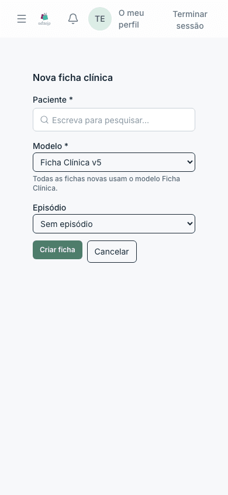
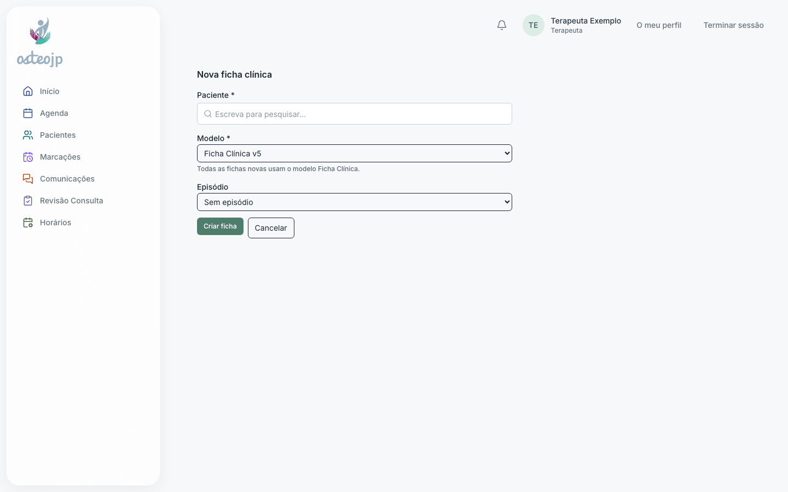

Nota: a plataforma não guarda sozinha. Carregue em **Guardar** antes de **Assinar e bloquear**, porque o que não estiver guardado não entra no registo. **Assinar e bloquear** não pede confirmação e o bloqueio é permanente. **Cancelar** sai sem criar o registo.

## Iniciar consulta

Este ecrã grava o áudio de uma consulta para que a plataforma prepare um registo clínico a partir dessa gravação. Abre no **Início**, em **Acessos rápidos**, com **Iniciar consulta**. Tem dois modos: **Paciente existente** e **Novo paciente**. Enquanto grava, pode abrir o painel **Guião do Exame Subjetivo**, que lista as perguntas da consulta por secções.

Pacientes visíveis: em **Paciente existente**, a pesquisa só encontra os pacientes da sua lista **Pacientes**. Um paciente criado em **Novo paciente** passa a aparecer na sua lista.

### Como fazer

Gravar a consulta de um paciente que já existe:

1. Carregue em **Paciente existente** e, em **Paciente**, escreva pelo menos duas letras do nome e escolha o paciente.
2. Leia ao paciente o texto de consentimento, que começa por «Autorizo a gravação de áudio desta consulta», e, se ele concordar, marque a caixa ao lado desse texto.
3. Carregue em **Iniciar gravação** e depois em **Gravar**.
4. No fim da consulta, carregue em **Parar**. Espere pela mensagem **Gravação enviada para processamento.** antes de fechar a página.

Gravar a consulta de uma pessoa que ainda não está registada:

1. Carregue em **Novo paciente**, escreva o **Nome** e, se tiver, o **Telefone (opcional)**. Se trabalhar em mais de uma clínica, escolha a **Localização**.
2. Carregue em **Criar e iniciar gravação**. Aparece **Paciente criado** com o nome.
3. Siga os passos 2 a 4 acima: consentimento, **Iniciar gravação**, **Gravar** e **Parar**.

Quando o processamento termina, o registo aparece em **Revisão Consulta**, com a origem **IA**.

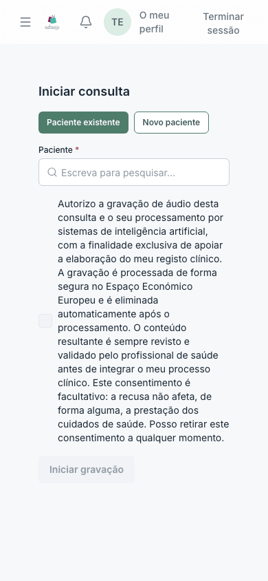
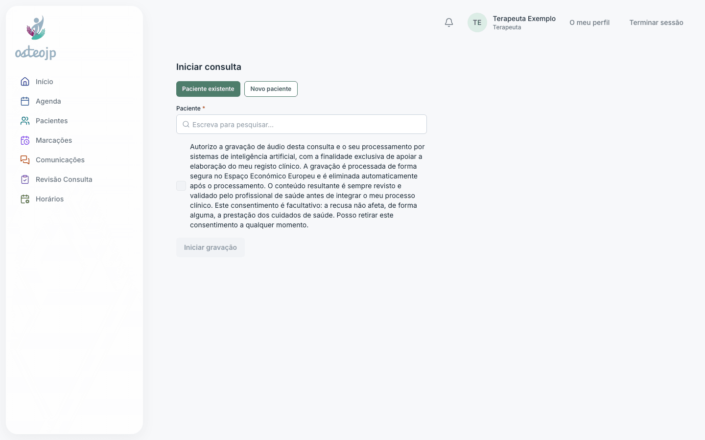

Nota: a gravação só funciona no Google Chrome; noutro navegador, o ecrã avisa e não grava. Sem a caixa de consentimento marcada, **Iniciar gravação** fica desativado. Um paciente criado aqui fica sem NIF e a ficha mostra o aviso **Ficha incompleta: falta o NIF.** Complete os dados em **Editar dados**. Se uma gravação nunca chegar a ser processada, aparece em **Notificações**, na secção **Gravações que não foram processadas**.

## Marcações

**Marcações** mostra, em forma de lista e agrupadas por dia, as marcações em que é o terapeuta principal; o subtítulo do ecrã diz isso mesmo. Por omissão mostra a semana atual, de segunda a sábado. No topo estão as duas datas do período, a pesquisa **Pesquisar por paciente** e os filtros **Todos os estados** e **Todos os serviços**. Cada linha mostra a hora, o paciente, o serviço, a clínica, o terapeuta, quem criou a marcação e o estado, com a etiqueta **Sem nota** quando uma consulta concluída ainda não tem nota, e os botões **Notas** e **Abrir marcação**.

Pacientes visíveis: a lista mostra só as marcações em que é o terapeuta principal (**Terapeuta**). As marcações em que é **Terapeuta 2** e as marcações dos seus pacientes com colegas não aparecem aqui; encontra essas no separador **Marcações** da ficha do paciente.

### Como fazer

Ver as marcações de outro período:

1. Escolha a data de início no primeiro campo e a data de fim no segundo.
2. Para encontrar um paciente, escreva o nome em **Pesquisar por paciente**. Para reduzir a lista, escolha um estado ou um serviço nos filtros.

Escrever uma nota numa marcação:

1. Na linha da marcação, carregue em **Notas**.
2. Carregue em **Adicionar nota**, escreva a nota e carregue outra vez em **Adicionar nota**.

Mudar o estado de uma marcação:

1. Carregue em **Abrir marcação**. Abre o painel **Editar marcação**.
2. Escolha o **Estado** e carregue em **Guardar**.

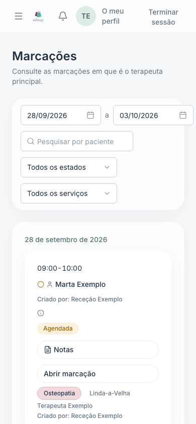
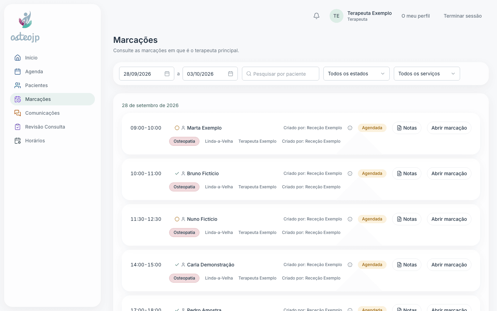

Nota: o período máximo é de 92 dias. Se escolher um período maior, a lista termina ao fim de 92 dias a contar da data de início.

## Comunicações: Recuperação

Ao carregar em **Comunicações** no menu, abre o ecrã **Recuperação de utentes**: pacientes que estiveram em tratamento recentemente e não têm marcação futura, para voltar a contactar. Cada paciente mostra a **Última consulta**, o **Terapeuta**, o telefone e a última nota, com os botões **WhatsApp**, **SMS**, **Email**, **Adiar**, **Notas** e a ligação **Abrir ficha**. Por baixo da lista há o filtro **Filtrar por nome ou telemóvel** e a secção **Adiados**.

Pacientes visíveis: a lista mostra os pacientes cuja última consulta concluída foi consigo, como **Terapeuta**, entre o início do mês passado e há sete dias, e que não têm marcação futura nem estão adiados. A secção **Adiados** segue a mesma regra.

### Como fazer

Contactar um paciente:

1. Carregue em **WhatsApp**, **SMS** ou **Email**. A aplicação do seu telemóvel ou computador abre com a mensagem já escrita.
2. Reveja a mensagem, altere o que quiser e envie nessa aplicação.
3. Na plataforma, a linha passa a mostrar **Contactado por** com o seu nome, a data e a hora.

Tirar um paciente da lista por algum tempo:

1. Carregue em **Adiar** e escolha **2 semanas**, **4 semanas**, **8 semanas** ou **12 semanas**.
2. O paciente passa para **Adiados** e volta à lista sozinho quando a data passar. Para o trazer antes, carregue em **Trazer de volta**.

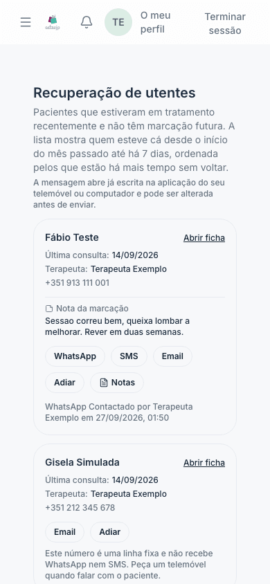
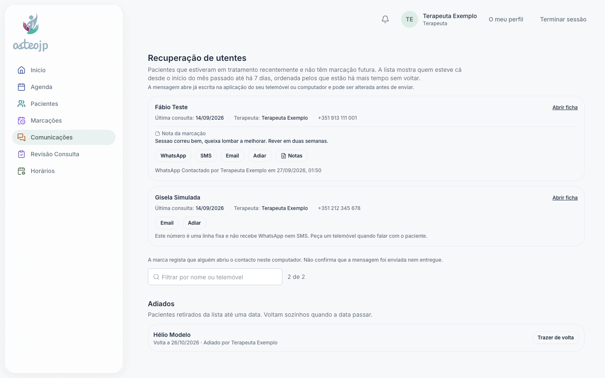

Nota: a marca **Contactado por** só regista que alguém abriu o contacto; não confirma que a mensagem foi enviada nem entregue. **WhatsApp** e **SMS** só aparecem quando o paciente tem um telemóvel português registado, **Email** só aparece quando há email registado e **Notas** só aparece quando o paciente tem notas.

## Revisão Consulta

**Revisão Consulta** é a fila dos registos que precisam da sua revisão antes de entrarem na ficha: os que vêm das gravações de consultas (origem **IA**) e os formulários preenchidos pelos pacientes (origem **Paciente**). A tabela tem as colunas **Paciente**, **Origem**, **Item**, **Estado** e **Atualizado**. O estado é **Por rever** ou **Em revisão**. No topo há a pesquisa **Pesquisar por paciente**.

Pacientes visíveis: a fila mostra só os registos dos pacientes da sua lista **Pacientes**.

### Como fazer

Rever um registo que veio de uma gravação:

1. Na linha do registo, carregue em **Assumir** (ou em **Abrir**, se já estiver **Em revisão**).
2. Abre **Rever e finalizar** com a **Ficha Clínica** preenchida a partir da gravação. Leia e corrija os campos.
3. Carregue em **Guardar** para guardar as correções.
4. Quando estiver tudo certo, carregue em **Finalizar (assinar e bloquear)**.

Rever um formulário de paciente:

1. Carregue em **Assumir**.
2. Corrija o texto em **Campos narrativos (texto livre)** e carregue em **Guardar narrativa**.
3. Carregue em **Finalizar (assinar e bloquear)**. Para voltar à lista sem finalizar, use **Voltar à fila**.

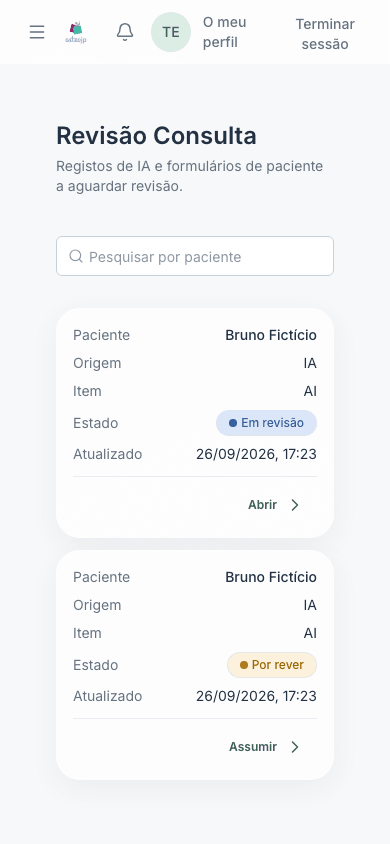
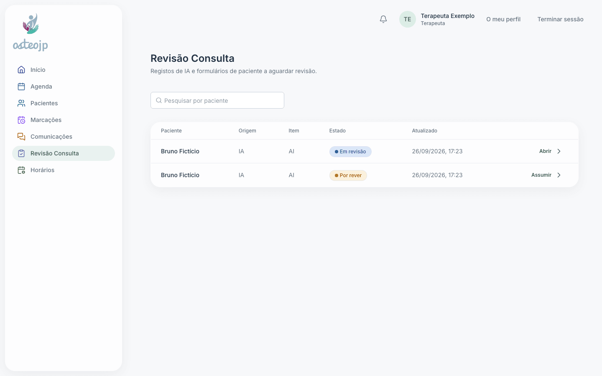

Nota: **Finalizar (assinar e bloquear)** não pede confirmação e não guarda as alterações por si; carregue primeiro em **Guardar**. Se aparecer o aviso **Campos não reconhecidos**, a gravação trouxe dados que a ficha não mostra: verifique esses dados antes de finalizar. Nos formulários de paciente, os campos codificados e os sinais de alarme não se editam aqui e têm de ser preenchidos à mão.

## Horários

**Horários** mostra o seu horário de trabalho e as suas ausências. O título do ecrã é **O meu horário**: a sua conta só vê e altera o seu próprio horário. No topo está o **Inspetor de horários**, que mostra dia a dia o que a agenda usa, com o **Local** e o tipo de horário (**Base**, **Dia definido** ou **Exceção**). Por baixo está o seu cartão, com **Definir semanas alternadas**, **Definir dia a dia**, **Bloquear horário** e **Editar horários**.

### Como fazer

Registar uma ausência (por exemplo, uma manhã de formação):

1. No seu cartão, carregue em **Bloquear horário**. Abre a lista dos seus bloqueios, com o formulário **Adicionar bloqueio**.
2. Em **Tipo**, escolha **Bloqueio pontual**. Preencha a **Data**, o **Início**, o **Fim** e a **Nota** (obrigatória).
3. Carregue em **Guardar**.

Alterar o horário semanal habitual:

1. Carregue em **Editar horários**.
2. Em cada dia, marque **Trabalha** e preencha **Início**, **Fim** e **Local**. Para uma pausa a meio do dia, use **Adicionar 2.º período**.
3. Carregue em **Guardar**.

Confirmar o horário que a agenda vai usar: no **Inspetor de horários**, escolha o **Período** (**Esta semana**, **Duas semanas** ou **Este mês**). Para mudar as horas de um só dia, carregue em **Editar** na linha desse dia.

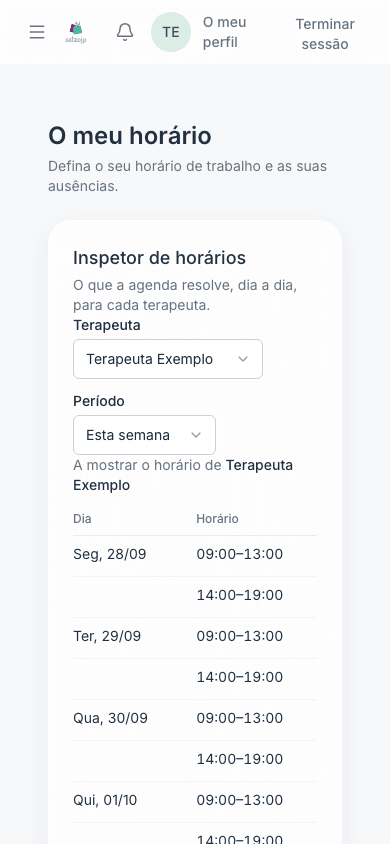
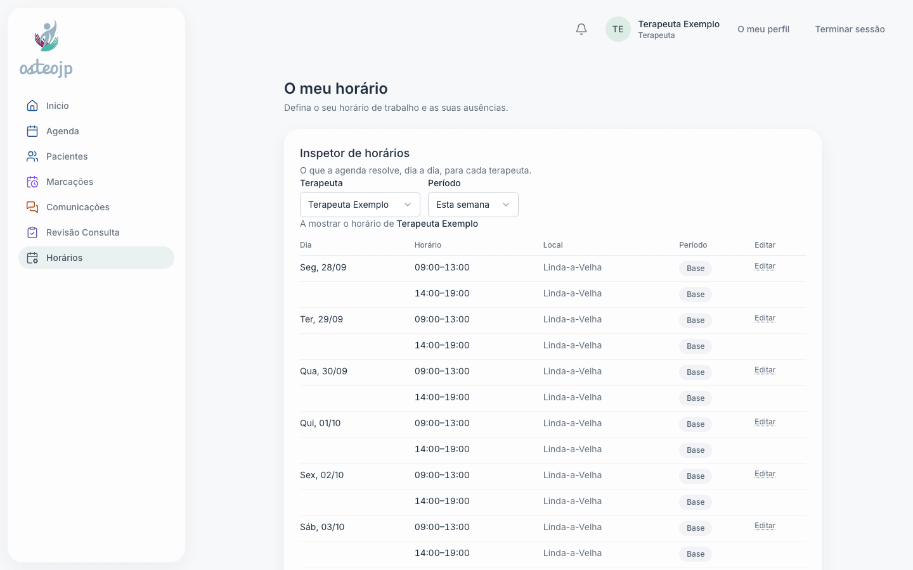

Nota: um bloqueio não cancela as marcações que já existem. **Ausência prolongada** bloqueia dias inteiros em todas as clínicas, e durante esse período ninguém consegue marcar consigo, nem a receção nem os pacientes no portal. Se vai apenas trabalhar noutra clínica nesses dias, não use um bloqueio: use **Definir dia a dia**.

## Notificações

As **Notificações** abrem-se com o sino no topo da página; o número no sino indica quantas estão por ler. O ecrã tem, por esta ordem, as secções **Pedidos de remarcação**, **Gravações que não foram processadas**, **Pedidos de marcação**, **Pacientes sem SMS possível** e, no fim, a lista **Notificações**, com as alterações às marcações (**Nova marcação**, **Marcação cancelada**, **Marcação remarcada**, **Pedido de marcação** e **Marcação confirmada**). Uma secção vazia mostra uma frase a dizer que não há nada pendente.

Pacientes visíveis: a lista **Notificações** mostra só as notificações dirigidas a si. **Gravações que não foram processadas** e **Pacientes sem SMS possível** mostram só pacientes da sua lista **Pacientes**.

### Como fazer

Tratar um pedido de remarcação:

1. Em **Pedidos de remarcação**, veja o paciente, a marcação e o terapeuta.
2. Remarque na **Agenda**, como habitualmente.
3. Volte aqui e carregue em **Marcar como tratado**. Este botão não altera a marcação.

Recuperar uma gravação que não foi processada: em **Gravações que não foram processadas**, veja o paciente e a data da consulta. A gravação já foi apagada e não existe registo, por isso escreva as notas da consulta à mão, num registo novo em **Nova ficha clínica**, enquanto ainda se lembra da consulta.

Ler as notificações:

1. Em cada notificação, carregue em **Ver marcação** para abrir a marcação em **Marcações**.
2. Carregue em **Marcar todas como lidas** para retirar a etiqueta **Por ler**.

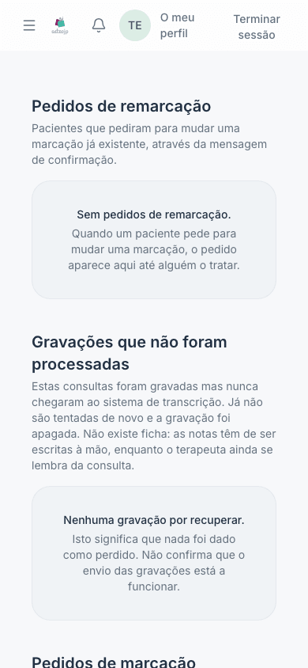
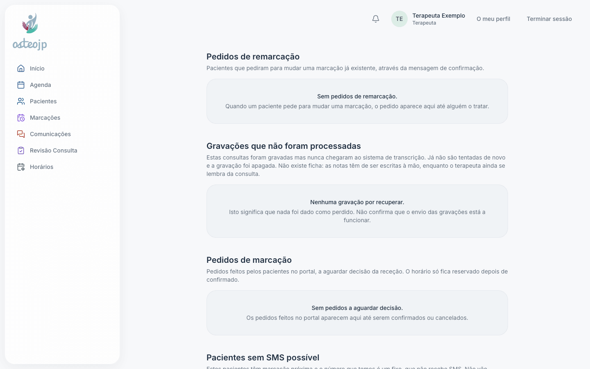

Nota: em **Pedidos de marcação**, o horário pedido só fica reservado depois de alguém carregar em **Confirmar**. Em **Pacientes sem SMS possível**, o número registado é um telefone fixo e o paciente não vai receber o lembrete por SMS: peça um telemóvel quando falar com ele e registe o número na ficha (**Abrir ficha**, **Editar dados**).

## O meu perfil

**O meu perfil**, no topo da página, abre o ecrã onde muda o nome da sua conta e a sua palavra-passe. Tem duas partes: **Dados pessoais** (**Nome** e **Email**) e **Palavra-passe**.

### Como fazer

Mudar o nome:

1. Em **Nome**, escreva o nome como quer que apareça.
2. Carregue em **Guardar**. Aparece **Nome atualizado.**

Mudar a palavra-passe:

1. Escreva a nova palavra-passe em **Nova palavra-passe** e repita em **Confirmar palavra-passe**. Tem de ter pelo menos 8 caracteres, com pelo menos uma letra e um número.
2. Carregue em **Alterar palavra-passe**. Aparece **Palavra-passe alterada.**

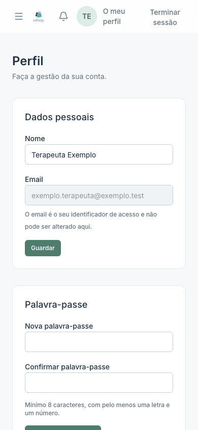
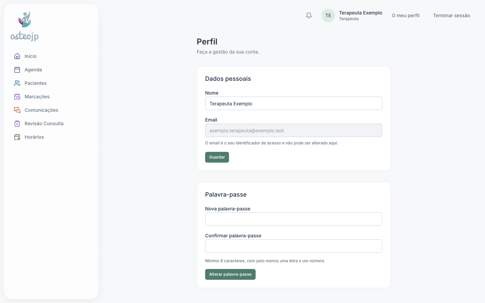

Nota: o **Email** é o seu identificador de acesso e não pode ser alterado aqui. A saudação do **Início** usa a primeira parte do seu email e não o nome da conta, por isso não muda quando altera o **Nome**.
