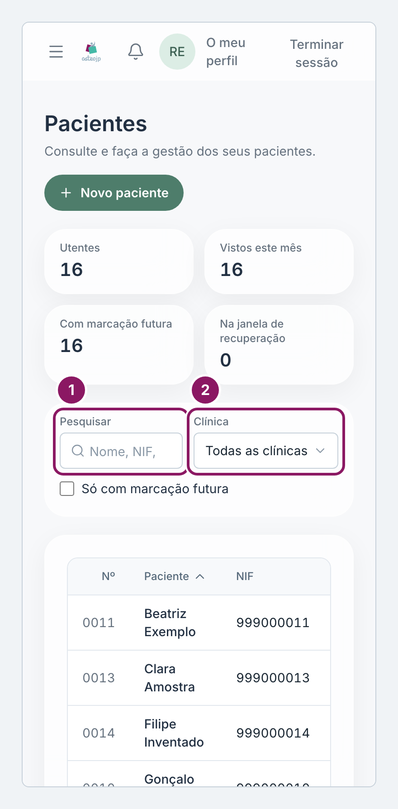
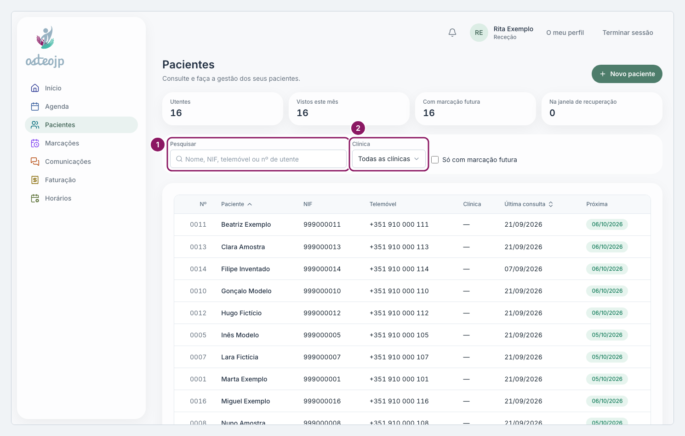

## Encontrar um paciente

A lista **Pacientes** mostra no topo quatro números: **Utentes**, **Vistos este mês**, **Com marcação futura** e **Na janela de recuperação**. A tabela tem as colunas **Nº**, **Paciente**, **NIF**, **Telemóvel**, **Clínica**, **Última consulta** e **Próxima**.

1. No campo **Pesquisar**, escreva o nome, o NIF, o telemóvel ou o nº de utente. A lista filtra sozinha a partir do terceiro carácter; com menos, prima a tecla Enter.
2. Se precisar, escolha uma clínica em **Clínica** ou marque **Só com marcação futura**. **Limpar filtros** volta à lista completa.
3. Clique no nome do paciente para abrir a ficha.

Para ordenar, clique no título **Paciente** ou **Última consulta**. Quando a lista tem várias páginas, os botões **Anterior** e **Seguinte** ficam no fim da página.

::: terapeuta
Pacientes visíveis: a lista mostra os pacientes com quem tem ou teve uma marcação, como **Terapeuta** ou como **Terapeuta 2**, e os pacientes que registou. Um paciente atribuído, mas ainda sem marcação consigo, não aparece. Os quatro números contam só estes pacientes.
:::

