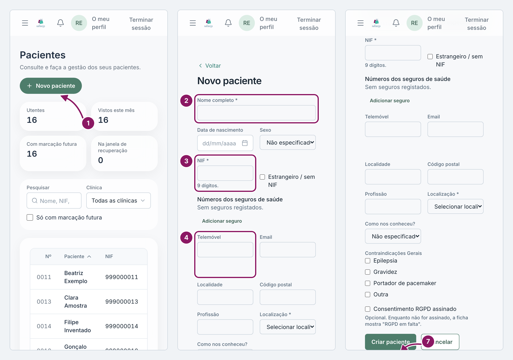
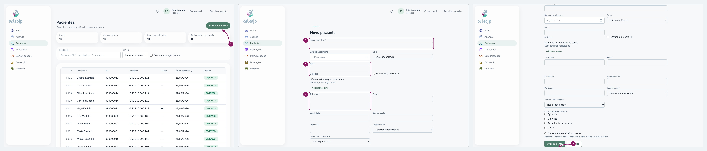

## Registar um paciente novo

Antes de registar, pesquise sempre pelo NIF ou pelo telemóvel em **Pacientes**. Assim evita criar uma segunda ficha para a mesma pessoa.

1. Em **Pacientes**, clique em **Novo paciente**.
2. Preencha o **Nome completo**.
3. Escreva o **NIF** com 9 dígitos. Se o paciente não tiver NIF português, marque **Estrangeiro / sem NIF** e escreva o **Motivo**.
4. Preencha o **Telemóvel** e o **Email**. Sem **Telemóvel**, o paciente não recebe lembretes por SMS.
5. Escolha a **Localização**, se tiver mais de uma clínica, e, se souber, responda a **Como nos conheceu?**.
6. Em **Contraindicações Gerais**, marque o que se aplica: **Epilepsia**, **Gravidez**, **Portador de pacemaker** ou **Outra**.
7. Clique em **Criar paciente**. Abre a ficha do paciente.

Se o número for um telefone fixo ou estrangeiro, aparece um aviso: os lembretes por SMS não chegam a esse número. Peça um telemóvel português. Marque **Consentimento RGPD assinado** apenas quando o paciente tiver assinado; até lá, a ficha mostra **RGPD em falta**.

