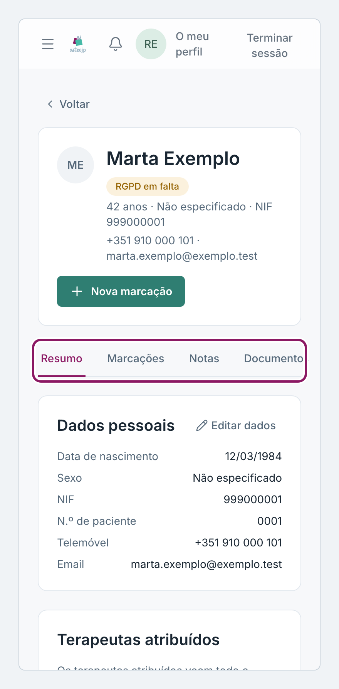
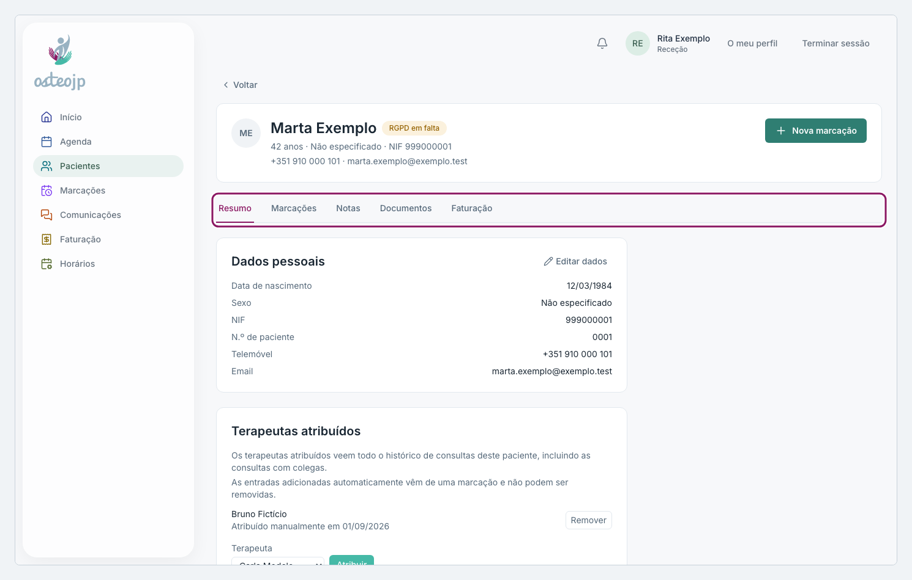

## A ficha do paciente

No topo da ficha estão o nome, o NIF, os contactos e o botão **Nova marcação**, que abre a Agenda com o paciente já escolhido. Os separadores são:

* **Resumo**: os **Dados pessoais**, com **Editar dados**, e os **Terapeutas atribuídos**.
* **Marcações**: o histórico de marcações, com filtros e os pacotes.
* **Notas**: as notas do paciente e das marcações.
* **Documentos**: os ficheiros do paciente e a **Declaração de Presença**.
* **Faturação**: as faturas do paciente, só para consulta.

::: terapeuta proprietario
Há também o separador **Registos clínicos**.
:::

::: proprietario
No fundo da página fica a **Zona de risco**, para juntar ou eliminar a ficha.
:::

Por cima dos separadores podem aparecer avisos: **Ficha incompleta: falta o NIF.**, **RGPD em falta** (não há consentimento registado) ou um aviso de que o telefone guardado não recebe SMS.

::: terapeuta
Pacientes visíveis: só abre a ficha dos pacientes da sua lista **Pacientes**. Em **Registos clínicos** vê todos os registos do paciente, incluindo os de colegas, e abre um episódio novo com o botão **Episódio**.
:::

