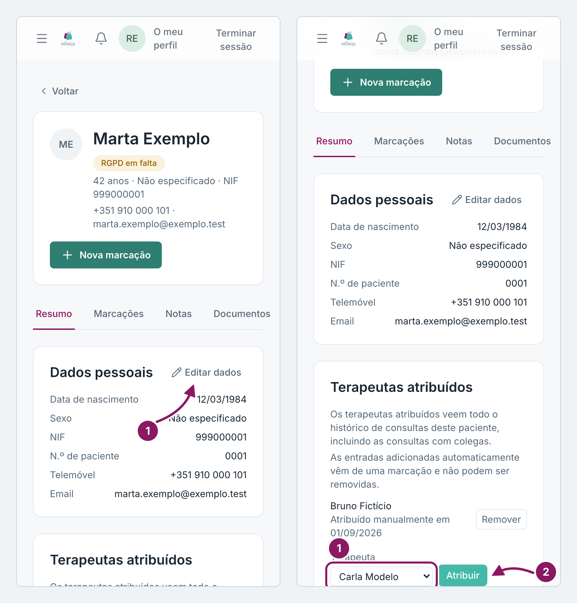
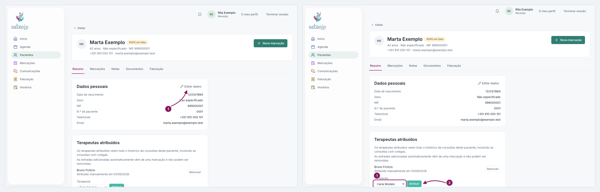

## Atualizar dados e atribuir terapeutas

Corrigir os dados pessoais:

1. Na ficha, no separador **Resumo**, clique em **Editar dados**.
2. Corrija o que for preciso e clique em **Guardar**.

Atribuir um terapeuta:

1. No separador **Resumo**, em **Terapeutas atribuídos**, escolha o nome no campo **Terapeuta**.
2. Clique em **Atribuir**.
3. Para retirar uma atribuição feita à mão, clique em **Remover**.

Um terapeuta atribuído passa a ver todo o histórico de consultas do paciente, incluindo as consultas com colegas. Atribua apenas quem o vai acompanhar. As entradas acrescentadas automaticamente a partir de uma marcação não podem ser removidas.

