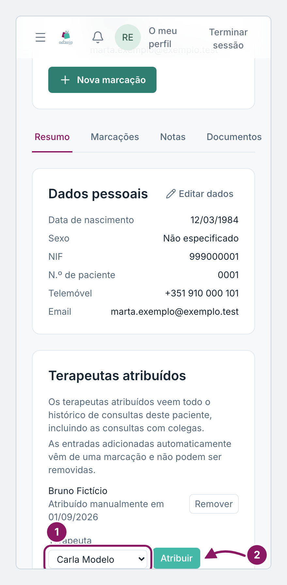
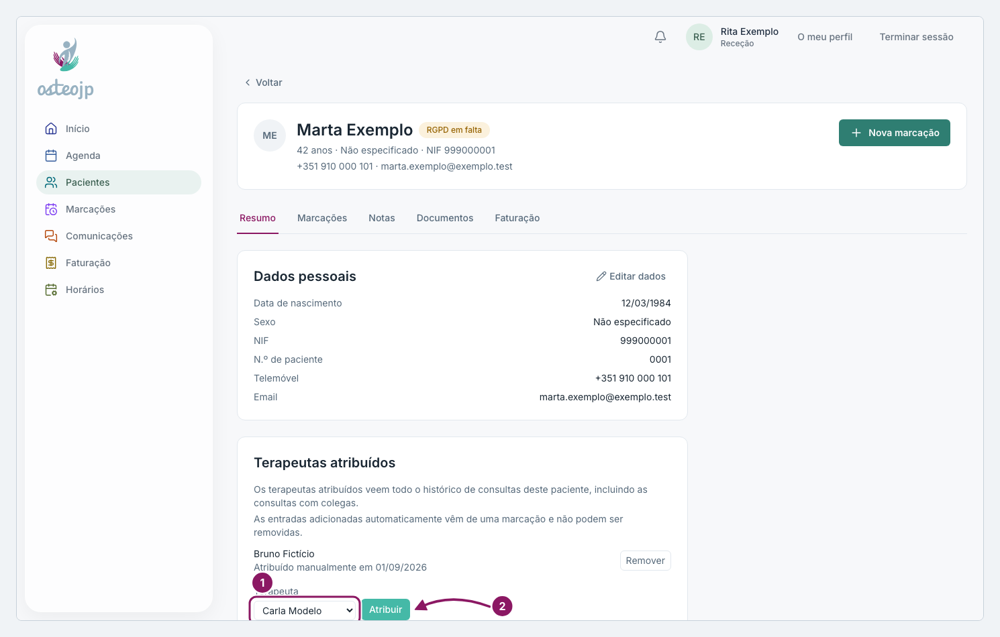

## Atribuir terapeutas a um paciente

1. Na ficha, no separador **Resumo**, em **Terapeutas atribuídos**, escolha o nome no campo **Terapeuta**.
2. Clique em **Atribuir**.
3. Para retirar uma atribuição feita à mão, clique em **Remover**.

Um terapeuta atribuído passa a ver todo o histórico de consultas do paciente, incluindo as consultas com colegas. Atribua apenas quem o vai acompanhar. As entradas acrescentadas automaticamente a partir de uma marcação não podem ser removidas.

