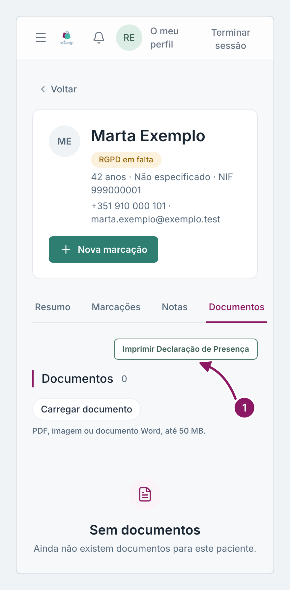
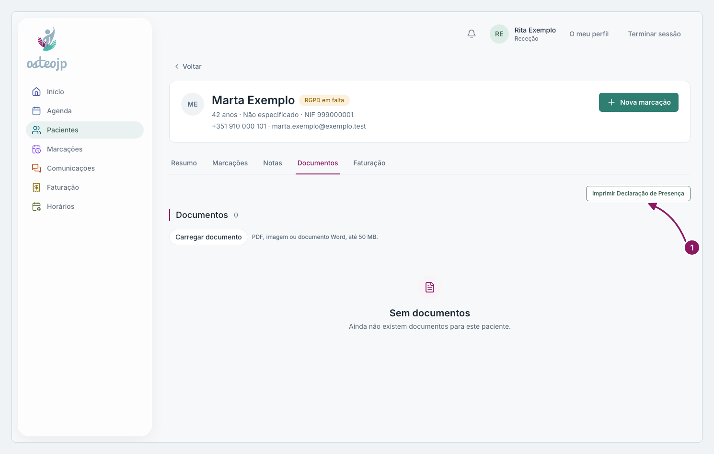

## Declaração de presença e documentos

Imprimir uma declaração de presença:

1. Na ficha, no separador **Documentos**, clique em **Imprimir Declaração de Presença**.
2. Em **Marcação**, escolha a consulta, ou escolha **Introdução manual** e preencha **Data**, **Hora de início** e **Hora de fim**. Na introdução manual, se trabalhar em mais do que um local, escolha também a **Localização**.
3. Confira o **NIF** e, se quiser, escreva **Observações (opcional)**.
4. Clique em **Gerar**. A declaração abre num novo separador do navegador, pronta a imprimir, com o carimbo do local da consulta.

Sem NIF na ficha (nem **Estrangeiro / sem NIF**), a declaração não pode ser emitida. Corrija primeiro em **Editar dados**.

Num local que ainda não tem carimbo, a declaração não é emitida e aparece o aviso «Declaração indisponível neste local: falta o carimbo. Contacte a administração.».

Carregar um documento: em **Documentos**, clique em **Carregar documento** e escolha o ficheiro. Aceita PDF, imagem ou documento Word até 50 MB.

Retirar um documento:

1. Na linha do documento, clique em **Eliminar**.
2. Escreva o **Motivo (obrigatório)** e confirme em **Eliminar documento**.

O ficheiro não é apagado: deixa só de aparecer na ficha.

