# Proprietário

O Proprietário vê e gere a clínica inteira: a agenda de toda a equipa em todos os locais, todos os pacientes, a faturação, as estatísticas e a administração (equipa, serviços, locais e definições). O menu lateral tem, por esta ordem, **Início**, **Agenda**, **Pacientes**, **Marcações**, **Comunicações**, **Faturação**, **Revisão Consulta**, **Estatísticas**, **Horários** e **Administração**; no telemóvel, o menu abre-se com o botão de três linhas no canto superior esquerdo. No topo de todas as páginas ficam o sino das Notificações, **O meu perfil** e **Terminar sessão**.

O Proprietário também abre os ecrãs Nova ficha clínica e Iniciar consulta. Estão descritos no guia do Terapeuta e no guia completo, e não se repetem aqui.

## Início

O Início é o resumo do dia na clínica. No topo há quatro números: **Pacientes ativos**, **Marcações hoje**, **Novas fichas** (criadas esta semana) e **Receita (mês)** (a soma das faturas emitidas e pagas no mês corrente). Por baixo ficam os **Acessos rápidos**, o gráfico **Resumo semanal** com as marcações de cada dia desta semana, a lista **Próximas marcações** e o quadro **Notas rápidas**.

### Como fazer: ver outro dia

1. Use as setas ao lado da data, ou clique na data e escolha outro dia no calendário.
2. Clique em **Hoje** para voltar ao dia atual.

### Como fazer: abrir uma tarefa frequente

1. Em **Acessos rápidos**, clique em **Nova marcação**, **Novo paciente**, **Ficha Clínica**, **Ver agenda**, **Administração** ou **Iniciar consulta**.

### Como fazer: deixar uma nota rápida

1. Em **Notas rápidas**, no campo **Paciente**, escreva o nome e escolha o paciente.
2. Em **Consulta (opcional)**, deixe **Nota geral do paciente (sem consulta)** ou escolha uma marcação desse paciente.
3. Escreva a nota e clique em **Guardar**. Aparece **Notas guardadas** e a nota fica no separador **Notas** da ficha do paciente.

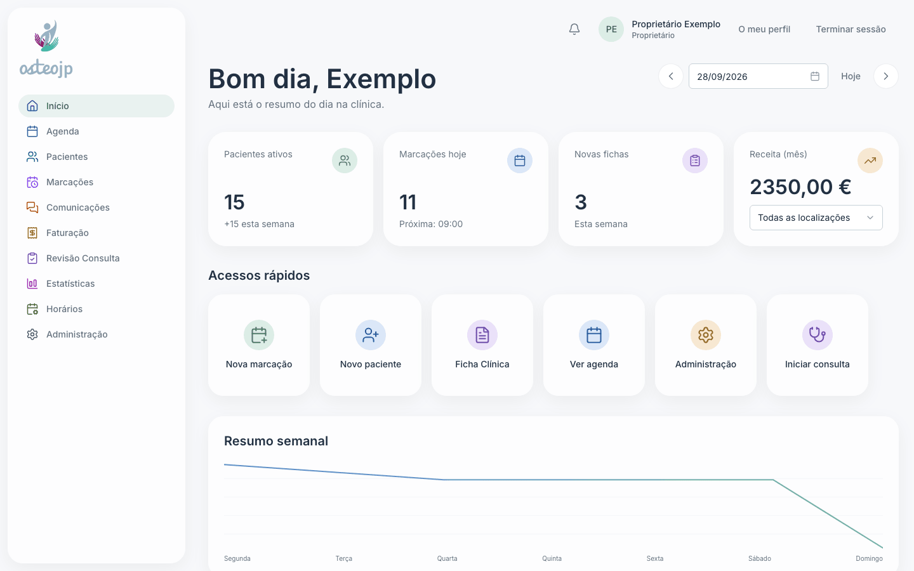

Nota: **Marcações hoje** e **Próximas marcações** só cobrem hoje e os seis dias seguintes; num dia passado ou mais distante aparecem vazios. Para esses dias use a Agenda ou as Marcações. **Receita (mês)** e **Resumo semanal** mostram sempre o mês e a semana atuais, seja qual for o dia escolhido.

## Agenda

A Agenda mostra as marcações de toda a equipa, em todos os locais, por dia ou por semana. É aqui que se marca, muda e cancela uma consulta e que se bloqueia tempo de um terapeuta. Na barra de cima estão **Todos os terapeutas**, **Todas as localizações** e **Serviços** (filtros), **Dia** e **Semana**, as setas, a data e **Hoje**, e os botões **Bloquear**, atualizar (seta circular com a hora da última atualização) e **Nova marcação**. Cada marcação tem um símbolo do estado: círculo para Agendada, visto para Confirmada, círculo com visto para Concluída, círculo cortado para Cancelada e pessoa riscada para Falta.

### Como fazer: criar uma marcação

1. Clique em **Nova marcação**. No computador, também pode clicar num espaço livre da grelha: a janela abre já com esse dia e essa hora.
2. Em **Paciente**, escreva parte do nome e escolha o paciente.
3. Escolha o **Terapeuta**, confirme o **Serviço** e escolha a **Localização**.
4. Confirme **Data**, **Hora** e **Duração**. O quadro **Disponibilidade** mostra os **Horários livres** do terapeuta; clique num deles para preencher a hora.
5. Clique em **Guardar**. Para várias sessões seguidas, marque antes **Agendar lote**, escolha os **Dias da semana** e quando **Termina**, e clique em **Gerar datas**.

### Como fazer: mudar ou cancelar uma marcação

1. Clique na marcação. Abre a janela **Editar marcação**.
2. Se a marcação fizer parte de uma série, escolha em **Aplicar a**: **Esta marcação**, **Esta e seguintes** ou **Toda a série**.
3. Para mudar o dia ou a hora, altere **Data** e **Hora**. Para registar o que aconteceu, escolha em **Estado** a opção **Confirmada**, **Concluída**, **Falta** ou **Cancelada**.
4. Clique em **Guardar**.

### Como fazer: bloquear tempo de um terapeuta

1. Clique em **Bloquear**.
2. Escolha o **Terapeuta**, a **Data**, o **Início** e o **Fim**, e escreva em **Nota (obrigatória)** o motivo. Para repetir, marque **Repetir bloqueio**.
3. Clique em **Bloquear**. As marcações que já existam nesse tempo não são canceladas.

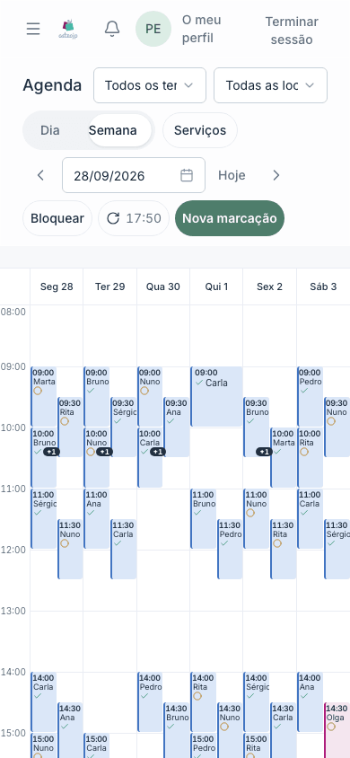
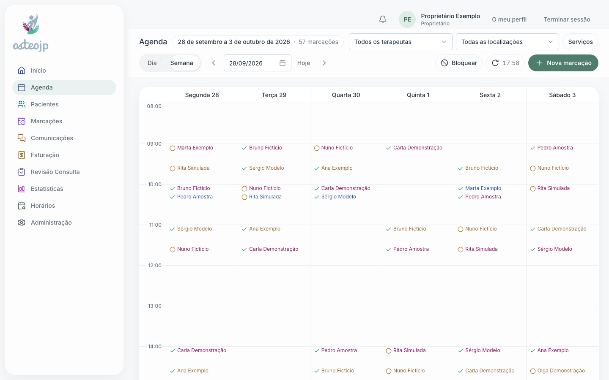

Nota: se a marcação colidir com outra marcação, com a sala ou com uma ausência do terapeuta, aparece um aviso (**Conflito de terapeuta**, **Conflito de sala** ou **Ausência**) e o botão passa a **Guardar mesmo assim**. Leia o aviso antes de confirmar. Uma hora fora do horário do terapeuta é sempre recusada (altere primeiro o horário em Horários), e uma hora em que a clínica está fechada também.

Nota: como Proprietário, vê também, no fundo da janela, **Eliminar marcação**, que pede a palavra-passe de eliminação e apaga a marcação de vez. Para uma consulta que não se realiza, use o estado **Cancelada**, que fica no histórico. Uma marcação com notas clínicas, registos ou faturas não pode ser eliminada.

## Pacientes

Pacientes é a lista de todos os pacientes da clínica. No topo, quatro números resumem a lista: **Utentes**, **Vistos este mês**, **Com marcação futura** e **Na janela de recuperação**. A tabela mostra **Nº**, **Paciente**, **NIF**, **Telemóvel**, **Clínica**, **Última consulta** e **Próxima**; clique no título **Paciente** ou **Última consulta** para ordenar.

### Como fazer: encontrar um paciente

1. Em **Pesquisar**, escreva o nome, o NIF, o telemóvel ou o número de utente.
2. Se quiser, escolha uma clínica em **Clínica** ou marque **Só com marcação futura**.
3. Clique no nome do paciente para abrir a ficha.

### Como fazer: registar um paciente novo

1. Clique em **Novo paciente**.
2. Preencha **Nome completo**, **NIF** e **Localização**, que são obrigatórios, e o que tiver dos restantes dados (**Telemóvel**, **Email**, **Data de nascimento**, **Como nos conheceu?**, **Contraindicações Gerais**).
3. Se o paciente não tiver NIF português, marque **Estrangeiro / sem NIF** e escreva o **Motivo**.
4. Clique em **Criar paciente**. Abre a ficha do paciente.

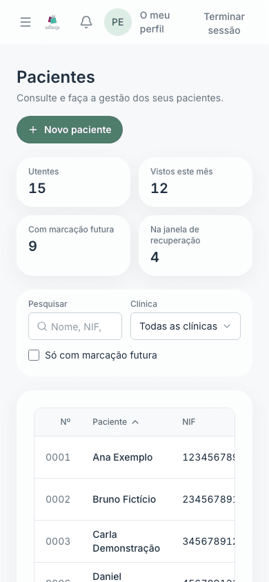
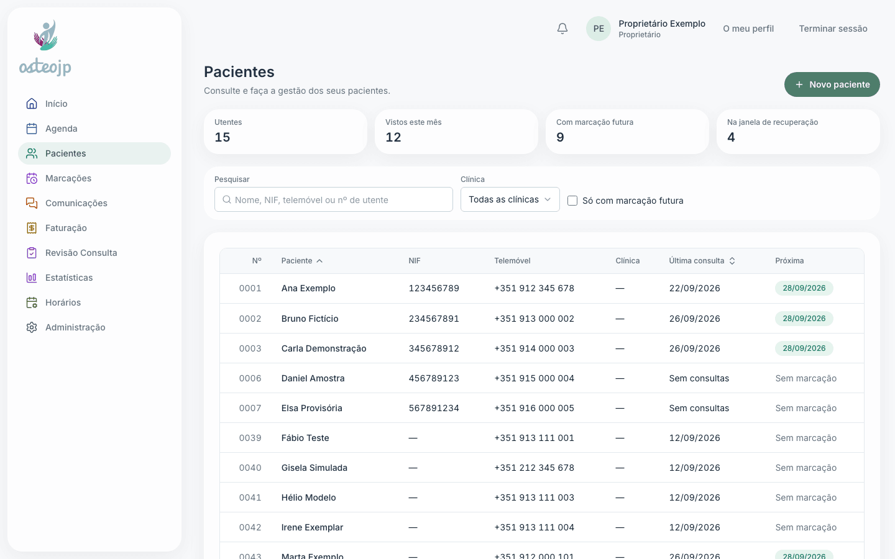

Nota: pesquise sempre antes de criar um paciente, para não abrir uma segunda ficha para a mesma pessoa. Se isso acontecer, junte as duas fichas como se explica em Ficha do paciente.

## Ficha do paciente

A ficha reúne tudo sobre um paciente. No topo estão o nome, o NIF, os contactos e avisos como **RGPD em falta**, com os botões **Nova marcação** e **Novo episódio**. Por baixo há seis separadores: **Resumo** (**Dados pessoais**, com **Editar dados**, e **Terapeutas atribuídos**), **Marcações** (as consultas do paciente e os pacotes), **Notas**, **Registos clínicos**, **Documentos** (**Carregar documento** e **Imprimir Declaração de Presença**) e **Faturação**. No fundo da página fica a **Zona de risco**.

### Como fazer: marcar a partir da ficha

1. Clique em **Nova marcação**. A Agenda abre com este paciente já escolhido.
2. Escolha o **Terapeuta**, a **Data** e a **Hora** e clique em **Guardar**.

### Como fazer: atribuir um terapeuta ao paciente

1. No separador **Resumo**, em **Terapeutas atribuídos**, escolha o nome no campo **Terapeuta**.
2. Clique em **Atribuir**. Os terapeutas atribuídos veem todo o histórico de consultas do paciente, incluindo as consultas com colegas.
3. Para retirar uma atribuição feita à mão, clique em **Remover**. As entradas acrescentadas automaticamente por uma marcação não se removem.

### Como fazer: juntar uma ficha duplicada

1. Abra a ficha que fica e copie o seu ID: é o código longo que aparece no endereço da página, logo a seguir a patients/ (sem o que vier depois de um ponto de interrogação).
2. Abra a ficha duplicada, clique em **Zona de risco** e cole o ID em **ID do paciente a manter (sobrevivente)**.
3. Clique em **Fundir neste paciente**. O histórico passa para a ficha que fica e a duplicada é marcada como duplicado.

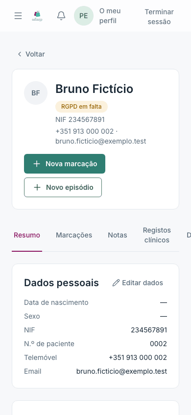
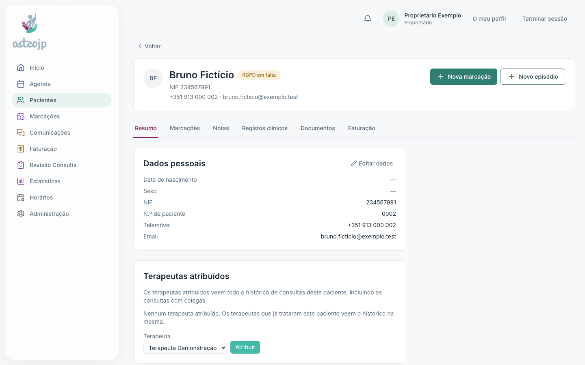

Nota: na **Zona de risco**, **Eliminar** retira o paciente da lista e pode ser desfeito em Administração, Pacientes eliminados. **Eliminar definitivamente** pede a palavra-passe de eliminação, não se desfaz e só funciona num paciente sem dados associados; um paciente com registos clínicos nunca pode ser eliminado definitivamente.

## Marcações

Marcações é a lista de todas as marcações, agrupadas por dia, e abre na semana atual. Cada linha mostra a hora, o paciente, o serviço, o local, o terapeuta, quem criou a marcação (**Criado por**) e o estado; a etiqueta **Sem nota** assinala uma consulta concluída sem nota.

### Como fazer: encontrar marcações

1. Escolha a data de início e a data de fim nos dois campos de data.
2. Use **Pesquisar por paciente** e os filtros **Todas as localizações**, **Todos os estados**, **Todos os serviços** e **Todos os terapeutas**.

### Como fazer: abrir e alterar uma marcação

1. Clique em **Abrir marcação**. Abre a mesma janela **Editar marcação** da Agenda.
2. Faça a alteração e clique em **Guardar**.
3. Para ler as notas sem abrir a marcação, clique em **Notas** na linha.

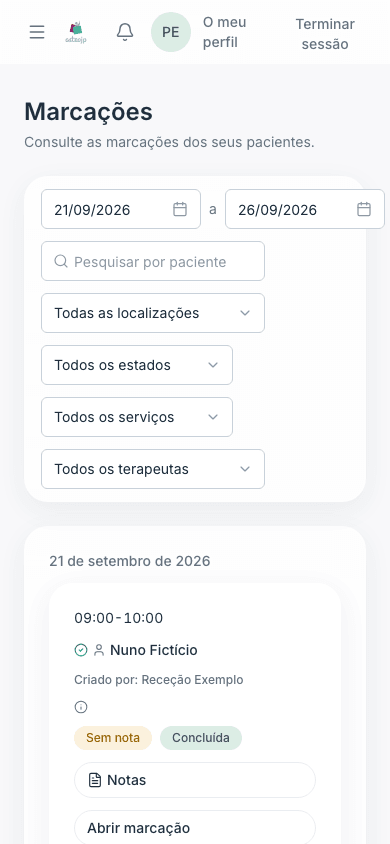
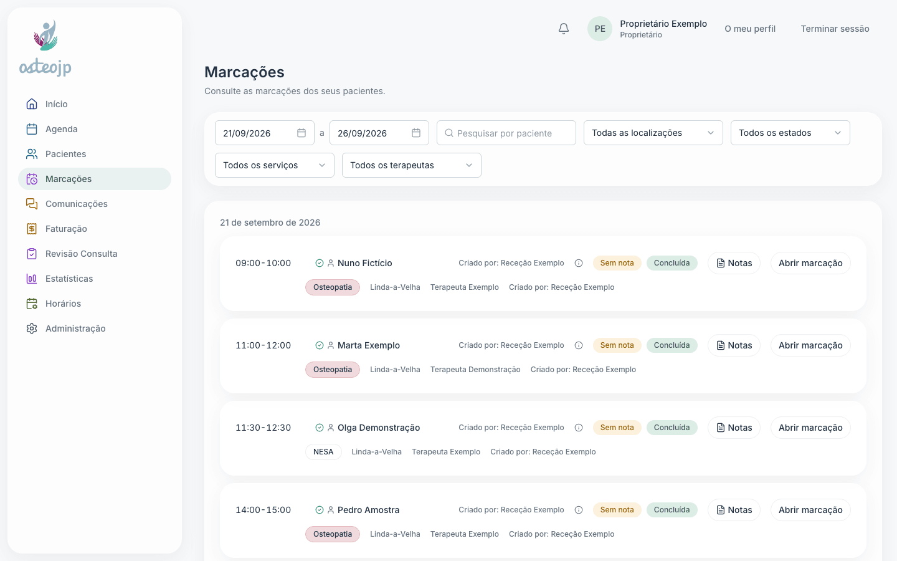

Nota: a lista mostra no máximo 92 dias a contar da data de início. Para um período maior, faça várias pesquisas.

## Comunicações: Recuperação

**Comunicações** tem três separadores: **Recuperação**, **Lembretes SMS** e **Respostas SMS**, e abre sempre em **Recuperação**. O separador **Recuperação** lista os pacientes que estiveram em tratamento e não têm marcação futura: quem veio desde o início do mês passado até há 7 dias, primeiro os que estão há mais tempo sem voltar. Cada cartão mostra a **Última consulta**, o **Terapeuta**, o telefone, a última nota e a ligação **Abrir ficha**. Mais abaixo fica a lista **Adiados**.

### Como fazer: contactar um paciente

1. Clique em **WhatsApp**, **SMS** ou **Email**. A mensagem abre já escrita na aplicação do seu telemóvel ou computador.
2. Reveja o texto e envie a mensagem nessa aplicação.
3. O cartão passa a mostrar quem abriu o contacto e quando.

### Como fazer: tirar um paciente da lista durante algum tempo

1. Clique em **Adiar** e escolha **2 semanas**, **4 semanas**, **8 semanas** ou **12 semanas**.
2. O paciente passa para **Adiados** e volta sozinho à lista quando a data passar. Para o trazer antes, clique em **Trazer de volta**.

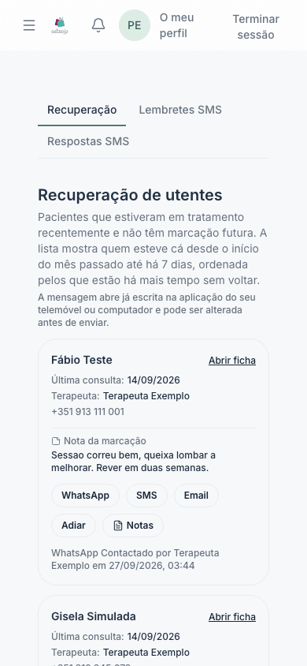
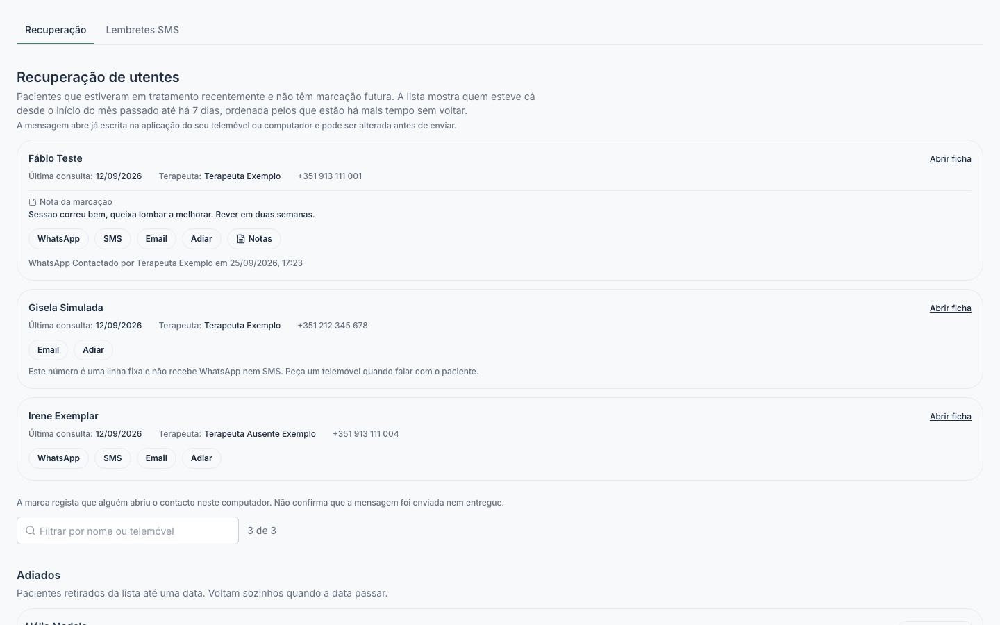

Nota: a marca de contacto só regista que alguém abriu o contacto neste computador; não confirma que a mensagem foi enviada nem entregue. Um número fixo não recebe WhatsApp nem SMS, e o cartão avisa disso. Para procurar alguém na lista, use **Filtrar por nome ou telemóvel**.

## Comunicações: Lembretes SMS

O separador **Lembretes SMS** mostra cada tentativa de enviar um SMS a um paciente (lembretes, confirmações de marcação e mensagens depois da consulta ou de uma falta), a mais recente primeiro. É só para consulta: daqui não se envia nada. A coluna **Estado** diz o que aconteceu: **Enviado**, **Entregue**, **Não entregue**, **Falhou no fornecedor**, ou **Não enviado** seguido do motivo.

### Como fazer: ver os SMS de um paciente

1. Escreva o nome em **Nome do paciente**.

### Como fazer: ver só os problemas

1. Clique em **Só falhas**. A lista fica com os envios **Não entregue** e **Falhou no fornecedor**, com o **Código de erro** quando existe.
2. Clique em **Todos** para voltar à lista completa.

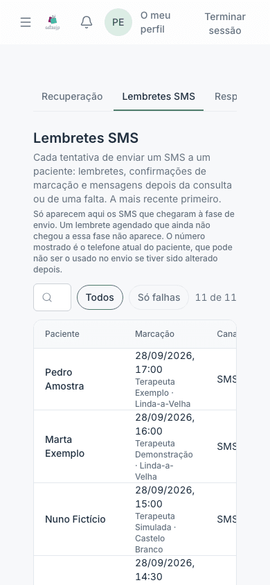
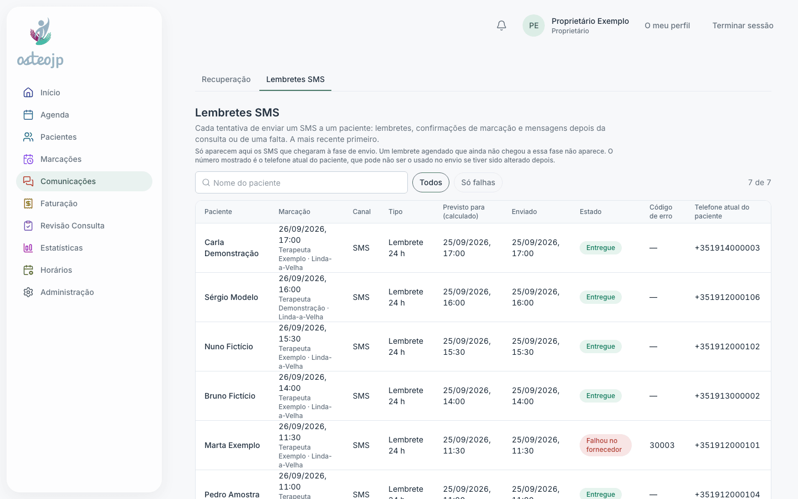

Nota: só aparecem os SMS que chegaram à fase de envio; um lembrete agendado que ainda não chegou a essa fase não está na lista. A coluna **Telefone atual do paciente** mostra o número de hoje, que pode não ser o usado no envio.

## Comunicações: Respostas SMS

Nesta versão, a clínica ainda não recebe respostas dos pacientes por SMS, por isso o separador **Respostas SMS** mostra apenas o aviso **Respostas por rever indisponível**. O resto desta secção, incluindo as capturas, mostra o ecrã depois de a receção de respostas ser ativada.

O separador **Respostas SMS** abre **Respostas por rever**: as respostas de pacientes aos SMS da clínica que não correspondem a uma palavra-chave, para alguém ler e decidir. Cada resposta mostra o paciente (ou **Paciente não identificado**), **Recebida em**, a consulta associada (ou **Sem consulta associada**), o texto e os botões **Marcar como confirmada**, **Marcar como cancelada** e **Marcar como lida**. É o mesmo ecrã que a receção usa.

### Como fazer: tratar uma resposta

1. Leia a mensagem e veja a consulta associada.
2. Clique em **Marcar como confirmada** ou **Marcar como cancelada** para mudar a consulta, ou em **Marcar como lida** para a deixar como está. Em qualquer dos casos a resposta fica tratada.

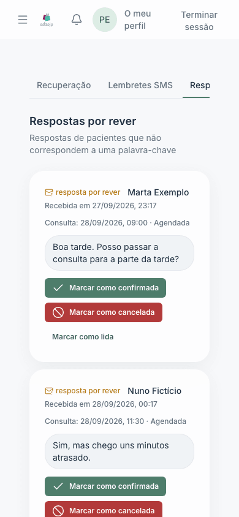
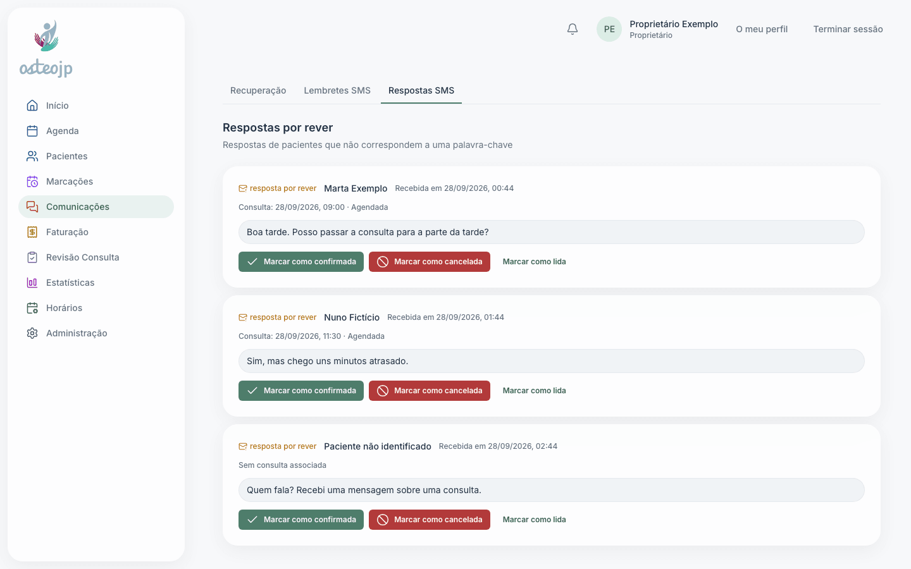

Nota: **Marcar como confirmada** e **Marcar como cancelada** só mudam uma consulta ainda **Agendada**. Se a consulta já estiver noutro estado, ou se não houver consulta associada, aparece **Resposta arquivada. Nenhuma consulta foi alterada.** Se já houver outra consulta confirmada à mesma hora com o mesmo terapeuta, a confirmação é recusada e a resposta continua por tratar.

## Faturação

Faturação lista as faturas da clínica e abre no mês corrente, do dia 1 até hoje. A tabela mostra **Nº**, **Paciente**, **Data**, **Valor** e **Estado** (**Rascunho**, **Emitida**, **Paga** ou **Anulada**). No fundo, **Pago** soma as faturas pagas e **Pendente** as emitidas ainda por pagar.

### Como fazer: procurar faturas

1. Escolha a data de início e a data de fim.
2. Filtre por **Todos os estados** e **Todas as localizações**.

### Como fazer: ver uma fatura

1. Clique em **Abrir** na linha da fatura. Abre o painel **Fatura** com os dados.
2. Clique em **Fechar** para voltar à lista.

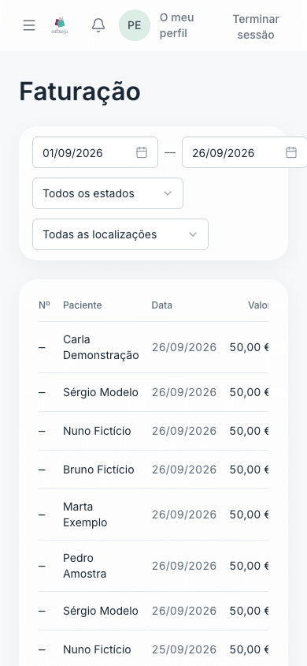
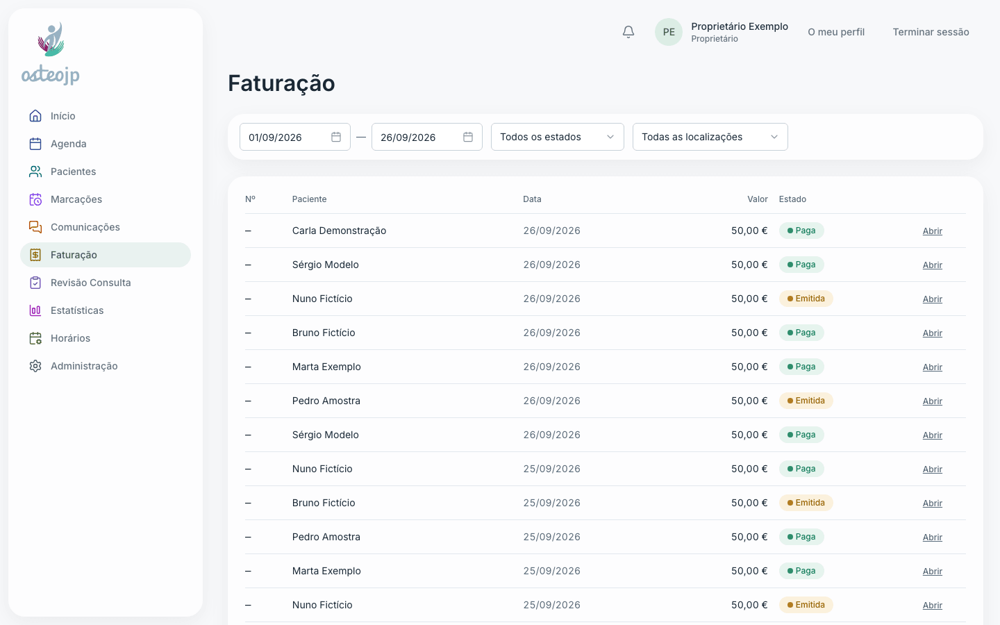

Nota: este ecrã serve para consultar faturas; não tem botão nem formulário para emitir uma fatura nova. As faturas de um só paciente estão também no separador **Faturação** da ficha.

## Revisão Consulta

Revisão Consulta é a fila dos registos que chegam das gravações de consulta (origem **IA**) e dos formulários preenchidos pelos pacientes (origem **Paciente**), à espera de revisão. Como Proprietário, vê a fila da clínica inteira. A coluna **Estado** mostra **Por rever** ou **Em revisão**.

### Como fazer: rever e finalizar um registo

1. Se a fila for longa, procure o paciente em **Pesquisar por paciente**.
2. Clique em **Assumir** num item **Por rever**, ou em **Abrir** num item **Em revisão**. Abre **Rever e finalizar**.
3. Corrija o que for preciso e clique em **Guardar** (ou **Guardar narrativa**, conforme o tipo de registo).
4. Quando estiver certo, clique em **Finalizar (assinar e bloquear)**.

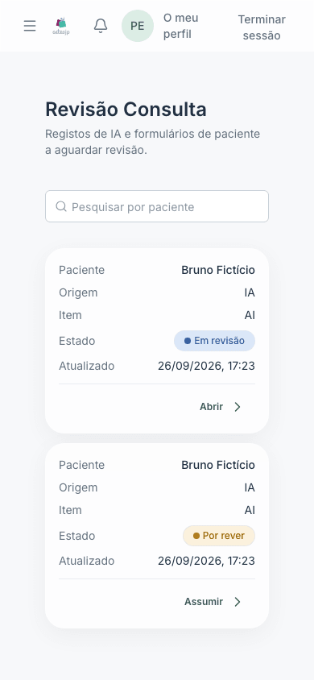
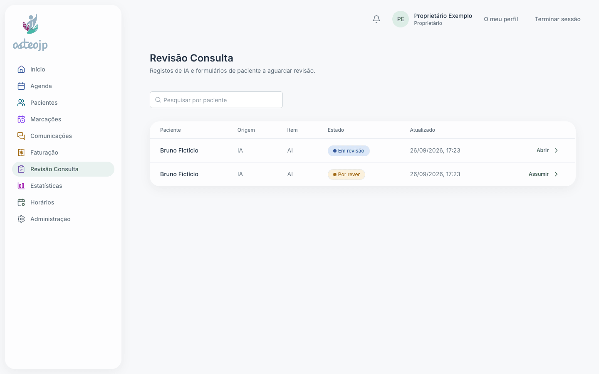

Nota: depois de finalizado, o registo fica assinado e bloqueado e já não pode ser alterado; confirme o conteúdo antes. Para sair sem finalizar, clique em **Voltar à fila**.

## Estatísticas: Painel

Ao clicar em **Estatísticas** no menu, escolhe entre dois cartões: **Estatísticas** (este painel) e **Indicadores (KPI)**. O painel mostra a receita e o volume das marcações: **Receita total**, **Total de marcações**, **Tempo ocupado**, **Receita por mês**, **Receita por terapeuta**, **Receita por serviço**, **Receita por local** e **Marcações por estado**.

### Como fazer: ver um período

1. Escolha as datas em **De** e **Até**. Com os dois campos em branco, o painel conta todo o histórico.
2. Os números mudam logo que altera um campo.

### Como fazer: ver um terapeuta, um local ou um serviço

1. Escolha em **Todos os terapeutas**, **Todas as localizações** ou **Todos os serviços**.
2. Para tirar o filtro, volte à primeira opção da lista.

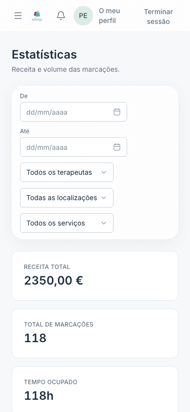
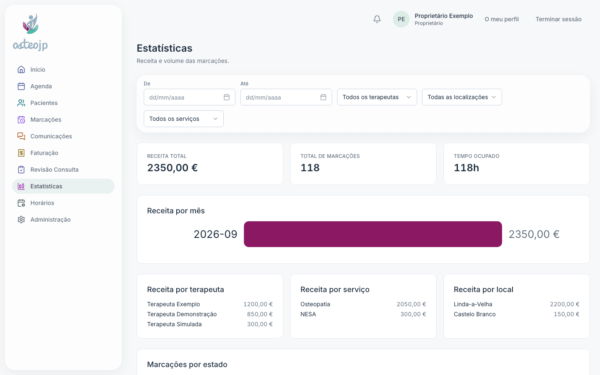

Nota: a receita conta as faturas emitidas e pagas, não o preço das marcações. **Total de marcações** inclui as canceladas (veja a divisão em **Marcações por estado**), e **Tempo ocupado** soma a duração das marcações não canceladas.

## Estatísticas: Indicadores

**Indicadores (KPI)** são relatórios visuais por período, e abrem com os últimos 12 meses. Os relatórios são **Tipos de marcação**, **Top terapeutas por marcações**, **Evolução da faturação**, **Evolução da faturação por terapeuta**, **Distribuição etária**, **Marcações diárias por terapeuta**, **Top 10 utentes por pagamentos**, **Top 10 utentes por marcações**, **Origem dos utentes** e **Top localidades dos utentes**. Cada um mostra um gráfico com a tabela por baixo.

### Como fazer: escolher o período

1. Em **Escolher período**, clique em **Este mês**, **Últimos 3 meses**, **Este ano**, **Últimos 12 meses** ou **Tudo**. O período aplica-se logo.
2. Para outras datas, preencha **De** e **Até** e clique em **Aplicar**.

### Como fazer: mudar de relatório

1. Clique no nome do relatório, por exemplo **Evolução da faturação**.
2. Para voltar à escolha inicial, clique em **Estatísticas**, por cima do título.

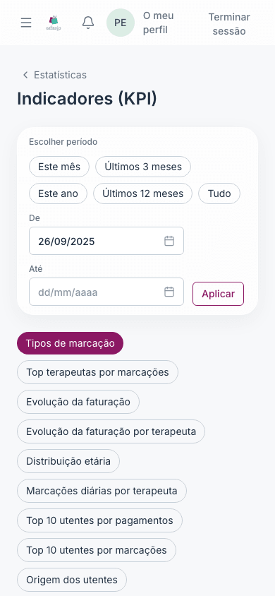
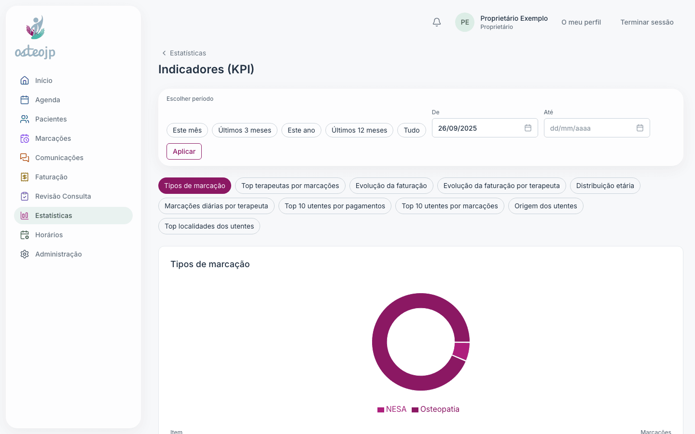

Nota: depois de escrever datas em **De** e **Até**, nada muda até clicar em **Aplicar**.

## Horários

**Horários da equipa** é onde se definem os horários de trabalho e as ausências dos terapeutas; o Proprietário vê todos. No topo, o **Inspetor de horários** mostra o que a agenda resolve, dia a dia, para um terapeuta: escolha-o em **Terapeuta** e escolha o **Período** (**Esta semana**, **Duas semanas** ou **Este mês**). Cada dia indica a regra que vale: **Base** (o horário semanal habitual), **Dia definido** ou **Exceção** (um bloqueio). Por baixo há um cartão por terapeuta, com **Ver no inspetor**, **Definir semanas alternadas**, **Definir dia a dia**, **Bloquear horário** e **Editar horários**.

### Como fazer: mudar o horário semanal habitual

1. No cartão do terapeuta, clique em **Editar horários**.
2. Em cada dia, marque **Trabalha** e escolha **Início**, **Fim** e **Local**. Para um segundo turno no mesmo dia, clique em **Adicionar 2.º período**.
3. Clique em **Guardar**.

### Como fazer: um período fora do habitual

1. Clique em **Definir semanas alternadas** (para quem alterna de clínica de semana a semana) ou em **Definir dia a dia** (para um período sem padrão).
2. Escolha o **Início** e o **Fim** do período.
3. Nas semanas alternadas, indique a **Clínica na 1.ª semana**, a **Clínica na 2.ª semana** e as horas. No dia a dia, marque em cada dia **Trabalha** e a **Clínica**; os dias que ficarem por marcar contam como não trabalhados.
4. Clique em **Guardar**. Fora desse período vale o horário habitual.

### Como fazer: registar uma ausência

1. No cartão do terapeuta, clique em **Bloquear horário**.
2. Em **Tipo**, escolha **Bloqueio pontual** (umas horas num dia), **Ausência prolongada** (dias inteiros, de **De** a **Até**) ou **Bloqueio repetido**.
3. Escreva a **Nota** e clique em **Guardar**. Numa ausência prolongada, confirme com **Bloquear na mesma**.

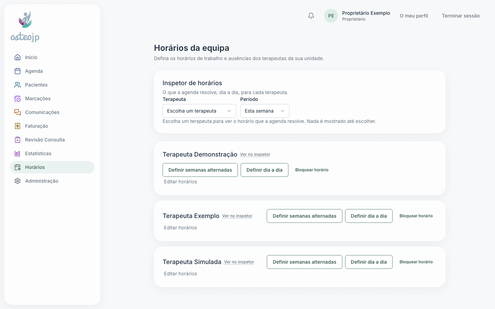

Nota: um bloqueio não muda o local de trabalho, só retira o terapeuta da agenda. Se ele vai atender noutra clínica nesses dias, use **Definir dia a dia**. As marcações que já existam no período bloqueado não são canceladas: reveja-as na Agenda.

## Administração: Resumo

**Administração** é a gestão da clínica e tem separadores no topo: **Resumo**, **Definições da Clínica**, **Equipa**, **Serviços**, **Locais**, **Pacientes eliminados** e **Teste de envio**. Os dois últimos só aparecem ao Proprietário. O **Resumo** tem um cartão para cada área e, em baixo, a **Zona de risco**, fechada.

### Como fazer: abrir uma área

1. Clique no cartão **Definições da Clínica**, **Equipa**, **Serviços** ou **Locais**, ou no separador com o mesmo nome.

### Como fazer: chegar às ações de risco

1. Clique em **Zona de risco** para a abrir.
2. Escolha **Pacientes eliminados** ou **Palavra-passe de eliminação** (esta leva às Definições da Clínica).

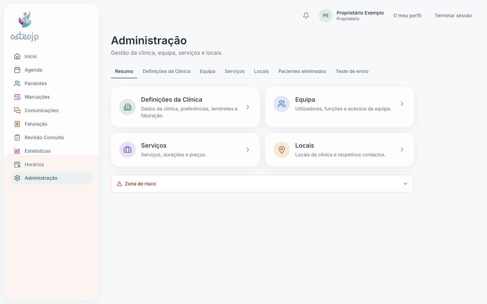

## Administração: Definições da Clínica

Aqui ficam os dados da clínica (**Nome da clínica**, **NIF**, **Email de contacto**, **Telefone**, **Morada**), o **Idioma predefinido**, os **Lembretes** e os dados de **Faturação** (**Moeda**, **Taxa de IVA (%)**, **Email de faturação**). Num quadro à parte, **Eliminação de marcações**, está a **Palavra-passe de eliminação**.

### Como fazer: alterar os dados ou os lembretes

1. Altere os campos. Em **Lembretes**, marque ou desmarque **Enviar lembretes por email** e **Enviar lembretes por SMS** e escolha a **Antecedência dos lembretes**: **48 horas antes**, **24 horas antes**, ou as duas.
2. Clique em **Guardar**. Aparece **Definições guardadas.**

### Como fazer: mudar a palavra-passe de eliminação

1. No quadro **Eliminação de marcações**, escreva a nova palavra-passe em **Palavra-passe de eliminação**.
2. Clique em **Atualizar palavra-passe**. Com o campo em branco, fica a atual.

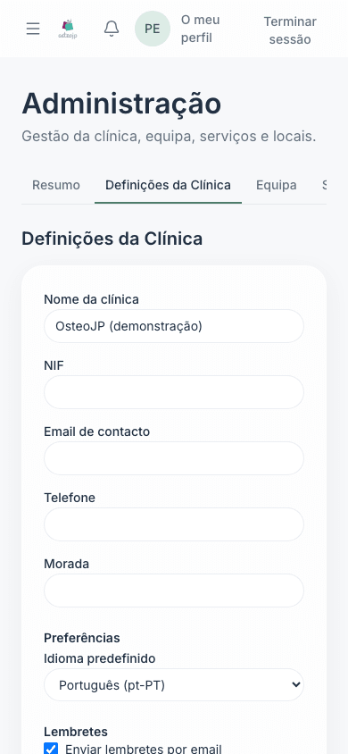
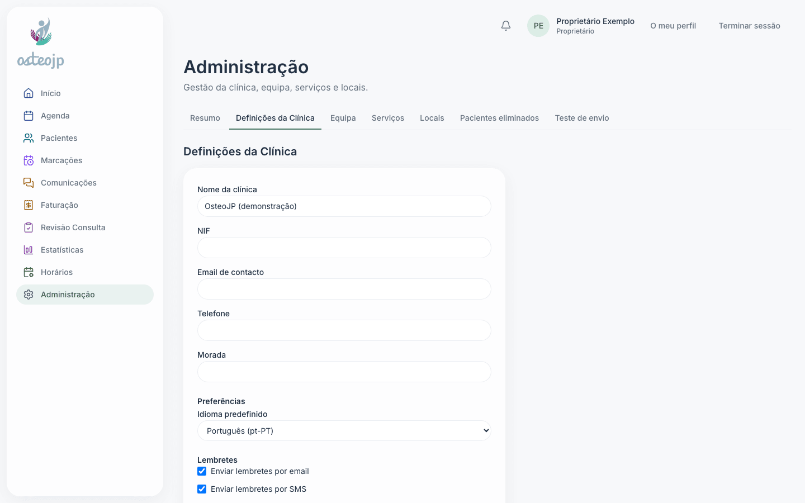

Nota: a palavra-passe de eliminação é da clínica, não da sua conta. É pedida para eliminar de vez marcações, pacientes e membros da equipa, e para eliminar ou anular registos clínicos. Troque o valor inicial e partilhe a nova só com quem precisa. As opções de lembretes não garantem, por si, que as mensagens saem: o separador Lembretes SMS mostra o que foi de facto enviado.

## Administração: Equipa

**Equipa** mostra quem trabalha na clínica. No topo ficam **Convidar novo membro** e o **Resumo da equipa** (**Membros ativos**, **Inativos**, **Com serviço principal**, **Com horário definido**). Por baixo há um cartão por pessoa, com a função, o estado (**Ativo** ou **Inativo**), as **Localizações**, o **Serviço principal**, os **Horários** e o botão **Gerir**. Para procurar, use **Pesquisar por nome ou função** e o filtro **Todas as localizações**.

### Como fazer: convidar uma pessoa nova

1. Em **Convidar novo membro**, preencha **Nome completo** e **Email** e escolha a **Função** (**Proprietário**, **Administrador**, **Terapeuta** ou **Receção**).
2. Clique em **Convidar**.
3. Se aparecer que o convite foi enviado por email, a pessoa define a própria palavra-passe pela ligação que recebe. Se aparecer uma palavra-passe temporária, entregue-a por um canal seguro.

### Como fazer: mudar os dados de uma pessoa

1. No cartão, clique em **Gerir**.
2. Escolha a secção: **Contacto** (nome, email, **Cargo**, **Telefone** e **Disponível para marcações**), **Função e acesso**, **Locais e cor** e, para terapeutas, **Serviço principal** e **Horários**.
3. Faça a alteração e clique no botão dessa secção (**Guardar**, **Aplicar** ou **Definir**).

### Como fazer: quando alguém deixa a clínica

1. Em **Gerir**, **Função e acesso**, clique em **Desativar**. A pessoa passa a **Inativo** e o registo e o histórico ficam. **Reativar** desfaz.
2. **Eliminar**, na **Zona de perigo**, pede a palavra-passe de eliminação e só funciona para quem não tem marcações, registos nem histórico (por exemplo, um convite com o email errado).

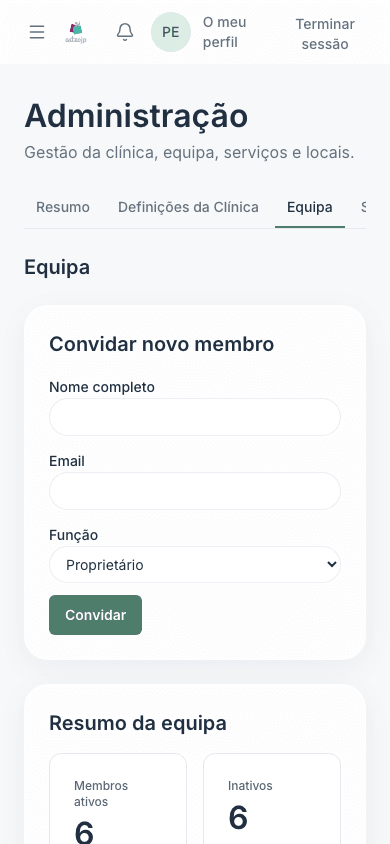
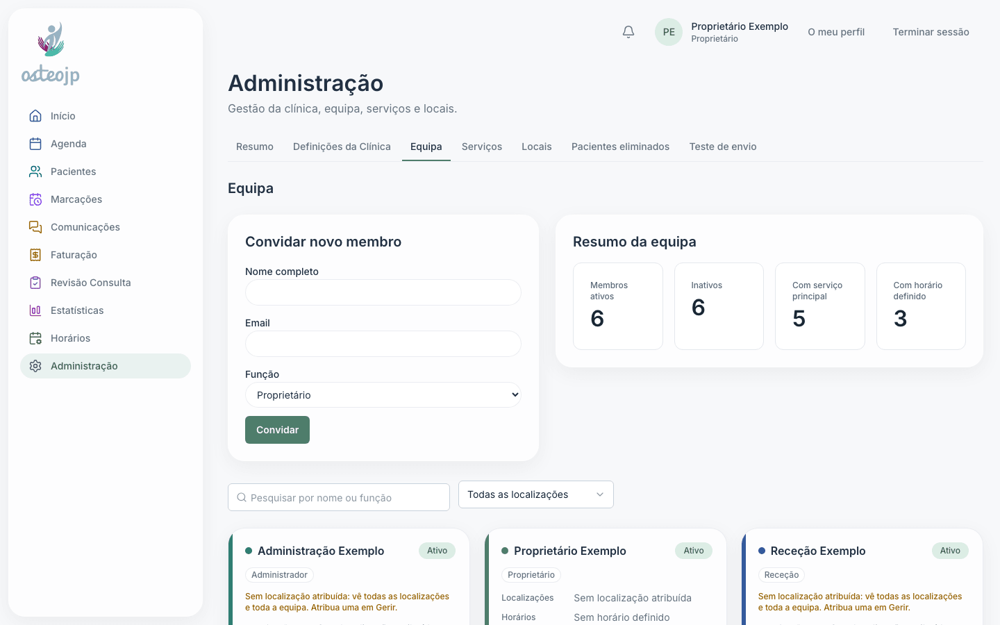

Nota: uma pessoa sem localização atribuída vê todas as localizações e toda a equipa, e o cartão avisa disso. Atribua os locais em **Gerir**, **Locais e cor**. **Disponível para marcações** decide se a pessoa aparece na lista **Terapeuta** ao marcar. A clínica tem de manter sempre pelo menos um proprietário ativo.

## Administração: Serviços

**Serviços** tem a lista dos serviços da clínica, com **Duração (min)**, **Preço (€)** e **Estado**, e, mais abaixo, os **Pacotes** de sessões. A etiqueta **Portal** indica que os pacientes podem marcar esse serviço sozinhos, no portal.

### Como fazer: criar um serviço

1. Em **Adicionar serviço**, preencha **Nome**, **Duração (min)** e **Preço (€)**. Marque **Sensível a contraindicações NESA** se for o caso.
2. Clique em **Adicionar serviço**.

### Como fazer: alterar um serviço ou o preço num local

1. Clique em **Gerir** na linha do serviço, altere o que for preciso e clique em **Guardar**.
2. No mesmo painel, **Abrir a marcação por pacientes** ou **Fechar a marcação por pacientes** decide se o serviço aparece no portal, e **Arquivar** deixa de o oferecer.
3. Para um preço diferente num local, abra **Preços por local**, escreva o preço desse local e clique em **Guardar preços**. Um local com o campo em branco usa o preço base.

### Como fazer: criar um pacote

1. Em **Adicionar pacote**, preencha **Nome**, **Serviço base**, **Nº de sessões**, **Preço (€)** e **Local**.
2. Clique em **Adicionar pacote**.

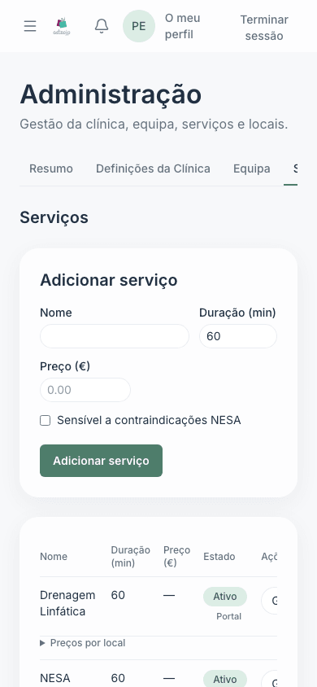
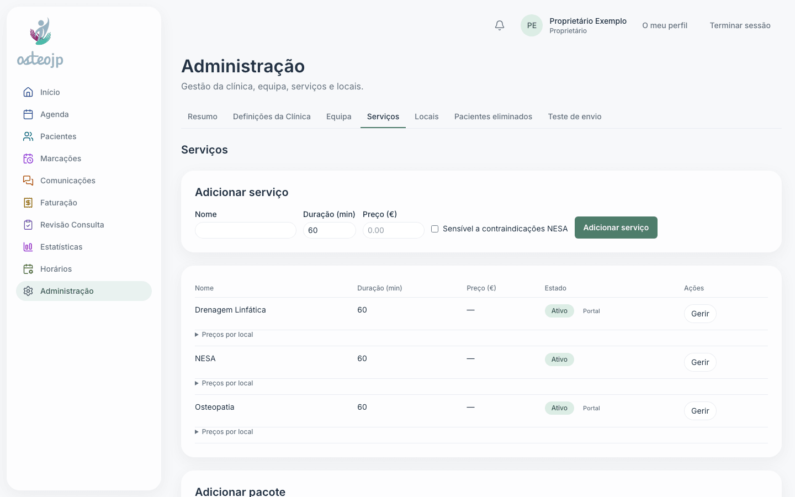

Nota: um serviço com marcações não pode ser eliminado; arquive-o. Um pacote que já foi vendido não pode mudar o número de sessões; crie um pacote novo.

## Administração: Locais

**Locais** lista as clínicas, com **Nome**, **Morada**, **Telefone**, **Marcação no portal** e **Estado**. Os campos alteram-se diretamente na linha.

### Como fazer: acrescentar um local

1. No topo, preencha **Nome**, **Morada** e **Telefone**.
2. Clique em **Adicionar local**.

### Como fazer: alterar um local

1. Mude o que for preciso na linha. Em **Marcação no portal**, escolha **De 30 em 30 min** ou **De hora a hora**: é o intervalo entre os horários que o portal oferece aos pacientes.
2. Clique em **Guardar** nessa linha.
3. Para deixar de usar um local, clique em **Arquivar**. **Restaurar** volta a ativá-lo.

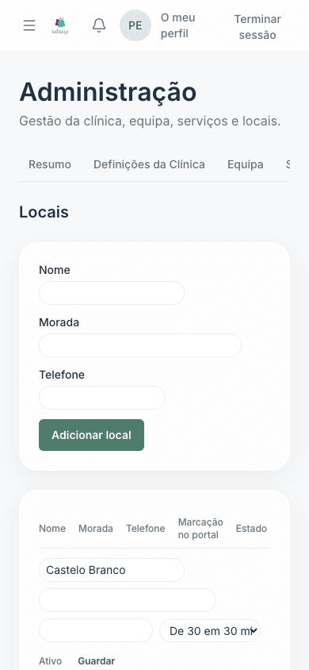
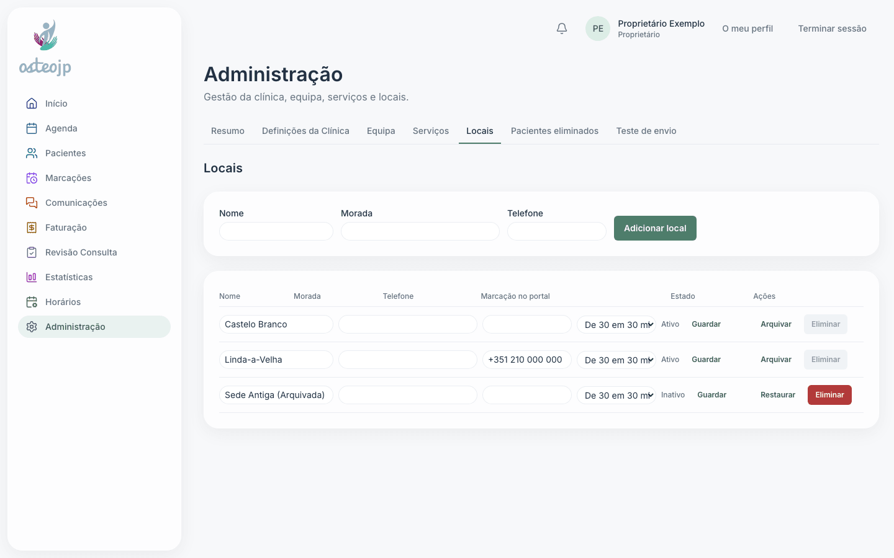

Nota: **Eliminar** só funciona num local sem marcações; com marcações, o botão fica desativado e o caminho é arquivar. **Marcação no portal** não mexe na Agenda, onde a equipa continua a marcar a qualquer hora. O horário de funcionamento da clínica não se altera neste ecrã.

## Administração: Pacientes eliminados

Aqui ficam os pacientes eliminados (etiqueta **Eliminado**) e os que foram fundidos noutra ficha (etiqueta **Duplicado**, ou **Duplicado de** seguida do nome da ficha que ficou). Só o Proprietário vê este separador.

### Como fazer: recuperar um paciente

1. Clique em **Restaurar**. O paciente volta à lista de Pacientes.

### Como fazer: eliminar um paciente de vez

1. Clique em **Eliminar definitivamente**.
2. Escreva a **Palavra-passe de eliminação** e clique em **Confirmar eliminação definitiva**.

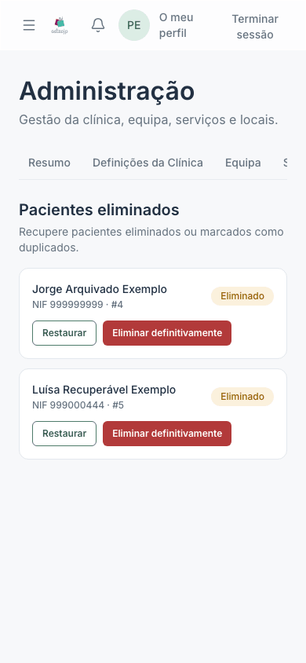
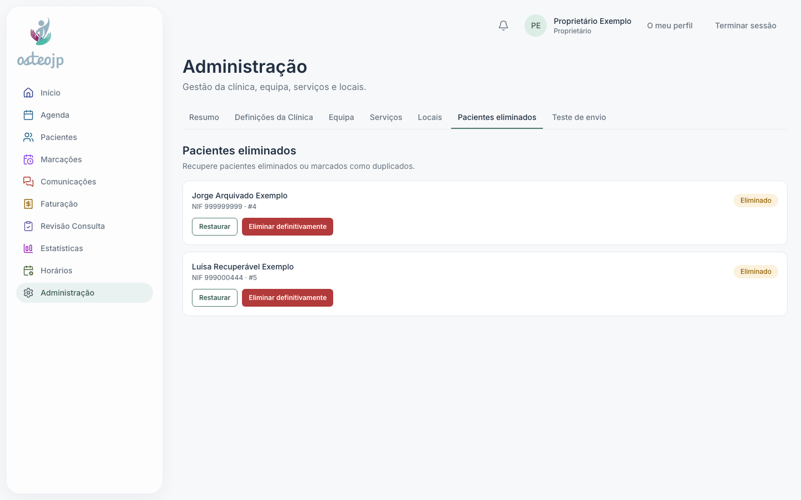

Nota: eliminar definitivamente não se desfaz. O botão fica desativado enquanto o paciente tiver marcações, notas, faturas ou registos clínicos, e o ecrã mostra o que o impede. Um paciente com registos clínicos nunca pode ser eliminado definitivamente.

## Administração: Teste de envio

**Teste de envio** manda uma mensagem real, pela via de produção, para o número que indicar. Serve para ver no telemóvel o que o paciente recebe: o remetente, a quebra de linha, a ligação e se a mensagem cabe num só segmento. O quadro **Remetente em uso** mostra o remetente configurado e se a linha de resposta está ativa. Só o Proprietário vê este separador.

### Como fazer: enviar uma mensagem de teste

1. Escreva o número em **Número (formato internacional, +351...)**, por exemplo o seu telemóvel.
2. Deixe em branco o campo **Id da consulta (opcional)**.
3. Clique em **Enviar mensagem de teste**. Se correr bem, aparece **Enviada. Veja o telemóvel.**

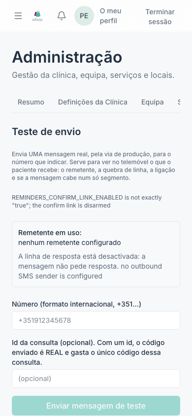
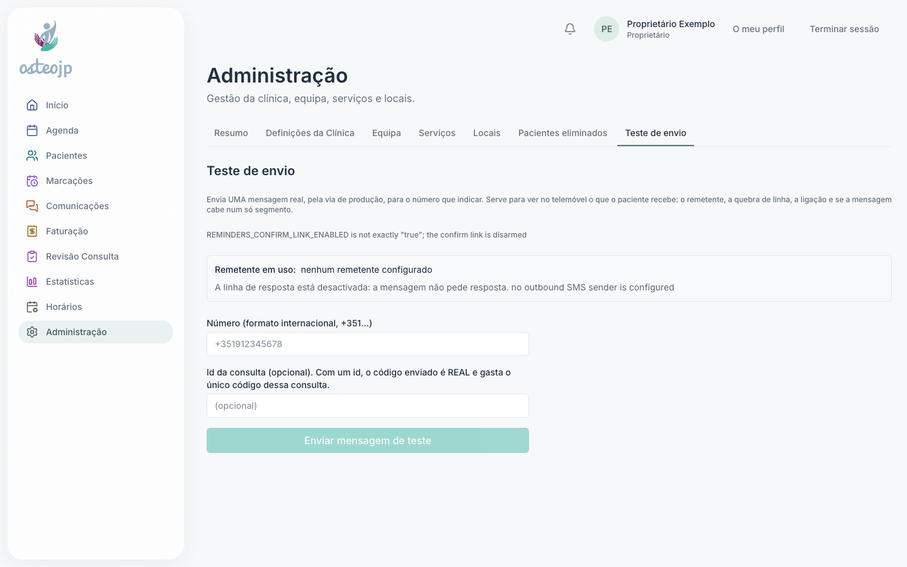

Nota: com um id de consulta, o código enviado é real e gasta o único código dessa consulta, por isso deixe o campo em branco num simples teste. Se o botão estiver desativado, a ligação de confirmação está desligada na configuração e não há nada para testar. O ecrã mostra sempre, em inglês, duas indicações técnicas para quem configura os envios: uma por baixo da explicação e outra no quadro **Remetente em uso**. As imagens foram feitas numa instalação de teste sem remetente configurado, por isso o botão aparece desativado. Há um limite diário de envios.

## Notificações

O sino no topo da página abre **Notificações** e mostra quantas estão por ler. A página junta, por esta ordem, **Pedidos de remarcação**, **Gravações que não foram processadas**, **Pedidos de marcação** (feitos pelos pacientes no portal), **Pedidos de novos clientes**, **Pacientes sem SMS possível** e, no fim, a lista **Notificações** com as alterações feitas pelos pacientes.

### Como fazer: aceitar um pedido de marcação do portal

1. Em **Pedidos de marcação**, confira o pedido.
2. Clique em **Confirmar**. O horário só fica reservado depois de confirmado. Para mudar ou cancelar, clique em **Abrir na agenda**, que abre a marcação.

### Como fazer: tratar um pedido de um cliente novo

1. Em **Pedidos de novos clientes**, veja o nome, o **Telemóvel**, o **Local** e a **Preferência**. **Ver questionário clínico** mostra as respostas, quando existem.
2. Clique em **Criar paciente e marcar**. Se o número já constar numa ficha, confirme com a pessoa e escolha **É este paciente** ou **É alguém novo, criar ficha**. A agenda abre com o paciente escolhido.
3. Se o paciente já foi criado mas o pedido ficou na lista sem marcação, clique em **Dispensar** para o tirar da lista. Um pedido novo não tem **Dispensar**.

### Como fazer: tratar um pedido de remarcação

1. Remarque a consulta na Agenda.
2. Volte a **Pedidos de remarcação** e clique em **Marcar como tratado**.

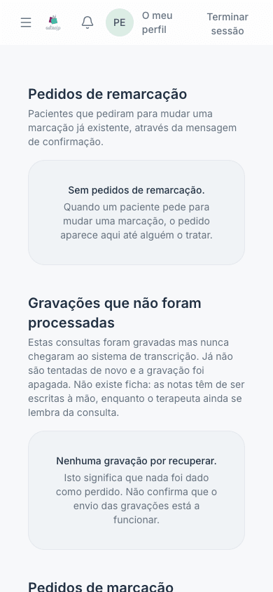
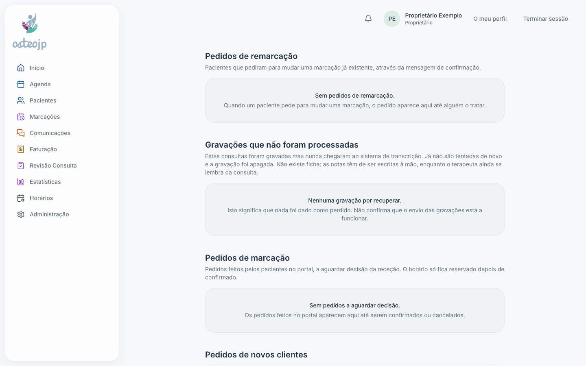

Nota: **Marcar como tratado** não altera a marcação; remarque sempre primeiro na Agenda. **Marcar todas como lidas** só limpa as alterações por ler da lista **Notificações** e não trata nenhum pedido.

## O meu perfil

**O meu perfil**, no topo da página, abre o ecrã **Perfil**, onde muda o nome e a palavra-passe da sua conta.

### Como fazer: mudar o nome

1. Em **Dados pessoais**, altere o **Nome**.
2. Clique em **Guardar**.

### Como fazer: mudar a palavra-passe

1. Em **Palavra-passe**, escreva a **Nova palavra-passe** e repita-a em **Confirmar palavra-passe** (mínimo 8 caracteres, com pelo menos uma letra e um número).
2. Clique em **Alterar palavra-passe**.

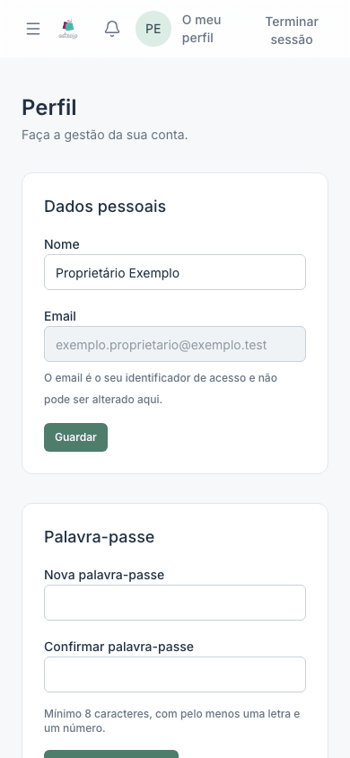
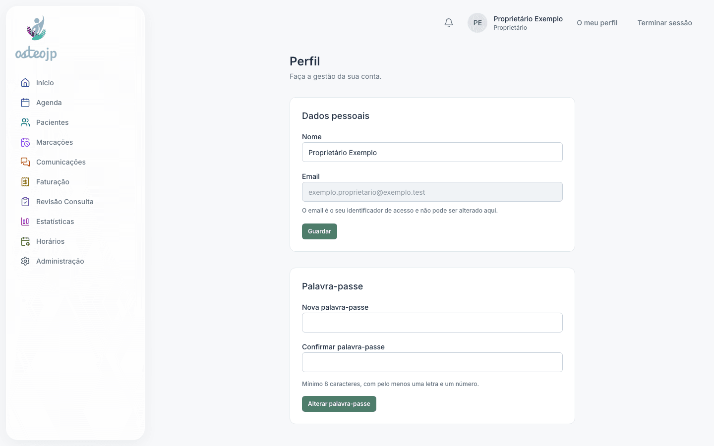

Nota: o email é o seu identificador de acesso e não se altera aqui. A palavra-passe da conta não é a palavra-passe de eliminação das Definições da Clínica.
