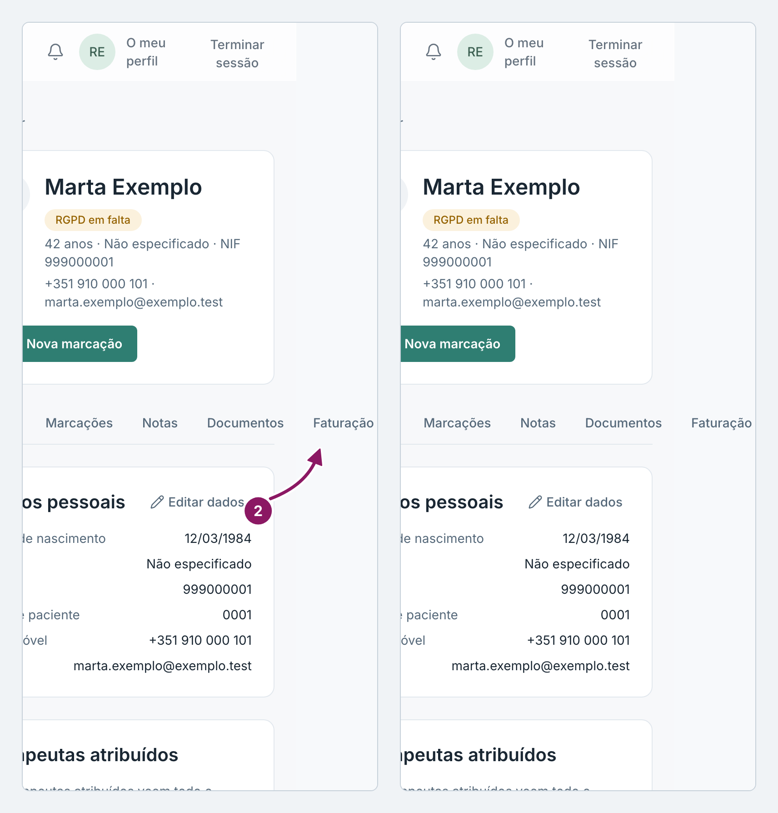
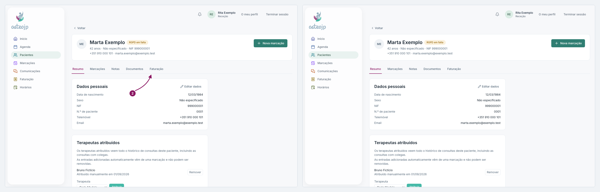

## Ver as faturas de um paciente

1. Abra a ficha do paciente, a partir da lista **Pacientes**.
2. Clique no separador **Faturação**.

O separador mostra as faturas desse paciente, só para consulta. Daqui não se emite nem se altera nenhuma fatura.

::: terapeuta
Só abre a ficha, e portanto este separador, dos pacientes da sua lista **Pacientes**.
:::

