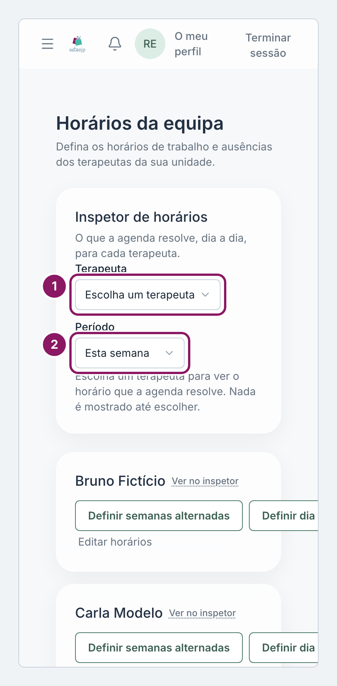
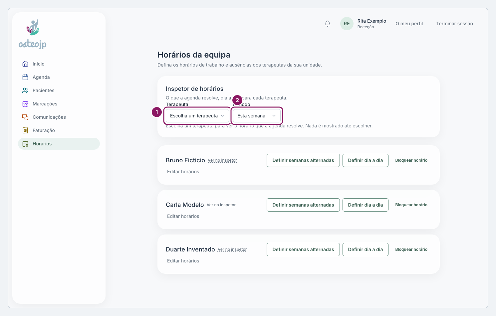

## Ver onde e quando um terapeuta trabalha

Abra **Horários** no menu. No topo está o **Inspetor de horários**, que mostra, dia a dia, o horário que a agenda usa, com o **Local** e o motivo: **Base** (o horário semanal habitual), **Dia definido**, **Exceção** (uma ausência), **Não trabalha** ou **Bloqueado**.

::: rececao proprietario
O ecrã chama-se **Horários da equipa**. A Receção vê os terapeutas da sua unidade; o Proprietário vê todos.

1. Em **Terapeuta**, escolha a pessoa, ou clique em **Ver no inspetor** no cartão dela.
2. Em **Período**, escolha **Esta semana**, **Duas semanas** ou **Este mês**.
:::

::: terapeuta
O ecrã chama-se **O meu horário**: a sua conta só vê e altera o seu próprio horário.

1. Em **Período**, escolha **Esta semana**, **Duas semanas** ou **Este mês**.
2. Para mudar as horas de um só dia, clique em **Editar** na linha desse dia.
:::

Quando a agenda não deixa marcar num dia, o motivo indicado no inspetor diz porquê.

