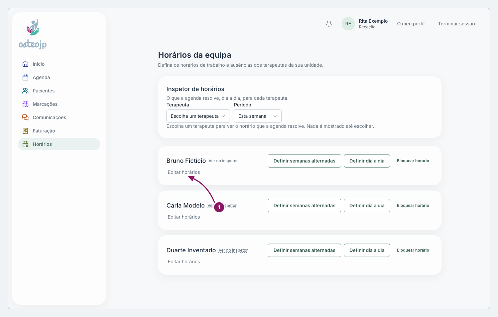

## Alterar o horário semanal habitual

O horário semanal habitual é o que a agenda usa sempre que não há um período diferente nem uma ausência.

1. No cartão do terapeuta, clique em **Editar horários**.
2. Em cada dia, marque **Trabalha** e escolha **Início**, **Fim** e **Local**. Para uma pausa a meio do dia, clique em **Adicionar 2.º período**.
3. Clique em **Guardar**. Aparece **Horário guardado.**
4. Confirme o resultado no **Inspetor de horários**.

::: terapeuta
Em **O meu horário** só aparece o seu cartão, por isso só altera o seu próprio horário.
:::

Nota: para umas semanas fora do habitual, não mude o horário semanal; use **Definir semanas alternadas** ou **Definir dia a dia**.

