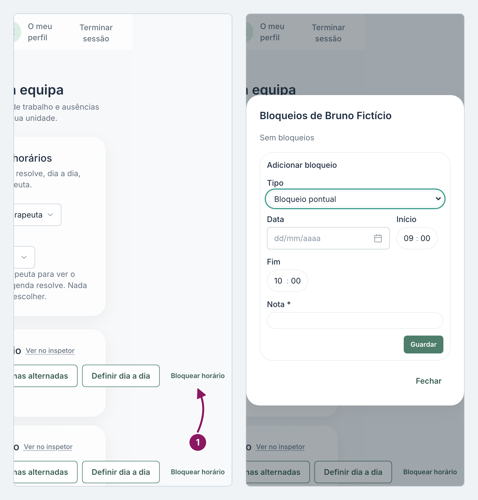
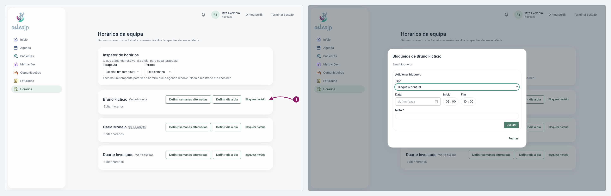

## Registar uma ausência

1. No cartão do terapeuta, clique em **Bloquear horário**. A janela mostra os bloqueios já marcados e, por baixo, **Adicionar bloqueio**.
2. Em **Tipo**, escolha **Bloqueio pontual** (umas horas num dia), **Bloqueio repetido** (o mesmo bloqueio em várias semanas) ou **Ausência prolongada** (dias inteiros, de uma data a outra).
3. Preencha as datas e, quando o tipo as pede, as horas. Escreva a **Nota**, que é obrigatória.
4. Clique em **Guardar**. Numa ausência prolongada aparece primeiro um aviso; se estiver certo, clique em **Bloquear na mesma**.

::: terapeuta
Em **O meu horário** só aparece o seu cartão. Uma manhã de formação, por exemplo, é um **Bloqueio pontual**.
:::

Nota: um bloqueio não cancela as marcações que já existem no período: reveja-as na Agenda. Uma **Ausência prolongada** tira o terapeuta da agenda em todas as clínicas, e ninguém consegue marcar com ele, nem a receção nem os pacientes no portal.

Nota: se o terapeuta vai apenas atender noutra clínica, não bloqueie: use **Definir dia a dia**.

